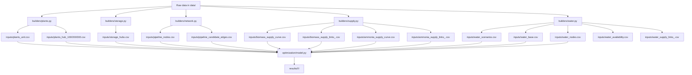

# Coal Retrofit Experiment System

一个面向煤电多路径改造研究的可复现实验系统。这个仓库的目标不是只保存 proposal 或零散脚本，而是把煤电减排改造问题拆成可验证的四层：

1. 原始数据
2. 标准化输入
3. 可重复优化实验
4. 标准化结果与 review 产物

当前研究边界覆盖：

- `retire`
- `CCS`
- `biomass`
- `BECCS`
- `ammonia`
- 可选 `water` 约束
- 基于油气管道走廊先验的 CO2 候选管网

运行前提很简单，但必须满足：

- `data/` 下原始图层与表格已经就位
- 本机有可用的 Gurobi license

## 1. 这个项目回答什么问题

项目围绕一个统一问题展开：

在既定减排目标下，煤电机组在 `retire / CCS / biomass / BECCS / ammonia` 五条路径之间如何配置，空间上如何与生物质、绿氨、水资源和封存汇耦合，以及这些结论对管网、封存口径、水情景和关键参数是否稳健。

它不是一个通用能源系统模型，而是一个为这篇研究专门收束过边界的实验系统。

## 2. 当前实现到了哪一步

目前仓库已经具备以下能力：

- `Phase A` 预处理流水线
- 全部实验 ID 注册与统一运行
- 基于 `gurobipy` 的全局多期多路径优化器
- 基于油气走廊先验的运行时 CO2 网络装配
- 标准化结果落盘
- markdown 摘要与出图故事线

当前 `plan.md` 中定义的实验族已经在代码中注册：

- `EXP-B1` 到 `EXP-B5`
- `EXP-W1` 到 `EXP-W4`
- `EXP-R1` 到 `EXP-R6`

需要注意，较早期归档结果里既有“单年滚动”口径；当前代码默认的 `joint` 已经升级为“2040-2050-2060 一次性联立”的全局多期求解。

如果只想先理解“系统怎么工作”，一次实验可以压缩成这 5 步：

1. `run_phase_a.py`
   把原始数据物化成 `inputs/`
2. `catalog.py`
   选择实验家族和 scenario
3. `scenario mapping`
   把实验参数映射成统一优化参数
4. `optimization/model.py`
   求一个全局多期 `joint` 或逐年 `sequential` 模型
5. `artifacts/`
   把结果写成按年长表和摘要

## 3. 目录结构

```text
coal-retrofit/
├─ data/                       # 原始外部数据
├─ inputs/                     # Phase A 生成的标准化输入
├─ intermediate/               # 预留中间产物
├─ reference/                  # 外部参考资料与 GMS 参考模型
├─ results/                    # 实验结果、reviews、figure plans
├─ scripts/                    # 薄 CLI 入口
├─ src/
│  └─ coal_retrofit/
│     ├─ artifacts.py          # 统一 artifact 写入
│     ├─ constants.py          # 稳定常量
│     ├─ paths.py              # 路径发现与文件定位
│     ├─ spatial.py            # GIS / raster 通用工具
│     ├─ builders/             # 输入构建模块
│     ├─ experiments/          # 实验注册、运行、结果契约
│     ├─ optimization/         # 优化模型、运行时网络、scenario 映射
│     ├─ pipelines/            # Phase A 等编排层
│     └─ reporting/            # 结果摘要与 markdown 输出
├─ plan.md
├─ research-proposal.md
├─ project-architecture.md
├─ notes.md
└─ pyproject.toml
```

## 4. 安装与环境

### 4.1 Requirements

- Python `>= 3.11`
- 推荐 Windows PowerShell

### 4.2 主要依赖

当前 [pyproject.toml](/C:/Users/admin/OneDrive/文档/000.%20Paper%20work/煤电改造claude/pyproject.toml) 中的核心依赖包括：

- `gurobipy`
- `geopandas`
- `networkx`
- `numpy`
- `openpyxl`
- `pandas`
- `pyproj`
- `rasterio`
- `scikit-learn`
- `scipy`

运行优化实验还需要本机可用的 Gurobi license。

### 4.3 安装

```powershell
python -m pip install -U pip
python -m pip install -e .
```

如果不做 editable install，也至少要把依赖装齐。

## 5. 数据利用流程

这一部分是项目最重要的说明。核心原则是：

- 原始数据只放在 `data/`
- 一切模型输入都必须先显式物化到 `inputs/`
- 优化器不直接吃原始图层，只吃标准化输入表

### 5.1 数据流总览



### 5.2 原始数据到输入表的具体流程

#### A. 煤电机组数据

实现位置：
[plants.py](/C:/Users/admin/OneDrive/文档/000.%20Paper%20work/煤电改造claude/src/coal_retrofit/builders/plants.py)

原始来源：

- `data/GEM_with_Cooling_Technology_July2025.xlsx`

处理逻辑：

1. 读取原始机组表
2. 统一列名口径
3. 仅保留 `operating` 机组
4. 提取标准字段：
   `unit_id / plant_site / capacity_mw / commission_year / combustion / cooling_technology / province / latitude / longitude`
5. 输出 [plants_unit.csv](/C:/Users/admin/OneDrive/文档/000.%20Paper%20work/煤电改造claude/inputs/plants_unit.csv)

随后对机组坐标做 `KMeans` 聚类，生成 `100 / 200 / 300` 三档 hub：

- [plants_hub_100.csv](/C:/Users/admin/OneDrive/文档/000.%20Paper%20work/煤电改造claude/inputs/plants_hub_100.csv)
- [plants_hub_200.csv](/C:/Users/admin/OneDrive/文档/000.%20Paper%20work/煤电改造claude/inputs/plants_hub_200.csv)
- [plants_hub_300.csv](/C:/Users/admin/OneDrive/文档/000.%20Paper%20work/煤电改造claude/inputs/plants_hub_300.csv)

每个 hub 保留：

- 容量总和
- 机组数
- 平均投运年份
- 主导燃烧方式
- 主导冷却方式
- 重心坐标

#### B. 封存汇与注入能力

实现位置：
[storage.py](/C:/Users/admin/OneDrive/文档/000.%20Paper%20work/煤电改造claude/src/coal_retrofit/builders/storage.py)

目标：

- 把 DSA / EOR 储量与注入能力整理成统一的 storage hub 表

输出：

- [storage_hubs.csv](/C:/Users/admin/OneDrive/文档/000.%20Paper%20work/煤电改造claude/inputs/storage_hubs.csv)

关键字段包括：

- `storage_dsa_mt`
- `storage_eor_mt`
- `storage_all_mt`
- `injectivity_dsa_avg_mtpa`
- `injectivity_eor_avg_mtpa`

这些字段后续直接进入优化器的 `capacity` 与 `injectivity` 约束。

#### C. CO2 候选管网

实现位置：
[network.py](/C:/Users/admin/OneDrive/文档/000.%20Paper%20work/煤电改造claude/src/coal_retrofit/builders/network.py)
[network.py](/C:/Users/admin/OneDrive/文档/000.%20Paper%20work/煤电改造claude/src/coal_retrofit/optimization/network.py)

原始来源：

- `gas_pipelines.shp`
- `oil_pipeline.shp`

预处理逻辑分两层：

1. `builders/network.py`
   把油气管道矢量化为主走廊图，生成：
   - corridor nodes
   - corridor edges
   - hub-to-corridor branches
   - corridor-to-storage branches
   - source/sink triangulation candidate edges

2. `optimization/network.py`
   在求解前把预处理候选图装配成运行时图；
   如果某些 hub 或 storage 没有接上，会追加 `runtime` fallback edge 保证可达。

标准化输出：

- [pipeline_nodes.csv](/C:/Users/admin/OneDrive/文档/000.%20Paper%20work/煤电改造claude/inputs/pipeline_nodes.csv)
- [pipeline_candidate_edges.csv](/C:/Users/admin/OneDrive/文档/000.%20Paper%20work/煤电改造claude/inputs/pipeline_candidate_edges.csv)

关键字段包括：

- `length_km`
- `corridor_type`
- `existing_corridor_flag`
- `edge_class`
- `source`
- `year_basis`

#### D. 生物质供给曲线

实现位置：
[supply.py](/C:/Users/admin/OneDrive/文档/000.%20Paper%20work/煤电改造claude/src/coal_retrofit/builders/supply.py)

原始口径：

- 生物质图层单位：`GJ/m^2`

处理逻辑：

1. 读入生物质栅格
2. 计算每一行真实面积
3. 对每个像元做：
   `biomass_GJ_pixel = biomass_GJ_per_m2 * pixel_area_m2`
4. 将有资源的像元按较粗空间网格聚合成 `biomass node`
5. 对每个 plant hub，按缓冲半径匹配可达的 biomass node
6. 为每个 `hub-node` 生成一条候选供给 link，后续在优化中由多个 hub 竞争共享 node 资源

输出：

- [biomass_supply_curve.csv](/C:/Users/admin/OneDrive/文档/000.%20Paper%20work/煤电改造claude/inputs/biomass_supply_curve.csv)
- [biomass_supply_links_100.csv](/C:/Users/admin/OneDrive/文档/000.%20Paper%20work/煤电改造claude/inputs/biomass_supply_links_100.csv)
- [biomass_supply_links_200.csv](/C:/Users/admin/OneDrive/文档/000.%20Paper%20work/煤电改造claude/inputs/biomass_supply_links_200.csv)
- [biomass_supply_links_300.csv](/C:/Users/admin/OneDrive/文档/000.%20Paper%20work/煤电改造claude/inputs/biomass_supply_links_300.csv)

当前 README 应特别说明的研究边界：

- 不考虑土地竞争
- 质量换算使用 `15 GJ/t biomass`
- 成本口径以 `CNY/GJ` 表示
- 供给约束发生在共享 `biomass node`，不是省级总量
- 竞争关系通过 `hub -> biomass node` link flow 显式表示

#### E. 绿氢 / 绿氨供给曲线

实现位置：
[supply.py](/C:/Users/admin/OneDrive/文档/000.%20Paper%20work/煤电改造claude/src/coal_retrofit/builders/supply.py)

原始口径：

- `h2_production = kg H2/yr/m^2`
- `lcoh = USD/kg H2`

处理逻辑：

1. 按像元面积把氢产量转为像元年产氢量：
   `h2_kg_pixel = h2_kg_per_yr_per_m2 * pixel_area_m2`
2. 将资源像元按年份、资源类型、电解技术和粗空间网格聚合成 `ammonia node`
3. 在每个节点内用产量加权 `lcoh` 计算氢成本
4. 折算为氨：
   `nh3_supply_kg = h2_supply_kg / 0.176`
5. 每个 plant hub 只连接距离最近的若干个 ammonia node
6. 当前 builder 里写入氨成本下界：
   `nh3_cost_lb = h2_cost_component + storage_adder + transport_adder`
7. 同时保留 `HB` 电耗字段，供后续进一步货币化

输出：

- [ammonia_supply_curve.csv](/C:/Users/admin/OneDrive/文档/000.%20Paper%20work/煤电改造claude/inputs/ammonia_supply_curve.csv)
- [ammonia_supply_links_100.csv](/C:/Users/admin/OneDrive/文档/000.%20Paper%20work/煤电改造claude/inputs/ammonia_supply_links_100.csv)
- [ammonia_supply_links_200.csv](/C:/Users/admin/OneDrive/文档/000.%20Paper%20work/煤电改造claude/inputs/ammonia_supply_links_200.csv)
- [ammonia_supply_links_300.csv](/C:/Users/admin/OneDrive/文档/000.%20Paper%20work/煤电改造claude/inputs/ammonia_supply_links_300.csv)

关键点：

- 年份来自 `data/H2/<year>/`
- 成本年份直接等于文件夹年份
- 绿氨运输在当前模型中只作为低阶加项，而不是独立网络
- 供给约束发生在共享 `ammonia node`，不是全国市场
- 多个 hub 会竞争同一个 ammonia node 的当年可供量

#### F. 水约束输入

实现位置：
[water.py](/C:/Users/admin/OneDrive/文档/000.%20Paper%20work/煤电改造claude/src/coal_retrofit/builders/water.py)

原始来源：

- `data/water/*.nc`

处理逻辑：

1. 解析水情景文件名，提取：
   `hydrology / gcm / ssp / socioeconomics / variable / period`
2. 形成情景清单：
   [water_scenarios.csv](/C:/Users/admin/OneDrive/文档/000.%20Paper%20work/煤电改造claude/inputs/water_scenarios.csv)
3. 形成基准情景表：
   [water_base.csv](/C:/Users/admin/OneDrive/文档/000.%20Paper%20work/煤电改造claude/inputs/water_base.csv)
4. 在中国范围内提取 0.5° 水文格网节点：
   [water_nodes.csv](/C:/Users/admin/OneDrive/文档/000.%20Paper%20work/煤电改造claude/inputs/water_nodes.csv)
5. 按规划窗口计算各节点年度可用水量：
   [water_availability.csv](/C:/Users/admin/OneDrive/文档/000.%20Paper%20work/煤电改造claude/inputs/water_availability.csv)
6. 为每个 hub 生成本地 water-node 可达边：
   [water_supply_links_200.csv](/C:/Users/admin/OneDrive/文档/000.%20Paper%20work/煤电改造claude/inputs/water_supply_links_200.csv)

这里需要注意：

- 当前水约束已经改成“grid water node + hub access link + shared node competition”
- 需求侧水强度现在采用 `consumption` 口径，冷却方式按煤电 hub 的 `dominant_cooling_technology` 映射
- 这仍然是厂址局地耗水 proxy，不是完整的流域调度模型

### 5.3 Phase A 总调度

统一入口在：
[phase_a.py](/C:/Users/admin/OneDrive/文档/000.%20Paper%20work/煤电改造claude/src/coal_retrofit/pipelines/phase_a.py)

执行顺序是：

1. plants unit
2. plant hubs
3. storage hubs
4. network inputs
5. supply inputs
6. water inputs

运行命令：

```powershell
python scripts/run_phase_a.py
```

### 5.4 输入在模型里的抽象角色

从优化器视角看，Section 5 的所有输入最终会被抽象成四类对象：

- `decision hubs`
  煤电 plant hubs，是路径选择发生的位置
- `resource nodes`
  biomass / ammonia / water 的共享供给节点，是资源竞争发生的位置
- `storage hubs`
  CO2 最终注入的位置
- `candidate edges / pairs`
  CO2 可走的候选边，以及 hub-storage 配对

所以这些输入最终都在回答三个问题：

- 哪些 hub 可以改造成哪条路径
- 这些 hub 可以从哪些共享资源节点取量
- 捕集后的 CO2 可以沿哪些候选边送到哪些 storage hub

## 6. 算法实现细节

这一部分对应优化核心：
[model.py](/C:/Users/admin/OneDrive/文档/000.%20Paper%20work/煤电改造claude/src/coal_retrofit/optimization/model.py)

### 6.1 模型类型

当前实现不是单一一种模型，而是两条求解路径：

- `joint`
  全局多期 `MILP`
- `sequential`
  逐年滚动的 `LP + MILP` 对照解

其中：

- `joint` 会把全部规划年份放进同一个 Gurobi 模型里一次性联立求解
- `sequential` 仍保留为对照模式，先定路径，再在每个年份单独配网络

这意味着当前已经有显式的管网离散选边，但还不是完整工程级网络设计模型；例如还没有离散管径库、机组启停、施工停机与时序运行约束。

### 6.2 Scenario 映射

实验层先注册 scenario，再由优化层做参数映射。

实现位置：
[catalog.py](/C:/Users/admin/OneDrive/文档/000.%20Paper%20work/煤电改造claude/src/coal_retrofit/experiments/catalog.py)
[model.py](/C:/Users/admin/OneDrive/文档/000.%20Paper%20work/煤电改造claude/src/coal_retrofit/optimization/model.py#L258)

例如：

- `EXP-B2` 通过 `pathway_disable` 做路由删除
- `EXP-B3` 切换 `solve_mode = joint / sequential`
- `EXP-B4` 改 `hub_count`
- `EXP-B5` 改 `storage_scope / injectivity_multiplier`
- `EXP-W*` 改 `water_mode / water_multiplier / forced_cooling_technology`
- `EXP-R1` 改成本乘子
- `EXP-R2` 改 `capture_rate / biomass_blend_ratio / ammonia_blend_ratio`
- `EXP-R4` 改时间离散方式

### 6.3 决策变量

全局多期联合模型 `_solve_joint_multi_period(...)` 中，每个规划年份都会生成一组变量。核心变量包括：

- `share[h, p]`
  每个煤电 hub 在五条路径上的分配份额

- `ship_mt[y, pair]`
  年份 `y` 下，hub 到 storage pair 的 CO2 运输量

- `build_edge[y, edge] ∈ {0,1}`
  年份 `y` 下，该候选边是否被选中扩容

- `new_cap_mtpa[y, edge]`
  年份 `y` 下，该候选边新增容量

- `biomass_flow_gj[y, link]`
- `ammonia_flow_kg[y, link]`
- `water_flow_m3[y, link]`
  三类共享资源在 `hub -> resource node` 连接边上的流量

- `target_shortfall_mt[y]`
  年份 `y` 的减排目标缺口 slack

- `biomass_slack_gj`
- `ammonia_slack_kg`
- `water_slack_m3`
- `injectivity_slack_mtpa`
- `storage_slack_mt`
- `edge_slack_mtpa`

这些 slack 都被高惩罚系数压制，用来诊断不可行性。

### 6.4 目标函数

目标函数最小化以下成本之和：

- 路径固定成本
- 捕集成本
- 生物质成本
- 氨成本
- 运输与封存成本
- 管道扩容 CAPEX
- 各类 slack penalty

在代码里分别写成：

- `fixed_cost`
- `capture_cost`
- `biomass_cost`
- `ammonia_cost`
- `ship_cost`
- `pipe_capex`
- `slack_cost`

在 `joint` 多期模型里：

- 运行类成本按对应规划区间长度加权
- 管网扩容 CAPEX 保持为投资项，不再额外按区间重复计费
- 总目标是所有规划年的加权成本之和

### 6.5 主要约束

联合模型里已经实现的关键约束包括：

1. hub 路径份额守恒
   `sum_p share[h,p] = 1`

2. 减排目标
   总减排量加目标 slack 不得低于该年目标

3. CO2 运输配对守恒
   每个 hub 捕集量必须经 hub-storage pair 发出

4. 注入能力约束
   每个 storage hub 的年注入量不能超过 `injectivity_mtpa`

5. 累计封存容量约束
   跨期累计注入量不能超过 `available_capacity_mt`

6. 边容量约束
   每条 edge 的流量不能超过：
   `existing stock + new capacity + edge slack`

7. 管网选边二进制约束
   `build_edge[y,e] ∈ {0,1}`
   且：
   `new_cap[y,e] <= max_new[e] * build_edge[y,e]`
   `new_cap[y,e] >= min_build[e] * build_edge[y,e]`

   这保证一条边如果被选中扩容，就至少形成一条标准管道量级的有效新增能力，而不是任意小的连续增量。

8. 生物质供给约束
   每个 hub 的 biomass demand 必须由 `hub -> biomass node` flow 满足；
   每个 biomass node 的总流出不得超过该 node 的 `available_gj`

9. 绿氨供给约束
   每个 hub 的 ammonia demand 必须由 `hub -> ammonia node` flow 满足；
   每个 ammonia node 的总流出不得超过该 node 当年的 `nh3_supply_kg_per_year`

10. 水约束
   每个 hub 的 cooling-water demand 必须由 `hub -> water node` flow 满足；
   每个 water node 的总耗水不得超过该 node 当年的 `available_water_m3`

11. 跨期累计管网容量约束
   后续年份可用边容量等于：
   `initial stock + 截至 year y 仍在寿命内的新增容量`（`y − 建成年 < pipeline_lifetime_years`）；
   累计新增上限同样只数在役的管，到寿命的管可在原址重铺（2026-09-23 起）

12. 跨期累计封存容量约束
   截至年份 `y` 的累计注入量不能超过初始可用封存容量

### 6.6 两种求解模式

#### Joint mode

实现位置：
[model.py](/C:/Users/admin/OneDrive/文档/000.%20Paper%20work/煤电改造claude/src/coal_retrofit/optimization/model.py#L859)

特点：

- 一次性联立全部规划年份
- 同时决定路径份额、CO2 去向和边扩容
- 通过累计扩容和累计封存约束，把年份之间真正耦合起来
- 是当前默认模式

#### Sequential mode

实现位置：
[model.py](/C:/Users/admin/OneDrive/文档/000.%20Paper%20work/煤电改造claude/src/coal_retrofit/optimization/model.py#L1171)

逻辑：

1. 先在简化 transport cost 下做 path-stage
2. 再固定捕集量做 network-stage

这个模式主要用于 `EXP-B3` 对照，用来回答“全局联合优化值不值”。

### 6.7 时间维度处理

默认是稀疏规划点：

- `2040`
- `2050`
- `2060`

但 `EXP-R4` 已支持更细时间表达：

- `three_stage`
- `annual_static`
- `annual_rolling`

当前时间维度有两种解释：

- 在 `joint` 中，`2040/2050/2060` 会被一次性联立进同一个模型
- 在 `sequential` 中，仍通过 `SolveState` 做逐年滚动传递

`SolveState` 有两个作用：

- 作为模型初始条件，提供既有边容量增量 stock 和初始剩余储量
- 在 `sequential` 中，继续承担逐年滚动传递

### 6.8 网络实现细节

运行时网络在：
[optimization/network.py](/C:/Users/admin/OneDrive/文档/000.%20Paper%20work/煤电改造claude/src/coal_retrofit/optimization/network.py)

它做了三件事：

1. 读取预处理好的 `pipeline_nodes.csv` 和 `pipeline_candidate_edges.csv`
2. 构造 `networkx` 图并计算最短路径 pair
3. 为每个 hub 保留 top-k storage pair

当前还有一个重要保底机制：

- 如果某个 hub 或 storage 在预处理图中不可达，会创建 `runtime_direct_fallback` 边

这保证实验不会因为局部图断裂而直接不可行，但也意味着：

- 当前网络结果适合做研究分析
- 不应直接等同于最终工程选线

### 6.9 结果表怎么来的

优化器对大多数 scenario 固定输出以下 artifact：

- `overview.csv`
- `parameters_snapshot.csv`
- `pathway_shares.csv`
- `province_pathways.csv`
- `network_edges.csv`
- `storage_utilization.csv`
- `resource_use.csv`
- `cost_breakdown.csv`
- `sanity_checks.csv`
- `summary.md`

例外是 `EXP-R6`，它只输出 `assumption_matrix.csv` 和 `summary.md`。

这些表分别回答：

- 总体求解状态与总成本
- 参数快照
- hub 级路径配置
- 省级路径聚合
- 边流量、是否被选中扩容、扩容量
- storage 使用与剩余容量
- 共享供给节点层面的资源使用与竞争
- 成本分解
- 异常诊断
- 人读摘要

其中 `network_edges.csv` 里最值得关注的新列是：

- `build_selected`
  该边在本年是否被二进制选中扩容
- `edge_active`
  该边在本年是否承流或新增了容量

## 7. 实验系统

### 7.1 实验注册

实现位置：
[experiments](/C:/Users/admin/OneDrive/文档/000.%20Paper%20work/煤电改造claude/src/coal_retrofit/experiments)

实验不是写死在单独脚本里，而是由 registry 管理。这样新增实验时通常只需要：

1. 在 catalog 中增加 scenario
2. 在 scenario 映射层添加参数解释
3. 复用同一个求解器和结果契约

### 7.2 统一运行

运行入口：
[run_experiment.py](/C:/Users/admin/OneDrive/文档/000.%20Paper%20work/煤电改造claude/scripts/run_experiment.py)

示例：

```powershell
python scripts/run_experiment.py --experiment-id EXP-B1 --output-dir results/baseline
python scripts/run_experiment.py --experiment-id EXP-W4 --output-dir results/water
python scripts/run_experiment.py --experiment-id EXP-R1 --output-dir results/robustness
```

当前实验族如下：

- `EXP-B1`
  五路径全局多期基准解

- `EXP-B2`
  删路径 / 单路径对照

- `EXP-B3`
  `joint` 与 `sequential` 对照

- `EXP-B4`
  `100 / 200 / 300` hub 聚类敏感性

- `EXP-B5`
  `DSA only / DSA+EOR / injectivity discount`

- `EXP-W1`
  冷却方式下的基准水约束

- `EXP-W2`
  极端水情景扫描

- `EXP-W3`
  BECCS 水压力

- `EXP-W4`
  `no_water / base_water / high_water_stress`

- `EXP-R1`
  成本敏感性矩阵

- `EXP-R2`
  路径参数敏感性矩阵

- `EXP-R3`
  结构性假设检查

- `EXP-R4`
  时间离散方式对照

- `EXP-R5`
  sanity checks

- `EXP-R6`
  假设敏感性矩阵

按问题类型看，这些实验族大致可以理解成：

- `EXP-B*`
  基准解、路径消融、联合与顺序对照、聚类敏感性、封存口径敏感性
- `EXP-W*`
  冷却方式、水情景和水强度边界
- `EXP-R*`
  成本、路径参数、结构性假设和时间离散方式稳健性

### 7.3 结果落盘结构

每次实验会落到：

```text
results/<family>/<experiment_id>/<run_id>/
├─ experiment.json
├─ scenarios.csv
└─ scenarios/
   └─ <scenario_id>/
      ├─ context.json
      ├─ result.json
      └─ artifacts/
         ├─ overview.csv
         ├─ pathway_shares.csv
         ├─ ...
         └─ summary.md
```

## 8. 当前结果能支持什么，不该支持什么

当前系统已经足够支持：

- 研究流程复现
- 多实验族机制比较
- 敏感性与稳健性分析
- 图表与论文故事线构建

但还不应过度解释为：

- 最终工程部署模型
- 最终推荐 CO2 管道路由
- 已经充分竞争后的“五路径平衡结果”

目前最需要诚实说明的限制是：

1. `joint` 虽然已经包含管网二进制选边，但整体仍不是完整工程级基础设施设计模型
2. 运行时网络仍可能出现 `runtime_direct_fallback`
3. `single_route_lock_in` 在多组实验中持续告警
4. 当前参数空间下，`biomass / BECCS / ammonia` 尚未真正进入主解竞争

## 9. 快速上手

### 9.1 生成输入

```powershell
python scripts/run_phase_a.py
```

### 9.2 跑一个基准实验

```powershell
python scripts/run_experiment.py --experiment-id EXP-B1 --output-dir results/baseline
```

当前 `EXP-B1` 会生成一个多期 baseline scenario，并在 artifact 中输出按 `year` 展开的长表。

### 9.3 生成结果摘要

```powershell
python scripts/summarize_results.py results/baseline/EXP-B1/<run_id> -o results/reviews/exp_b1_summary.md
```

## 10. 相关文档

- [research-proposal.md](/C:/Users/admin/OneDrive/文档/000.%20Paper%20work/煤电改造claude/research-proposal.md)
- [plan.md](/C:/Users/admin/OneDrive/文档/000.%20Paper%20work/煤电改造claude/plan.md)
- [project-architecture.md](/C:/Users/admin/OneDrive/文档/000.%20Paper%20work/煤电改造claude/project-architecture.md)
- [notes.md](/C:/Users/admin/OneDrive/文档/000.%20Paper%20work/煤电改造claude/notes.md)
- [task_plan.md](/C:/Users/admin/OneDrive/文档/000.%20Paper%20work/煤电改造claude/task_plan.md)
- [figure_storyline_plan.md](/C:/Users/admin/OneDrive/文档/000.%20Paper%20work/煤电改造claude/results/reviews/figure_storyline_plan.md)

## 11. 下一步建议

- 继续净化网络结果中的 fallback edge 表达
- 为替代燃料路径补充更强的竞争性参数化
- 按 `figure_storyline_plan.md` 正式生成 7 张主图
- 在现有连续型原型之上，进一步推进到更强的网络设计模型
