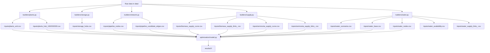

# Coal Retrofit Experiment System

一个面向煤电多路径改造研究的可复现实验系统。这个仓库的目标不是只保存 proposal 或零散脚本，而是把煤电减排改造问题拆成可验证的四层：

1. 原始数据
2. 标准化输入
3. 可重复优化实验
4. 标准化结果与 review 产物

当前研究边界覆盖：

- `retire`
- `CCS`
- `biomass`
- `BECCS`
- `ammonia`
- 可选 `water` 约束
- 基于油气管道走廊先验的 CO2 候选管网

运行前提很简单，但必须满足：

- `data/` 下原始图层与表格已经就位
- 本机有可用的 Gurobi license

## 0. 代码现状核查与本轮改动（2026-09-23）

> 回答作者 2026-09-23 提的四个问题。核查基线为 `feature/industrial-sectors` @ 0f8d999，本节同时记录本轮已改的部分：
> 批 1（工业侧 dataclass 与拆文件、ruff、过时注释与文档、`references.bib`、注释中文化，模型不变）、
> 批 2（五项模型改动，每项一个提交加 toy 测试，见 `tests/test_capex_stock_and_lifetimes.py`；不求解的放在 `tests/test_discount_rate.py`、
> `tests/test_h2_route_multiplier.py`、`tests/test_capex_stock_no_solver.py`）、
> 批 3（无出处参数在代码注释与本节标 `⚠ 假设`，其中 4 项按作者拍板补上出处；数值都不动）、
> 批 4（PR #2 审查时列出的 20 项表外参数逐项查文献，按作者拍板补出处或标 `⚠ 假设` 并附对照值，其中长流程钢氢路线减排比例
> 与合成岛年金寿命改了值，各一个提交加不求解测试（`tests/test_h2_route_abatement.py`、`tests/test_discount_rate.py`）；
> 见 §0.2 末）。
> 标"未改"的地方要不要统一，由作者决定。
> 下面的 §1–§11 停在 2026-09-06（v9 基线入库），其中的 `EXP-*` 实验族、`sequential` 模式、成本键名与
> 规划年份都已过时；`ST_` 系求解树的现状见 [`_indtree/README.md`](_indtree/README.md)。

### 0.1 煤电改造投资与工业改造投资的建模方式是否一样

**计价框架一样**：两侧都按 CLAUDE.md §二.7 计价（一次性 capex + 固定运维 + 按模型自己价格计的能耗 + 期末残值），
目标函数里没有平准化每吨捕集成本（§二.7 禁的就是它）。外购绿氨、工业用氢与封存按外生单价计，这些单价本身含供应方的
资本回收，是买价，不在此列。

| 环节 | 煤电 | 工业 | 代码位置 |
|---|---|---|---|
| capex 何时收 | 计在改造存量的增量上：捕集岛存量 `retrofit_installed`（CCS 与 BECCS 共用）单调不减，CCS↔BECCS 切换不重复付钱；掺烧升级、空冷、原址重建同样按增量 | 计在能力存量的增量上：每条路线一个能力存量 K（Mt/yr；CCS 为捕集能力，H2 为产能），K ≥ 份额 × 当年所需能力，跨期单调；capex = 单位 capex × (K_t − K_{t−1}) | `optimization/model_costs.py:189`（`_one_off_capex`）、`optimization/model_year.py:177`、`optimization/model_industry.py:150-159`、`:208`（`industry_capex_expr`） |
| 改造不可逆 | 捕集份额（CCS + BECCS）锁定，只能随退役减少；固定运维按改造 MW 收、与利用小时无关，装了就一直付，直到退役 | 路线份额与能力存量都跨期单调（工业没有退役）；固定运维按当年运行量收，产量下降时随之下降（见下文"仍不一样"第 5 条） | `optimization/model_linking.py:52-73`、`optimization/model_industry.py:178` |
| 折现 | 一次性项 × 折现因子；年度项 × 折现因子 × 区间年金权重（6%，基年 2025） | 同一套 | `optimization/model_costs.py:44`、`optimization/_shared.py:166` |
| 固定运维 | 捕集岛：学习后 capex × 5%/年，按改造 MW × 份额计 | CCS：capex × 5%/年；H2 路线：capex × 3.5%/年；都按当年运行量（捕集量或产量 × 份额）计，不按能力存量 K 计 | `optimization/plant_matrices.py:124`、`optimization/industry_matrices.py:176`、`:209` |
| 能耗 | 省级煤价 | 再沸器蒸汽按厂址所在省煤价，压缩与辅机按情景电价 | `optimization/plant_matrices.py:65-75`、`optimization/industry_matrices.py:138-143` |
| 学习曲线 | CCS/BECCS capex × `ccs_learning_factor(year)`（15%/倍增，5.6 年倍增一次，参照年 2030） | 工业 CCS 用同一条；H2 路线没有 | `optimization/scenario.py:428`、`optimization/industry_matrices.py:133` |
| 成本乘子 | `ccs_cost_multiplier` 只乘捕集岛 capex 与随之的固定运维 | `industry_cost_multiplier` 只乘捕集 capex 与随之的固定运维；`industry_h2_cost_multiplier` 只乘 H2 路线 capex 与随之的固定运维 | `optimization/plant_matrices.py:110`、`:124`、`optimization/industry_matrices.py:169`、`:204` |
| 期末残值 | 共用 `_add_salvage_credit`，直线折旧到 2070；寿命 CCS 20、掺烧升级 20、空冷 20、管道 30、重建 30 年 | 寿命 CCS 20、H2 路线 25 年 | `optimization/salvage.py:62`、`optimization/model_costs.py:61-83` |
| 到寿命后 | 管道到 30 年退出，可在原址重铺；捕集岛、掺烧升级、空冷、重建过了经济寿命照常运行，不再投资 | 捕集岛、H2 路线同样照常运行 | `optimization/model_linking.py:176-202`；`optimization/salvage.py` 文件头注明为已知简化 |

**本轮已统一的差异**（批 2）：

| 项 | 原来 | 现在 |
|---|---|---|
| (a) 工业 capex 计费基数 | 计在路线份额的增量上：份额不变时产量增长不付钱（电炉钢 2050 年指数 2.10），萎缩后闲置的已建能力被重复收费 | 计在能力存量的增量上（见上表） |
| (b) BECCS 的生物质改造 | 捕集岛之上另收 +1 000 元/kW 的"生物质改造增量"（`beccs_retrofit_capex_cny_per_kw` = 4 500），又按掺烧档位收升级 capex，付了两次 | 删掉 +1 000；BECCS 捕集岛的 capex 与固定运维同 CCS，生物质改造只走档位 capex |
| (c) 管道到寿命 | 每条边的累计新增上限把到寿命的管也算进去：2030 年铺满的边，2060 年管退出后不能再铺 | 累计新增上限、LP 热启动取整、结果表的"铺前存量"都只数在役的管 |
| (d) 成本乘子 | 煤电乘 capex 与每 MWh 附加项（BECCS 的 30 元/MWh 掺烧运维随之变动），不乘固定运维；工业还乘能耗与耗材；工业 H2 路线的乘子同时乘 capex 与锚点溢价（含反推的非氢运行差额） | 两侧都只乘 capex 与随 capex 的固定运维；H2 路线反推的非氢运行差额固定在乘子为 1 时的值，所以锚点氢价下 m = 2 只让 H2 溢价增加钢铁 25%、合成氨 14%、甲醇 2%（原来 +100%） |
| (e) 贴现率 | 绿氨合成岛年金按 8%（`constants.NH3_HB_CAPEX_DISCOUNT_RATE`，烘进 `inputs/ammonia_supply_curve.csv`），模型其余处为 6% | 删掉 8% 常量：模型自己折现与折年金的地方都用情景的 `discount_rate`（缺省 `constants.DEFAULT_DISCOUNT_RATE` = 6%）；读入氨供给曲线时把 CSV 里的合成岛年金换成按它算的（`builders/supply.py:92-129` `reprice_hb_capex`），不重建输入。6% 时氨价每 kg 低 0.0128 USD（≈ 0.09 元；这是按原来的 20 年寿命算的，寿命改为 30 年后合计低 0.0256 USD，见 §0.2）。氨价里的 LCOH 是外生数据（仓库根氨供给曲线的 2030–2060 四个规划年，按供给量加权的总额算占氨价的 77%–86%，合成岛年金按 6%、30 年算），内含的资本成本率不随情景变 |

对已有结果：(a)(b)(c)(e) 改了目标函数或约束，`_indtree/results/` 里在本 PR 合入之前落盘的 `ST_` 结果（含 09-22 到合入之间求的）
与新代码的求解**不得相减**，需重解（CLAUDE.md §二.7、`_indtree/README.md` 已同步）；
(d) 在乘子为 1.0 时不改任何系数，登记表里三个 `ST_` 情景的乘子都是 1.0。toy 上 (a) 使 5 个变体的目标值在 1% gap 内移动
（gap = 0 时不变）；(b) 删掉 BECCS 增量那一列存量，模型变小，gap = 0 时目标值不变；(c) 只让 2060 年的累计新增上限
少了已到期的 2030 年项，解不变；(d) 模型与解逐字节不变；(e) toy 的氨供给表没有合成岛那一列（原样使用），模型逐字节不变，
重算由 `tests/test_discount_rate.py` 覆盖（不求解，不依赖 Gurobi）——真实输入（v7 / v9 / v9.1 都是按 8%、20 年算的 0.0891 USD/kg；
`_indtree/inputs/` 的那张表按 `_indtree/README.md` 是仓库根的副本，但不在 git 里，未核）上每条氨链路的成本都会变。

另外更正了北京煤价：69.4 → 38.6 元/GJ（`optimization/scenario.py:76-79`）。An et al. 2025 SI Table 2 里北京没有煤价，原来的
9.92 $/GJ 是气价；京津两行的气价、生物质价与潜力完全相同，取天津的 5.51 $/GJ。煤电没有北京机组；仓库根
`inputs/industry_hubs.csv` 里只有 1 个北京 hub（水泥 cement_039），它的捕集蒸汽变便宜（`_indtree/inputs/` 的 hub 表不在 git 里，未核）。
查不到省名时用的缺省煤价 38.2 元/GJ（`coal_fuel_cost_cny_per_gj`）原是 30 省的简单平均，含北京误取的 69.4；更正后简单平均
为 37.2，缺省值没有跟改，改标 ⚠ 假设（设定值）。仓库根 hub 表里用到它的原是写作 "Neimenggu" 的 28 个 hub（煤价表里是
"Inner Mongolia"，其中 14 个水泥 hub 的捕集蒸汽因此按 38.2 而不是 17.9 计价）与 4 个西藏 hub（优化侧已剔除）。
2026-09-25（PR #3 合入）起读入时按 `optimization/scenario.py` 的 `PROVINCE_NAME_ALIASES` 把 "Neimenggu" 换成 "Inner Mongolia"，
仍查不到煤价的省名会告警；仓库根输入里已没有 hub 或机组用到缺省煤价（`_indtree/inputs/` 不在 git 里，未核，
看建模时有无这条告警）。

**仍不一样的地方**（未改，大致按对结果的影响排序）：

1. **煤电有几项运维不是"capex 的比例"。** 生物质掺烧、BECCS 的掺烧部分、掺氨按发电量收 30 / 30 / 80 元/MWh
   （`optimization/scenario.py:39-41`），与掺烧档位无关，和 §二.7 字面的"固定运维 = capex 比例/年"不一致；空冷改造只有
   capex（300 元/kW）和背压能耗，没有固定运维项。工业 CCS 另有 15 或 5 元/t 的耗材，煤电 CCS 没有单列。
2. **工业没有退役和搁浅资产。** 煤电有退役份额、搁浅资产（3 500 元/kW × 剩余寿命 / 20 年）和原址重建
   （3 500 × 70% 元/kW）；工业产量完全外生，没有厂址级退役决策（`optimization/industry.py` 模块说明的"已知偏差"）。
3. **工业 H2 路线的 capex 没有学习曲线**（两侧 CCS 都有）。H2 路线的非氢运行差额由文献溢价锚点反推，目标计入
   max(0, 年度成本（含固定运维与购氢）)，见 `optimization/model_industry.py:113` 起。
4. **水费只对煤电收。** 所有情景（含不设水约束的）里，煤电用水都经取水链路计费：到厂单价 4.0 元/m³ + 0.05 元/(m³·km) × 距离
   （`optimization/data_prep.py:334`），乘该厂的"定额 / 耗水"比（截在 0–20，`optimization/data_prep.py:82-91`），再加情景加价
   `water_price_adder_cny_per_m3`（缺省 0）（`optimization/water_access.py:190-207`、`optimization/model_costs.py:163-167`）。
   工业取水（含捕集的 1.65 m³/t CO₂）只进流域上限，不进目标函数。
5. **固定运维的计费基数不同。** 煤电捕集岛按改造容量 MW × 份额计（`optimization/plant_matrices.py:122-133`、
   `optimization/model_costs.py:138-141`），`ST_` 的利用小时从 3 600 h 降到 1 500 h 也照付；工业按当年运行量计
   （`optimization/industry_matrices.py:176`、`:208-210`），`ST_` 下长流程钢 2060 年产量只有 2030 年的 23%，固定运维也跟着降到 23%。
   作者 2026-09-23 决定维持现状，只改正原来"两侧相同"的说法。

### 0.2 各部门、各技术的改造投资有没有来源

口径：只看投资（capex）及随 capex 走的固定运维与寿命。"有出处"= 代码注释或 `docs/` 写明了项目或文献且数值对得上。这些出处
多来自 2026-09-10（煤电）与 09-22（工业）两轮检索，不是每条都核过原文：没核过的在判定里注"原文未核"，出处栏的表号只标原文位置，
不代表核过。"推导"= 由有出处的数反推；"⚠ 假设"= 只有取值理由，没有可查的文献或项目，或推算用了无出处的输入（括号里说明缺在哪里，如无出处、出处不具体、设定值）。
代码注释里同样标了 `⚠ 假设`，可用 `grep -rn "⚠ 假设" src/` 列出。工业侧完整书目见
[`docs/工业部门参数溯源.md`](docs/工业部门参数溯源.md) §八，煤电侧见
[`docs/工业联合减排实现说明.md`](docs/工业联合减排实现说明.md) §9.6 与 `optimization/scenario.py` 的字段注释。
标 `⚠ 假设` 的参数已另做文献检索，按作者拍板补了 4 项出处，数值都不动：40 年设计寿命、掺生物质升级 capex 的水平、
2030 年电价水平落在全文核过的文献区间内；搁浅资产基数 3 500 元/kW 比全文核过的单值（Fan et al. 2023 的 3 636 元/kW）
低 3.7%，3 309–3 636 元/kW 的区间只见于二手转述（以上为批 3）。批 4 查了 PR #2 审查时列出的 20 项表外参数，
结果见本节末的"表外参数"表；查的过程中，下面工业残值寿命与管道 capex 两行的标签也随之改了；表外参数里有两项改了值，见表后。

**煤电**

| 技术 | 参数 | 取值 | 出处 | 判定 |
|---|---|---|---|---|
| CCS | 捕集岛 capex（2030，含压缩） | 3 500 元/kW | 袁家海等 2022（主引）；Lockwood 2018 IEA CCC（上沿）；An et al. 2025 SI Table 7（下沿，2 140 元/kW）；国能锦界 2024 备案。本地 PDF 里另有两个改造 capex，注释原来没提：Fan et al. 2023 SI Table 15 为 4 373 元/kW，Wang et al. 2025 SI Table 3 为 1 559.75（205–2 914.5）$/kW ≈ 10 918（1 435–20 402）元/kW | 有出处（主引、上沿与国能锦界备案原文未核；本地能核的三个值 2 140 / 4 373 / 10 918） |
| | 固定运维 | capex × 5%/年 | An et al. 2025 SI Table 7（5.4%） | 有出处（原文比值 5.4%，取 5%） |
| | 学习曲线 | 15%/倍增，5.6 年倍增 | 学习率：Li et al. 2012、DNV/Gassnova 2020（原文未核）；模型实际用的年降幅按 An et al. 2025 SI Table 7 的 capex 轨迹拟合；Fan et al. 2023 SI Table 15 的改造学习率为 7.25% | 推导（年降幅拟合 An et al. 2025；15% 的出处原文未核） |
| | 能耗惩罚 2030 年水平 | 15%（额外燃料比） | 逐年下降的形状取自 An et al. 2025 SI Table 7；该文 2030 年为 22.2%，15% 这个水平没有来源 | ⚠ 假设（无出处） |
| BECCS | capex | 捕集岛同 CCS；生物质改造走掺烧档位 capex | 2026-09-23 起删掉原 +1 000 元/kW 增量，见 §0.1 (b) | 同 CCS 与掺生物质两行 |
| 掺生物质 | 掺烧升级 capex | 50 万元/MW/档（5 档，满档 2 500 元/kW） | 满档落在 Wang et al. 2025 SI Table 3 的 2 290（985–3 596）元/kW 之内；第 1 档（10% 掺烧）500 元/kW 高于 Fan et al. 2023 SI 式 (S56) 的 15% 掺烧 350 元/kW（Fan 转引 IEA 2019，未核） | 水平有出处；逐档线性的形状 ⚠ 假设（无出处） |
| | 运维 | 30 元/MWh | Wang et al. 2025 SI Table 3 的固定运维 γ2 = 18.85（5.5–32.2）$/(kW·a) ≈ 132 元/(kW·a)，按约 4 400 h 折成每 MWh（对照：同文 SI 第 3 页补缺失值用的全国平均运行小时为 4 611.83 h，转引 Zhou et al.，按它折合 28.6 元/MWh）；同表可变运维 γ3（27.5 $/kW）未计。模型按改造后发电量逐 MWh 收：`ST_` 系的小时轨迹是全机组容量加权 3 600 / 3 100 / 2 000 / 1 500 h，改造机组发电量再乘 `retrofit_cf_boost` 1.15，相当于 4 140 / 3 565 / 2 300 / 1 725 h，γ2 折合 32 / 37 / 57 / 76 元/MWh，30 元/MWh 只收回其 94% / 81% / 52% / 39%；不设小时轨迹时为按分省利用小时、全机组容量加权的 4 643 h × 1.15 ≈ 5 340 h，多收 21% | ⚠ 假设（γ2 有出处，只计 γ2；折算用的 4 400 h 无出处） |
| 掺氨 | 掺烧升级 capex | 2.5 万元/MW/档（满档 50% 掺烧 125 元/kW） | CNERI 2025（90 元/kW，100% 改造另加储存）、Deng et al. 2024（163 元/kW，供应系统）、Li & Li 2022（121.6 元/kW，只算燃烧器，未核实）；三个值口径各异，都不是 50% 掺烧；中位数 121.6，取 125（每档 25 元/kW 的整数倍） | 水平有出处（原文未核）；逐档线性的形状 ⚠ 假设（无出处） |
| | 运维 | 80 元/MWh | — | ⚠ 假设（无出处） |
| 空冷改造 | capex | 300 元/kW | 注释只写"中国文献约 200–400 元/kW，取中点"，未列具体文献或项目 | ⚠ 假设（出处不具体） |
| 退役 | 退役成本 | 450 元/MWh | — | ⚠ 假设（无出处） |
| | 搁浅资产基数 | 3 500 元/kW | Fan et al. 2023 SI Table 15（3 636 元/kW）；电规总院 2020 年水平 3 309–3 636 元/kW（经《中国能源报》转述，未核原文） | 有出处（全文为单值 3 636，取值比原文低 3.7%） |
| | 搁浅资产会计寿命 | 20 年 | — | ⚠ 假设（无出处） |
| | 设计寿命（决定搁浅的剩余寿命与重建时点） | 平均投产年 + 40 年 | Fan et al. 2023 SI Table 10；Wang et al. 2025 正文与 SI Table 3（40 年，区间 25–40）（`builders/plants.py:151-153`） | 有出处 |
| 原址重建 | capex | 新建的 70%（2 450 元/kW） | — | ⚠ 假设（无出处） |
| 各技术 | 残值寿命 | CCS 20、掺烧升级 20、空冷 20、重建 30 年 | 注释给了取值理由，无文献；CCS 的 20 年与工业捕集岛同值，后者的出处（NPC 2019）只含工业 | ⚠ 假设（设定值） |

**工业**（与 `docs/工业部门参数溯源.md` §八逐项核对，数值一致）

| 部门 | 技术 | capex | 出处 | 判定 |
|---|---|---|---|---|
| 水泥 | CCS | 1 150 元/(t CO₂·a) | 中联青州、中联提纯、海螺白马山三个项目公告（990–1 280） | 有出处（项目公告，非同行评审，原文未核） |
| 长流程钢 | CCS | 1 000 元/(t CO₂·a) | 北大宝武案例 2020、IEAGHG 2013/04、包钢、日照 | 有出处（原文未核） |
| 电炉钢 | CCS | 1 150 元/(t CO₂·a) | 直接取水泥值 | ⚠ 假设（无出处；占工业 CO₂ 1.7%） |
| 合成氨 / 甲醇 | CCS | 450 元/(t CO₂·a) | 由延长榆林 105 元/t 全成本反推；但按注释给的输入（扣 110 kWh/t × 0.45 元/kWh 与 5 元/t 耗材，CRF(6%, 20 a) + 5%/a）只得约 368（105 元/t 是否含耗材原文未核，不扣耗材约 405） | ⚠ 假设（按注释输入推得约 368，450 比它高 22%） |
| 长流程钢 | H2-DRI + 电炉 | 3 500 元/(t 粗钢·a) | 宝钢湛江氢基竖炉 18.9 亿元；电炉用 Vogl et al. 2018（欧洲数） | 有出处（原文未核） |
| 合成氨 / 甲醇 | 绿氢接入 | 500 元/(t 产品·a) | 按绿地合成岛 capex 的 8% 设定 | ⚠ 假设（无出处） |
| 各部门 | 固定运维 | CCS 5%/年、H2 3.5%/年 | CCS 借用煤电的 An 2025（5.4%），工业自己的案例更低：宝武 2.9%、IEAGHG 2013/04 钢厂 3.6%；H2 借用 IEAGHG 2013/04 传统钢厂的维护费比例 3.6%，用到 H2-DRI 与化工氢接入上 | 有出处（两项都是借用的比例；宝武、IEAGHG 原文未核） |
| 各部门 | 残值寿命 | CCS 20 年 | NPC 2019 的钢铁、水泥、合成氨、乙醇捕集改造都取 20 年（经 PyPSA technology-data）；DEA 401 的技术寿命是 25 年，宝武案例据原注释也取 25 年（未核） | 有出处 |
| | | H2 路线 25 年 | 开源数据 20–40 年：MPP 钢铁模型的投资周期 20、钢厂寿命 40，DEA 合成氨与甲醇 30 | ⚠ 假设（无直接出处） |

**共用基础设施与燃料**（属投资但不属"改造"）

| 参数 | 取值 | 出处 | 判定 |
|---|---|---|---|
| 管道 capex（2 / 5 / 20 Mtpa 三档） | 2.0 / 3.5 / 8.0 百万元/km | 规模指数 0.6：Knoope et al. 2013；干线基价 40 万元/(Mtpa·km) 取的是"ADB 中国系数"，没能定位出自哪份 ADB 报告，同处引的 Smith et al. 2021 折算只有 23 万且没核到原文；对照：按 Fan et al. 2023 SI 的材料法自算 12–16 万（式中 r 按半径读；原文称其为直径，按直径读是 47–65 万，原式待核；壁厚与保温层为自设），吉林石化—吉林油田一期按规模放大 71 万（只见检索摘要） | 规模指数有出处（原文未核）；干线基价 ⚠ 假设（出处不具体） |
| 沿既有走廊新建的折减 | × 0.97 | NETL 2013 路权公式（经 IEAGHG 2013/18 Table 20 转引）：路权约占 24–40 英寸、100 英里管道 capex 的 2–3%，0.97 = 去掉这部分 | 推导（原文未核） |
| 支线 / 直连 / 海上倍率 | × 1.35 / 2.8 / 1.5 | — | ⚠ 假设（无出处） |
| 封存成本 | 32 元/t | An et al. 2025 SI Table 7：5.0（3.0–8.5）$/t = 35（21–60）元/t | 有出处（原文 35，取值在区间内、低 9%） |
| EOR 抵扣 | 12 元/t | — | ⚠ 假设（无出处） |
| 管道寿命 | 30 年 | — | ⚠ 假设（设定值） |
| 绿氨燃料价里的合成岛 capex | 875 USD/(t·a)，按模型贴现率、30 年折成年金计入氨价 | 注释由"绿地绿氨 1 300–2 000 USD/(t·a) 扣掉电解槽"推得，未列文献（`constants.py:54-65`、`builders/supply.py:76-129`）；2026-09-23 前单用 8%、20 年，见 §0.1 (e) 与下面的表外参数 | ⚠ 假设（出处不具体） |
| 工业用氢运费 | 0.03 元/(kg·km) | 注释称取中国氢能联盟白皮书 2019 的量级，未核到原文 | ⚠ 假设（临时值） |

**表外参数**（不属投资，但进目标函数或约束。PR #2 审查时列出的这 20 项原来既无出处又没标 ⚠，2026-09-23 逐项查过；
欧元汇率只在注释里折算用，一并查了）

出处分三级：本地 PDF 原文；开源数据集（PyPSA technology-data 收录的 DEA 数据表与 NPC 2019、MPP 钢铁模型、REMIND、
美联储 H.10，都从 raw.githubusercontent.com 下载后逐行核过）；只见检索摘要。只见检索摘要的只作对照，不算有出处。
书目键与原文位置写在代码注释里。

| 参数 | 取值 | 出处或对照 | 判定 |
|---|---|---|---|
| 碳价路径（只有 `ST_CP_BASE` 用，另两个 `ST_` 情景置零） | 2030–2060 年 120 / 500 / 880 / 1 260 元/t | 没有文献给出这条直线。对照（只见检索摘要）：ICF 2022 调查对 2030 年的预期 130 元/t；C-GEM（张希良等 2022）2060 年 2 700 元/t 以上 | ⚠ 假设（情景设定） |
| 基准发电效率 | 0.42，全期不变 | Fan et al. 2023 SI 式 (S42)：0.4（2020）→ 0.5（2060），0.42 约为 2028 年值；Wang et al. 2025 SI Table 1 各机型折 0.380–0.431。文献应是供电（净）口径、模型的发电量应属毛口径（都是推断，未核） | 有出处（取常数） |
| 捕集率 | 0.90 | Fan et al. 2023 SI p.43–44；An et al. 2025 SI p.20；Wang et al. 2025 SI Table 5。都是煤电，工业沿用 | 有出处 |
| 每期新增自愿退役上限 | 当年发电量的 15% | 对照：REMIND 中国煤电 2.4%/年（装机口径）；An et al. 2025 不设上限。v9 的结果卡在这个上限上 | ⚠ 假设（无出处） |
| 改造机组发电量倍数 | 1.15 | 数值同 Fan et al. 2023 SI Table 11 的 CCS 类 / 未改造煤电最大容量因子之比 0.69/0.60，但那是上限之比、只有 CCS 类；模型把它当必然多发，生物质、掺氨两列没有出处 | ⚠ 假设（用法无出处） |
| 重建效率 | 0.45 | Wang et al. 2025 SI Table 1 引 NDRC 2022："Ultra-supercritical/ccs" 270 gce/kWh，折 0.455 | 有出处（行名有歧义，NDRC 原文未核） |
| 掺氨用水乘子 | 1.01 | 本地水资源文献与三篇主引文献都没有掺氨耗水数据 | ⚠ 假设（无出处） |
| 绿氨合成岛用电 | 0.74 kWh/kg NH₃ | "合成回路 + 空分"口径的开源数据 0.55–1.17（DEA 103 + DEA 空分；Joule 2018） | ⚠ 假设（无单一出处） |
| 液氨储存附加 | 0.017 USD/kg | 罐价与寿命取自 Morgan 2013（经 PyPSA technology-data）；0.017 相当于常年保有 47–65 天储量，30 天约 0.008–0.011 | ⚠ 假设（储存天数无出处） |
| 合成岛年金寿命 | 30 年（原 20 年） | DEA 103 绿氨合成装置（不含电解与空分）的技术寿命为 30 年，PyPSA technology-data 把这一值同时用于合成回路与空分。原值无出处，找到的 20 年只对应液氨储罐 | 有出处（技术寿命口径。按经济寿命折的线索指向 25 年，只见检索摘要；工业捕集岛取的是 NPC 2019 的 20 年、不是 DEA 401 的技术寿命 25 年，两处口径不同） |
| 贴现率 | 6% | 发改投资〔2006〕1325号：社会折现率 8%，受益期长的项目不低于 6%（只见检索摘要，待作者核原文）；Wang et al. 2025 取 5%，本地 GAMS 模型取 8% | ⚠ 假设（待核规范原文） |
| 美元汇率 | 7.0 元/美元 | 美联储 H.10 2023 年均 7.08；统计局 2023 年 7.0467（只见检索摘要） | 有出处（取整） |
| 欧元汇率（只在注释里折算） | 7.8 元/欧元 | 美联储 H.10 交叉汇率：2018 年 7.81、2024 年 7.79 | 有出处 |
| 工业用水计入流域取水上限的系数 | 1.0 | 定额（GB/T 18916）与流域指标（国办发〔2013〕2号 附件1）都是取水口径。原注释"取水≈耗水"的论证已删：全国工业耗水 / 取水比只有 0.23（Jin et al. 2022） | 有出处（定义性） |
| 氢路线减排比例：长流程钢 | 0.95（原 0.85） | MPP 钢铁模型：100% 绿氢 DRI-EAF 的直接排放 0.0816 t/t 钢；按点源表长流程的 1.8 t/t 算，减排比例 1 − 0.0816/1.8 = 0.955。原值把电炉用的网电排放也算作残余，按直接排放口径那属于电力部门 | 推导（两条前提都未核：点源表的 1.8 为直接排放口径，而同库电炉取 0.4 t/t，是 MPP 电炉直接排放 0.1632 的 2.5 倍；TIMES 钢铁部门的 CO₂ 为直接排放口径，`scripts/build_sector_targets.py` 文件头写能源 + 过程，TIMES 文档未核） |
| 氢路线减排比例：合成氨 | 0.95 | 只去掉过程排放约 0.67，连公用工程一起电气化接近 1.0（只见检索摘要） | ⚠ 假设（无直接出处） |
| 氢路线减排比例：甲醇 | 0.90 | 绿氢耦合煤制甲醇的案例减排约 70%–98%（只见检索摘要） | ⚠ 假设（无直接出处） |
| 高浓度 CO₂ 捕集电耗 | 110 kWh/t | DEA 401 压缩与脱水 0.1 MWh/t（0.09–0.11）；NPC 2019 合成氨捕集改造 0.1 MWh/t | 有出处 |
| 捕集耗材：胺法 | 15 元/t | DEA 401 可变运维 2.5（1.5–3.5）€/t，折 19.5（11.7–27.3）元/t | 有出处（取值在区间内，比中值低 23%） |
| 捕集耗材：仅压缩 | 5 元/t | NPC 2019 与 PyPSA 把这类运维都放在固定运维里 | ⚠ 假设（无出处） |
| 捕集蒸汽锅炉效率 | 0.88 | DEA 311.1a 燃煤蒸汽锅炉年均净效率 89%（87–90.8），新建锅炉口径；存量工业锅炉的运行效率低得多 | 有出处（取值比原文低 1 个百分点） |

另外 3 项在上面的表里：管道干线基价（共用基础设施）、工业捕集岛与氢路线的残值寿命（工业）。

表外参数表里有两项改了值（作者 2026-09-23 拍板）。两项都改了约束或目标函数的系数，所以与 §0.1 的改动一样，本 PR 合入之前
落盘的 `ST_` 结果需重解（CLAUDE.md §二.7、`_indtree/README.md` 已同步）：

- 长流程钢的氢路线减排比例 0.85 → 0.95（`constants_industry.py:363-367`）。仓库根 `inputs/industry_hubs.csv` 的 80 个长流程
  hub 共排放 1 690.7 Mt CO₂/yr（2030 年产量指数 1.0），全部转氢时的减排量从 1 437 升到 1 606 Mt/yr，每吨减排分摊的路线成本
  降 10.5%（`_indtree/inputs/` 的 hub 表不在 git 里，未核）。`scripts/` 与 `_indtree/scripts/` 下的
  `plot_ind_fig1_joint_allocation.py` 也读这个常量，但它画的 `IND_` 情景已不在登记表，脚本在 `_require_registered` 处停下；
  按脚本的提示到 cf073be 的副本里重画，用的是那里的 0.85，不受这次改动影响。toy 没有长流程 hub，模型逐字节不变；
  `tests/test_h2_route_abatement.py` 覆盖（不求解）。
- 合成岛年金寿命 20 → 30 年（`constants.py:65`）。6% 时年金 0.0763 → 0.0636 USD/kg；仓库根 `inputs/ammonia_supply_curve.csv`
  里模型用到的 2030、2040、2050、2060 四个规划年（30 704 行），节点出厂氨价比 §0.1 (e) 之后（6%、20 年）的中位数低 2.2%
  （0.9%–4.7%）；连同 §0.1 (e)，比 CSV 里按 8%、20 年算的 0.0891 低 0.0256 USD/kg（`_indtree/inputs/` 的那张表不在 git 里，
  未核）。toy 的氨供给表没有合成岛那一列，模型逐字节不变；`tests/test_discount_rate.py` 覆盖（不求解）。

小结：

- 工业 CCS 的 capex：水泥、长流程钢有中国项目数据；化工的 450 由全成本反推，但按注释给的输入扣耗材后只得约 368，改标假设；
  电炉钢是假设。
- 煤电的 CCS 捕集岛、掺氨升级、搁浅资产基数、40 年设计寿命有文献（前两项原文未核），掺生物质升级只有水平有文献；**空冷、
  退役成本、搁浅会计寿命、原址重建这几项投资参数与掺生物质、掺氨的逐档形状没有可查出处**，其中多数在 `docs/算法实现审查_20260910.md` §四已列出。
- 表外、同样进目标函数的参数：PR #2 审查时列出的 20 项见上面的"表外参数"表；基线非燃料运维 80 元/MWh、电价的逐年上涨路径
  440 / 490 / 550 元/MWh（2030 年的 400 元/MWh 对照 Wang et al. 2025 SI Table 3 的 420（336–504）元/MWh，已补出处；这个对照只对应
  煤电售电价，同一电价也用作工业捕集压缩与辅机的购电价，那一用途没有对照）、
  取水与输水 4.0 元/m³ 与 0.05 元/(m³·km) 在代码注释里原来就标了 `⚠ 假设`。全仓库没有价格指数折算，IEAGHG 的 2010 年美元、
  Lockwood 的 2016 年人民币都按原值用。
- 书目：An et al. 2025 与 Knoope et al. 2013 已在批 1 补进 `references.bib`（`an2025repositioning`、`knoope2013review`）。
  `wang2025reducing` 按本地 PDF 更正：页码 475 → 241，第五作者 Ma, Weiming → Ma, Weidong，并补 `and others`；
  代码注释里的"Wang & Cai 2024""Wang et al. 2024"就是这篇（DOI 10.1038/s41467-024-55332-5，2025 年刊出）。
  查表外参数时又补了 10 条：Jin et al. 2022（`jin2022climate`），DEA 三张数据表（`dea_renewable_fuels`、`dea_ccts`、
  `dea_iph`），NPC 2019（`npc2019dualchallenge`），MPP 钢铁模型（`mpp_steel`），Morgan 2013（`morgan2013ammonia`），
  REMIND（`remind`），PyPSA technology-data（`pypsa_techdata`），美联储 H.10（`fred_h10`）。
- CLAUDE.md §二.7 说"参数出处在 `docs/工业部门参数溯源.md` §八"，但 §八 只有工业；煤电和管网的出处只在代码注释与
  `docs/工业联合减排实现说明.md` §9.6。

上一版列出的 5 处文档与代码不一致已在批 1 修正：实现说明 §3.3、§四.3（工业按链路买氢）、§9.4（再沸器蒸汽 CO₂ 计入残余）
加了"已被取代"注记并保留原文，§9.3 I8 改指 §9.9，`docs/工业部门参数溯源.md` §8.3 的锚点引用改为"实现说明 §3.3"，
`optimization/scenario.py` 的生物质收购价注释改为与 `constants.BIOMASS_COST_BASE`（20 元/GJ）一致。

### 0.3 注释有没有改成中文

**已全部改成中文**（批 1）。只动注释与 docstring：代码、变量名、日志与异常字符串、文献题名与原文引文保持原样；翻译前后 toy 上
15 个变体的模型与解逐字节一致。审查时又查出批 1 漏掉的 4 处，已在修复提交里改掉：`optimization/data_prep.py` 一条整句英文的
docstring（夹着"用水总量控制指标"几个汉字，统计时被记成中文行）、`constants_industry.py` 一行英文书目键、
`optimization/salvage.py` 两处反引号里的英文短语。终审又查出 6 处 1–3 个词的英文短语，也已改掉：`constants_water_quota.py`
的文号、`scenario.py` 的英文节名、`constants_industry.py` 两处、`optimization/results.py` 与 `tests/test_capex_stock_no_solver.py`
各一处。复核又查出 7 处单词或短语，也已改掉：`optimization/` 下的 `industry.py`、`industry_matrices.py`、`_shared.py`、`scenario.py`，
`builders/` 下的 `storage.py`、`supply.py`，以及 `constants_industry.py`，各一处。

统计口径：注释与 docstring 行（不计 `noqa` / `pragma` / `type:` 行），含汉字记中文，否则含 3 个以上连续字母记英文；一个文件
中文行 ≥ 70% 记"中文为主"，≤ 30% 记"英文为主"。含汉字的行一律记中文，夹在里面的英文句子统计不出来，所以另按"连续 4 个以上
英文单词"逐行筛过一遍，终审又按"连续 2 个以上"筛了一遍：剩下的是文献作者、刊名与机构名、题名、原文引文、标识符列表、公式与单位，
以及英文术语与缩写（括注的如"（steam cycle）""（firm yield）"，未括注的如 CCS、capex、vs），保留。

| `src/coal_retrofit/` | 本轮前（0f8d999） | PR #2 合入时（b5cd28c） |
|---|---|---|
| 文件数 | 55 | 58（工业侧拆出 3 个） |
| 中文行 / 英文行 | 449 / 1 610（22%） | 1 924 / 80（96%） |
| 中文为主 / 混合 / 英文为主 / 无注释 | 15 / 3 / 24 / 13 | 45 / 0 / 0 / 13 |

- 剩下的 80 行不含汉字，都是公式、Google 风格段名（Args / Returns / Raises）、标识符、网址与文献题名，没有英文叙述。
- `tests/`：中文 26 / 英文 105（20%）→ PR #2 合入时 196 / 5（98%）。
- 13 个无注释文件（`experiments/` 全部、`reporting/core.py`、`paths.py`、`spatial.py` 等）没有补注释；
  `scripts/` 与 `_indtree/scripts/` 不在本轮范围，仍约 26–27% 中文。

### 0.4 重构后的代码清楚了吗

**求解主干与工业侧都清楚了，外围还没动。**

- `optimization/solver.py` 只管顺序与求解参数，按 `model_index` → `model_year`（资源平衡在 `model_resources`）
  → `model_linking` → `model_costs` → `salvage` → `solver_extract` 一步一个文件。
- 逐年系数与变量都是 dataclass：煤电 `YearData`、工业（批 1）`IndustryYearData` / `IndustryPayload` 冻结；煤电
  `YearPayload`（`optimization/year_types.py`）不冻结，因为成本表达式由 `add_year_costs` 事后写入，`_add_salvage_credit`
  还要再补残值项。原来工业侧的 `dict[str, Any]` 和两处含义不同的 `annual_cost_cny` 键已去掉。
- 原 `optimization/industry.py`（664 行）按职责拆为 `industry_inputs.py`（输入与氢链路，183 行）、
  `industry_matrices.py`（逐年系数，263 行）、`model_industry.py`（变量、约束与 capex 表达式，235 行），
  `industry.py` 只留模块说明与再导出（104 行）；行数均为 PR #2 合入时。
- 结果按表拆为 `results_plant` / `results_network` / `results_resources` / `results_industry`。
- 批 1 前后，toy 上 15 个变体的模型与解逐字节一致。

| 指标 | 09-22 拆分前（ba967c1） | 上一轮重构前（a5cb31a） | 本轮前（0f8d999） | PR #2 合入时（b5cd28c） |
|---|---|---|---|---|
| 超 800 行的文件 | 4 | 2 | 0 | 0 |
| 超 400 行的文件 | 13 | 11 | 10 | 7 |
| 最长函数 | 1 198 行（`_solve_joint_multi_period`） | 357 行（`add_year_block`） | 202 行（`build_ammonia_supply_dataframe`） | 202 行（同左） |
| ≥ 80 行的函数 | 25 / 320 | 30 / 332 | 30 / 341 | 29 / 343 |
| mypy 错误（`--ignore-missing-imports`） | 397 | 406 | 175 | 173 |
| ruff 0.15.8（默认规则 E4/E7/E9/F，`src/`） | — | — | 7 | 0 |

PR #2 合入时还不清楚的地方（只报告，未改）：

1. **仍超 400 行的 7 个文件**：`builders/water.py` 736、`constants_industry.py` 609、`optimization/scenario.py` 602、
   `builders/supply.py` 600、`builders/network.py` 559、`reporting/core.py` 501、`optimization/constraints.py` 449。
2. **≥ 80 行的函数还有 29 个**：最长的是 `build_ammonia_supply_dataframe` 202 行、`build_runtime_network` 188 行、
   `build_water_availability_dataframe` 163 行；`industry_year_data` 140 行、`_one_off_capex` 111 行也没有拆。
3. **mypy 剩 173 个错误**，集中在 `builders/network_repair.py`（32）、`optimization/network.py`（19）、
   `optimization/model.py`（14）、`builders/network.py`（13），多为 pandas / gurobipy 存根的标注问题。
4. **ruff**：`src/` 0 条；`tests/` 19 条 E402（先 `importorskip` 再导入的固定写法）；两棵 `scripts/` 合计 329 条，未动。

## 1. 这个项目回答什么问题

项目围绕一个统一问题展开：

在既定减排目标下，煤电机组在 `retire / CCS / biomass / BECCS / ammonia` 五条路径之间如何配置，空间上如何与生物质、绿氨、水资源和封存汇耦合，以及这些结论对管网、封存口径、水情景和关键参数是否稳健。

它不是一个通用能源系统模型，而是一个为这篇研究专门收束过边界的实验系统。

## 2. 当前实现到了哪一步

目前仓库已经具备以下能力：

- `Phase A` 预处理流水线
- 全部实验 ID 注册与统一运行
- 基于 `gurobipy` 的全局多期多路径优化器
- 基于油气走廊先验的运行时 CO2 网络装配
- 标准化结果落盘
- markdown 摘要与出图故事线

当前 `plan.md` 中定义的实验族已经在代码中注册：

- `EXP-B1` 到 `EXP-B5`
- `EXP-W1` 到 `EXP-W4`
- `EXP-R1` 到 `EXP-R6`

需要注意，较早期归档结果里既有“单年滚动”口径；当前代码默认的 `joint` 已经升级为“2040-2050-2060 一次性联立”的全局多期求解。

如果只想先理解“系统怎么工作”，一次实验可以压缩成这 5 步：

1. `run_phase_a.py`
   把原始数据物化成 `inputs/`
2. `catalog.py`
   选择实验家族和 scenario
3. `scenario mapping`
   把实验参数映射成统一优化参数
4. `optimization/model.py`
   求一个全局多期 `joint` 或逐年 `sequential` 模型
5. `artifacts/`
   把结果写成按年长表和摘要

## 3. 目录结构

```text
coal-retrofit/
├─ data/                       # 原始外部数据
├─ inputs/                     # Phase A 生成的标准化输入
├─ intermediate/               # 预留中间产物
├─ reference/                  # 外部参考资料与 GMS 参考模型
├─ results/                    # 实验结果、reviews、figure plans
├─ scripts/                    # 薄 CLI 入口
├─ src/
│  └─ coal_retrofit/
│     ├─ artifacts.py          # 统一 artifact 写入
│     ├─ constants.py          # 稳定常量
│     ├─ paths.py              # 路径发现与文件定位
│     ├─ spatial.py            # GIS / raster 通用工具
│     ├─ builders/             # 输入构建模块
│     ├─ experiments/          # 实验注册、运行、结果契约
│     ├─ optimization/         # 优化模型、运行时网络、scenario 映射
│     ├─ pipelines/            # Phase A 等编排层
│     └─ reporting/            # 结果摘要与 markdown 输出
├─ plan.md
├─ research-proposal.md
├─ project-architecture.md
├─ notes.md
└─ pyproject.toml
```

## 4. 安装与环境

### 4.1 Requirements

- Python `>= 3.11`
- 推荐 Windows PowerShell

### 4.2 主要依赖

当前 [pyproject.toml](/C:/Users/admin/OneDrive/文档/000.%20Paper%20work/煤电改造claude/pyproject.toml) 中的核心依赖包括：

- `gurobipy`
- `geopandas`
- `networkx`
- `numpy`
- `openpyxl`
- `pandas`
- `pyproj`
- `rasterio`
- `scikit-learn`
- `scipy`

运行优化实验还需要本机可用的 Gurobi license。

### 4.3 安装

```powershell
python -m pip install -U pip
python -m pip install -e .
```

如果不做 editable install，也至少要把依赖装齐。

## 5. 数据利用流程

这一部分是项目最重要的说明。核心原则是：

- 原始数据只放在 `data/`
- 一切模型输入都必须先显式物化到 `inputs/`
- 优化器不直接吃原始图层，只吃标准化输入表

### 5.1 数据流总览



### 5.2 原始数据到输入表的具体流程

#### A. 煤电机组数据

实现位置：
[plants.py](/C:/Users/admin/OneDrive/文档/000.%20Paper%20work/煤电改造claude/src/coal_retrofit/builders/plants.py)

原始来源：

- `data/GEM_with_Cooling_Technology_July2025.xlsx`

处理逻辑：

1. 读取原始机组表
2. 统一列名口径
3. 仅保留 `operating` 机组
4. 提取标准字段：
   `unit_id / plant_site / capacity_mw / commission_year / combustion / cooling_technology / province / latitude / longitude`
5. 输出 [plants_unit.csv](/C:/Users/admin/OneDrive/文档/000.%20Paper%20work/煤电改造claude/inputs/plants_unit.csv)

随后对机组坐标做 `KMeans` 聚类，生成 `100 / 200 / 300` 三档 hub：

- [plants_hub_100.csv](/C:/Users/admin/OneDrive/文档/000.%20Paper%20work/煤电改造claude/inputs/plants_hub_100.csv)
- [plants_hub_200.csv](/C:/Users/admin/OneDrive/文档/000.%20Paper%20work/煤电改造claude/inputs/plants_hub_200.csv)
- [plants_hub_300.csv](/C:/Users/admin/OneDrive/文档/000.%20Paper%20work/煤电改造claude/inputs/plants_hub_300.csv)

每个 hub 保留：

- 容量总和
- 机组数
- 平均投运年份
- 主导燃烧方式
- 主导冷却方式
- 重心坐标

#### B. 封存汇与注入能力

实现位置：
[storage.py](/C:/Users/admin/OneDrive/文档/000.%20Paper%20work/煤电改造claude/src/coal_retrofit/builders/storage.py)

目标：

- 把 DSA / EOR 储量与注入能力整理成统一的 storage hub 表

输出：

- [storage_hubs.csv](/C:/Users/admin/OneDrive/文档/000.%20Paper%20work/煤电改造claude/inputs/storage_hubs.csv)

关键字段包括：

- `storage_dsa_mt`
- `storage_eor_mt`
- `storage_all_mt`
- `injectivity_dsa_avg_mtpa`
- `injectivity_eor_avg_mtpa`

这些字段后续直接进入优化器的 `capacity` 与 `injectivity` 约束。

#### C. CO2 候选管网

实现位置：
[network.py](/C:/Users/admin/OneDrive/文档/000.%20Paper%20work/煤电改造claude/src/coal_retrofit/builders/network.py)
[network.py](/C:/Users/admin/OneDrive/文档/000.%20Paper%20work/煤电改造claude/src/coal_retrofit/optimization/network.py)

原始来源：

- `gas_pipelines.shp`
- `oil_pipeline.shp`

预处理逻辑分两层：

1. `builders/network.py`
   把油气管道矢量化为主走廊图，生成：
   - corridor nodes
   - corridor edges
   - hub-to-corridor branches
   - corridor-to-storage branches
   - source/sink triangulation candidate edges

2. `optimization/network.py`
   在求解前把预处理候选图装配成运行时图；
   如果某些 hub 或 storage 没有接上，会追加 `runtime` fallback edge 保证可达。

标准化输出：

- [pipeline_nodes.csv](/C:/Users/admin/OneDrive/文档/000.%20Paper%20work/煤电改造claude/inputs/pipeline_nodes.csv)
- [pipeline_candidate_edges.csv](/C:/Users/admin/OneDrive/文档/000.%20Paper%20work/煤电改造claude/inputs/pipeline_candidate_edges.csv)

关键字段包括：

- `length_km`
- `corridor_type`
- `existing_corridor_flag`
- `edge_class`
- `source`
- `year_basis`

#### D. 生物质供给曲线

实现位置：
[supply.py](/C:/Users/admin/OneDrive/文档/000.%20Paper%20work/煤电改造claude/src/coal_retrofit/builders/supply.py)

原始口径：

- 生物质图层单位：`GJ/m^2`

处理逻辑：

1. 读入生物质栅格
2. 计算每一行真实面积
3. 对每个像元做：
   `biomass_GJ_pixel = biomass_GJ_per_m2 * pixel_area_m2`
4. 将有资源的像元按较粗空间网格聚合成 `biomass node`
5. 对每个 plant hub，按缓冲半径匹配可达的 biomass node
6. 为每个 `hub-node` 生成一条候选供给 link，后续在优化中由多个 hub 竞争共享 node 资源

输出：

- [biomass_supply_curve.csv](/C:/Users/admin/OneDrive/文档/000.%20Paper%20work/煤电改造claude/inputs/biomass_supply_curve.csv)
- [biomass_supply_links_100.csv](/C:/Users/admin/OneDrive/文档/000.%20Paper%20work/煤电改造claude/inputs/biomass_supply_links_100.csv)
- [biomass_supply_links_200.csv](/C:/Users/admin/OneDrive/文档/000.%20Paper%20work/煤电改造claude/inputs/biomass_supply_links_200.csv)
- [biomass_supply_links_300.csv](/C:/Users/admin/OneDrive/文档/000.%20Paper%20work/煤电改造claude/inputs/biomass_supply_links_300.csv)

当前 README 应特别说明的研究边界：

- 不考虑土地竞争
- 质量换算使用 `15 GJ/t biomass`
- 成本口径以 `CNY/GJ` 表示
- 供给约束发生在共享 `biomass node`，不是省级总量
- 竞争关系通过 `hub -> biomass node` link flow 显式表示

#### E. 绿氢 / 绿氨供给曲线

实现位置：
[supply.py](/C:/Users/admin/OneDrive/文档/000.%20Paper%20work/煤电改造claude/src/coal_retrofit/builders/supply.py)

原始口径：

- `h2_production = kg H2/yr/m^2`
- `lcoh = USD/kg H2`

处理逻辑：

1. 按像元面积把氢产量转为像元年产氢量：
   `h2_kg_pixel = h2_kg_per_yr_per_m2 * pixel_area_m2`
2. 将资源像元按年份、资源类型、电解技术和粗空间网格聚合成 `ammonia node`
3. 在每个节点内用产量加权 `lcoh` 计算氢成本
4. 折算为氨：
   `nh3_supply_kg = h2_supply_kg / 0.176`
5. 每个 plant hub 只连接距离最近的若干个 ammonia node
6. 当前 builder 里写入氨成本下界：
   `nh3_cost_lb = h2_cost_component + storage_adder + transport_adder`
7. 同时保留 `HB` 电耗字段，供后续进一步货币化

输出：

- [ammonia_supply_curve.csv](/C:/Users/admin/OneDrive/文档/000.%20Paper%20work/煤电改造claude/inputs/ammonia_supply_curve.csv)
- [ammonia_supply_links_100.csv](/C:/Users/admin/OneDrive/文档/000.%20Paper%20work/煤电改造claude/inputs/ammonia_supply_links_100.csv)
- [ammonia_supply_links_200.csv](/C:/Users/admin/OneDrive/文档/000.%20Paper%20work/煤电改造claude/inputs/ammonia_supply_links_200.csv)
- [ammonia_supply_links_300.csv](/C:/Users/admin/OneDrive/文档/000.%20Paper%20work/煤电改造claude/inputs/ammonia_supply_links_300.csv)

关键点：

- 年份来自 `data/H2/<year>/`
- 成本年份直接等于文件夹年份
- 绿氨运输在当前模型中只作为低阶加项，而不是独立网络
- 供给约束发生在共享 `ammonia node`，不是全国市场
- 多个 hub 会竞争同一个 ammonia node 的当年可供量

#### F. 水约束输入

实现位置：
[water.py](/C:/Users/admin/OneDrive/文档/000.%20Paper%20work/煤电改造claude/src/coal_retrofit/builders/water.py)

原始来源：

- `data/water/*.nc`

处理逻辑：

1. 解析水情景文件名，提取：
   `hydrology / gcm / ssp / socioeconomics / variable / period`
2. 形成情景清单：
   [water_scenarios.csv](/C:/Users/admin/OneDrive/文档/000.%20Paper%20work/煤电改造claude/inputs/water_scenarios.csv)
3. 形成基准情景表：
   [water_base.csv](/C:/Users/admin/OneDrive/文档/000.%20Paper%20work/煤电改造claude/inputs/water_base.csv)
4. 在中国范围内提取 0.5° 水文格网节点：
   [water_nodes.csv](/C:/Users/admin/OneDrive/文档/000.%20Paper%20work/煤电改造claude/inputs/water_nodes.csv)
5. 按规划窗口计算各节点年度可用水量：
   [water_availability.csv](/C:/Users/admin/OneDrive/文档/000.%20Paper%20work/煤电改造claude/inputs/water_availability.csv)
6. 为每个 hub 生成本地 water-node 可达边：
   [water_supply_links_200.csv](/C:/Users/admin/OneDrive/文档/000.%20Paper%20work/煤电改造claude/inputs/water_supply_links_200.csv)

这里需要注意：

- 当前水约束已经改成“grid water node + hub access link + shared node competition”
- 需求侧水强度现在采用 `consumption` 口径，冷却方式按煤电 hub 的 `dominant_cooling_technology` 映射
- 这仍然是厂址局地耗水 proxy，不是完整的流域调度模型

### 5.3 Phase A 总调度

统一入口在：
[phase_a.py](/C:/Users/admin/OneDrive/文档/000.%20Paper%20work/煤电改造claude/src/coal_retrofit/pipelines/phase_a.py)

执行顺序是：

1. plants unit
2. plant hubs
3. storage hubs
4. network inputs
5. supply inputs
6. water inputs

运行命令：

```powershell
python scripts/run_phase_a.py
```

### 5.4 输入在模型里的抽象角色

从优化器视角看，Section 5 的所有输入最终会被抽象成四类对象：

- `decision hubs`
  煤电 plant hubs，是路径选择发生的位置
- `resource nodes`
  biomass / ammonia / water 的共享供给节点，是资源竞争发生的位置
- `storage hubs`
  CO2 最终注入的位置
- `candidate edges / pairs`
  CO2 可走的候选边，以及 hub-storage 配对

所以这些输入最终都在回答三个问题：

- 哪些 hub 可以改造成哪条路径
- 这些 hub 可以从哪些共享资源节点取量
- 捕集后的 CO2 可以沿哪些候选边送到哪些 storage hub

## 6. 算法实现细节

这一部分对应优化核心：
[model.py](/C:/Users/admin/OneDrive/文档/000.%20Paper%20work/煤电改造claude/src/coal_retrofit/optimization/model.py)

### 6.1 模型类型

当前实现不是单一一种模型，而是两条求解路径：

- `joint`
  全局多期 `MILP`
- `sequential`
  逐年滚动的 `LP + MILP` 对照解

其中：

- `joint` 会把全部规划年份放进同一个 Gurobi 模型里一次性联立求解
- `sequential` 仍保留为对照模式，先定路径，再在每个年份单独配网络

这意味着当前已经有显式的管网离散选边，但还不是完整工程级网络设计模型；例如还没有离散管径库、机组启停、施工停机与时序运行约束。

### 6.2 Scenario 映射

实验层先注册 scenario，再由优化层做参数映射。

实现位置：
[catalog.py](/C:/Users/admin/OneDrive/文档/000.%20Paper%20work/煤电改造claude/src/coal_retrofit/experiments/catalog.py)
[model.py](/C:/Users/admin/OneDrive/文档/000.%20Paper%20work/煤电改造claude/src/coal_retrofit/optimization/model.py#L258)

例如：

- `EXP-B2` 通过 `pathway_disable` 做路由删除
- `EXP-B3` 切换 `solve_mode = joint / sequential`
- `EXP-B4` 改 `hub_count`
- `EXP-B5` 改 `storage_scope / injectivity_multiplier`
- `EXP-W*` 改 `water_mode / water_multiplier / forced_cooling_technology`
- `EXP-R1` 改成本乘子
- `EXP-R2` 改 `capture_rate / biomass_blend_ratio / ammonia_blend_ratio`
- `EXP-R4` 改时间离散方式

### 6.3 决策变量

全局多期联合模型 `_solve_joint_multi_period(...)` 中，每个规划年份都会生成一组变量。核心变量包括：

- `share[h, p]`
  每个煤电 hub 在五条路径上的分配份额

- `ship_mt[y, pair]`
  年份 `y` 下，hub 到 storage pair 的 CO2 运输量

- `build_edge[y, edge] ∈ {0,1}`
  年份 `y` 下，该候选边是否被选中扩容

- `new_cap_mtpa[y, edge]`
  年份 `y` 下，该候选边新增容量

- `biomass_flow_gj[y, link]`
- `ammonia_flow_kg[y, link]`
- `water_flow_m3[y, link]`
  三类共享资源在 `hub -> resource node` 连接边上的流量

- `target_shortfall_mt[y]`
  年份 `y` 的减排目标缺口 slack

- `biomass_slack_gj`
- `ammonia_slack_kg`
- `water_slack_m3`
- `injectivity_slack_mtpa`
- `storage_slack_mt`
- `edge_slack_mtpa`

这些 slack 都被高惩罚系数压制，用来诊断不可行性。

### 6.4 目标函数

目标函数最小化以下成本之和：

- 路径固定成本
- 捕集成本
- 生物质成本
- 氨成本
- 运输与封存成本
- 管道扩容 CAPEX
- 各类 slack penalty

在代码里分别写成：

- `fixed_cost`
- `capture_cost`
- `biomass_cost`
- `ammonia_cost`
- `ship_cost`
- `pipe_capex`
- `slack_cost`

在 `joint` 多期模型里：

- 运行类成本按对应规划区间长度加权
- 管网扩容 CAPEX 保持为投资项，不再额外按区间重复计费
- 总目标是所有规划年的加权成本之和

### 6.5 主要约束

联合模型里已经实现的关键约束包括：

1. hub 路径份额守恒
   `sum_p share[h,p] = 1`

2. 减排目标
   总减排量加目标 slack 不得低于该年目标

3. CO2 运输配对守恒
   每个 hub 捕集量必须经 hub-storage pair 发出

4. 注入能力约束
   每个 storage hub 的年注入量不能超过 `injectivity_mtpa`

5. 累计封存容量约束
   跨期累计注入量不能超过 `available_capacity_mt`

6. 边容量约束
   每条 edge 的流量不能超过：
   `existing stock + new capacity + edge slack`

7. 管网选边二进制约束
   `build_edge[y,e] ∈ {0,1}`
   且：
   `new_cap[y,e] <= max_new[e] * build_edge[y,e]`
   `new_cap[y,e] >= min_build[e] * build_edge[y,e]`

   这保证一条边如果被选中扩容，就至少形成一条标准管道量级的有效新增能力，而不是任意小的连续增量。

8. 生物质供给约束
   每个 hub 的 biomass demand 必须由 `hub -> biomass node` flow 满足；
   每个 biomass node 的总流出不得超过该 node 的 `available_gj`

9. 绿氨供给约束
   每个 hub 的 ammonia demand 必须由 `hub -> ammonia node` flow 满足；
   每个 ammonia node 的总流出不得超过该 node 当年的 `nh3_supply_kg_per_year`

10. 水约束
   每个 hub 的 cooling-water demand 必须由 `hub -> water node` flow 满足；
   每个 water node 的总耗水不得超过该 node 当年的 `available_water_m3`

11. 跨期累计管网容量约束
   后续年份可用边容量等于：
   `initial stock + 截至 year y 仍在寿命内的新增容量`（`y − 建成年 < pipeline_lifetime_years`）；
   累计新增上限同样只数在役的管，到寿命的管可在原址重铺（2026-09-23 起）

12. 跨期累计封存容量约束
   截至年份 `y` 的累计注入量不能超过初始可用封存容量

### 6.6 两种求解模式

#### Joint mode

实现位置：
[model.py](/C:/Users/admin/OneDrive/文档/000.%20Paper%20work/煤电改造claude/src/coal_retrofit/optimization/model.py#L859)

特点：

- 一次性联立全部规划年份
- 同时决定路径份额、CO2 去向和边扩容
- 通过累计扩容和累计封存约束，把年份之间真正耦合起来
- 是当前默认模式

#### Sequential mode

实现位置：
[model.py](/C:/Users/admin/OneDrive/文档/000.%20Paper%20work/煤电改造claude/src/coal_retrofit/optimization/model.py#L1171)

逻辑：

1. 先在简化 transport cost 下做 path-stage
2. 再固定捕集量做 network-stage

这个模式主要用于 `EXP-B3` 对照，用来回答“全局联合优化值不值”。

### 6.7 时间维度处理

默认是稀疏规划点：

- `2040`
- `2050`
- `2060`

但 `EXP-R4` 已支持更细时间表达：

- `three_stage`
- `annual_static`
- `annual_rolling`

当前时间维度有两种解释：

- 在 `joint` 中，`2040/2050/2060` 会被一次性联立进同一个模型
- 在 `sequential` 中，仍通过 `SolveState` 做逐年滚动传递

`SolveState` 有两个作用：

- 作为模型初始条件，提供既有边容量增量 stock 和初始剩余储量
- 在 `sequential` 中，继续承担逐年滚动传递

### 6.8 网络实现细节

运行时网络在：
[optimization/network.py](/C:/Users/admin/OneDrive/文档/000.%20Paper%20work/煤电改造claude/src/coal_retrofit/optimization/network.py)

它做了三件事：

1. 读取预处理好的 `pipeline_nodes.csv` 和 `pipeline_candidate_edges.csv`
2. 构造 `networkx` 图并计算最短路径 pair
3. 为每个 hub 保留 top-k storage pair

当前还有一个重要保底机制：

- 如果某个 hub 或 storage 在预处理图中不可达，会创建 `runtime_direct_fallback` 边

这保证实验不会因为局部图断裂而直接不可行，但也意味着：

- 当前网络结果适合做研究分析
- 不应直接等同于最终工程选线

### 6.9 结果表怎么来的

优化器对大多数 scenario 固定输出以下 artifact：

- `overview.csv`
- `parameters_snapshot.csv`
- `pathway_shares.csv`
- `province_pathways.csv`
- `network_edges.csv`
- `storage_utilization.csv`
- `resource_use.csv`
- `cost_breakdown.csv`
- `sanity_checks.csv`
- `summary.md`

例外是 `EXP-R6`，它只输出 `assumption_matrix.csv` 和 `summary.md`。

这些表分别回答：

- 总体求解状态与总成本
- 参数快照
- hub 级路径配置
- 省级路径聚合
- 边流量、是否被选中扩容、扩容量
- storage 使用与剩余容量
- 共享供给节点层面的资源使用与竞争
- 成本分解
- 异常诊断
- 人读摘要

其中 `network_edges.csv` 里最值得关注的新列是：

- `build_selected`
  该边在本年是否被二进制选中扩容
- `edge_active`
  该边在本年是否承流或新增了容量

## 7. 实验系统

### 7.1 实验注册

实现位置：
[experiments](/C:/Users/admin/OneDrive/文档/000.%20Paper%20work/煤电改造claude/src/coal_retrofit/experiments)

实验不是写死在单独脚本里，而是由 registry 管理。这样新增实验时通常只需要：

1. 在 catalog 中增加 scenario
2. 在 scenario 映射层添加参数解释
3. 复用同一个求解器和结果契约

### 7.2 统一运行

运行入口：
[run_experiment.py](/C:/Users/admin/OneDrive/文档/000.%20Paper%20work/煤电改造claude/scripts/run_experiment.py)

示例：

```powershell
python scripts/run_experiment.py --experiment-id EXP-B1 --output-dir results/baseline
python scripts/run_experiment.py --experiment-id EXP-W4 --output-dir results/water
python scripts/run_experiment.py --experiment-id EXP-R1 --output-dir results/robustness
```

当前实验族如下：

- `EXP-B1`
  五路径全局多期基准解

- `EXP-B2`
  删路径 / 单路径对照

- `EXP-B3`
  `joint` 与 `sequential` 对照

- `EXP-B4`
  `100 / 200 / 300` hub 聚类敏感性

- `EXP-B5`
  `DSA only / DSA+EOR / injectivity discount`

- `EXP-W1`
  冷却方式下的基准水约束

- `EXP-W2`
  极端水情景扫描

- `EXP-W3`
  BECCS 水压力

- `EXP-W4`
  `no_water / base_water / high_water_stress`

- `EXP-R1`
  成本敏感性矩阵

- `EXP-R2`
  路径参数敏感性矩阵

- `EXP-R3`
  结构性假设检查

- `EXP-R4`
  时间离散方式对照

- `EXP-R5`
  sanity checks

- `EXP-R6`
  假设敏感性矩阵

按问题类型看，这些实验族大致可以理解成：

- `EXP-B*`
  基准解、路径消融、联合与顺序对照、聚类敏感性、封存口径敏感性
- `EXP-W*`
  冷却方式、水情景和水强度边界
- `EXP-R*`
  成本、路径参数、结构性假设和时间离散方式稳健性

### 7.3 结果落盘结构

每次实验会落到：

```text
results/<family>/<experiment_id>/<run_id>/
├─ experiment.json
├─ scenarios.csv
└─ scenarios/
   └─ <scenario_id>/
      ├─ context.json
      ├─ result.json
      └─ artifacts/
         ├─ overview.csv
         ├─ pathway_shares.csv
         ├─ ...
         └─ summary.md
```

## 8. 当前结果能支持什么，不该支持什么

当前系统已经足够支持：

- 研究流程复现
- 多实验族机制比较
- 敏感性与稳健性分析
- 图表与论文故事线构建

但还不应过度解释为：

- 最终工程部署模型
- 最终推荐 CO2 管道路由
- 已经充分竞争后的“五路径平衡结果”

目前最需要诚实说明的限制是：

1. `joint` 虽然已经包含管网二进制选边，但整体仍不是完整工程级基础设施设计模型
2. 运行时网络仍可能出现 `runtime_direct_fallback`
3. `single_route_lock_in` 在多组实验中持续告警
4. 当前参数空间下，`biomass / BECCS / ammonia` 尚未真正进入主解竞争

## 9. 快速上手

### 9.1 生成输入

```powershell
python scripts/run_phase_a.py
```

### 9.2 跑一个基准实验

```powershell
python scripts/run_experiment.py --experiment-id EXP-B1 --output-dir results/baseline
```

当前 `EXP-B1` 会生成一个多期 baseline scenario，并在 artifact 中输出按 `year` 展开的长表。

### 9.3 生成结果摘要

```powershell
python scripts/summarize_results.py results/baseline/EXP-B1/<run_id> -o results/reviews/exp_b1_summary.md
```

## 10. 相关文档

- [research-proposal.md](/C:/Users/admin/OneDrive/文档/000.%20Paper%20work/煤电改造claude/research-proposal.md)
- [plan.md](/C:/Users/admin/OneDrive/文档/000.%20Paper%20work/煤电改造claude/plan.md)
- [project-architecture.md](/C:/Users/admin/OneDrive/文档/000.%20Paper%20work/煤电改造claude/project-architecture.md)
- [notes.md](/C:/Users/admin/OneDrive/文档/000.%20Paper%20work/煤电改造claude/notes.md)
- [task_plan.md](/C:/Users/admin/OneDrive/文档/000.%20Paper%20work/煤电改造claude/task_plan.md)
- [figure_storyline_plan.md](/C:/Users/admin/OneDrive/文档/000.%20Paper%20work/煤电改造claude/results/reviews/figure_storyline_plan.md)

## 11. 下一步建议

- 继续净化网络结果中的 fallback edge 表达
- 为替代燃料路径补充更强的竞争性参数化
- 按 `figure_storyline_plan.md` 正式生成 7 张主图
- 在现有连续型原型之上，进一步推进到更强的网络设计模型
