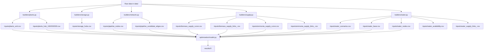

# Coal Retrofit Experiment System

一个面向煤电多路径改造研究的可复现实验系统。这个仓库的目标不是只保存 proposal 或零散脚本，而是把煤电减排改造问题拆成可验证的四层：

1. 原始数据
2. 标准化输入
3. 可重复优化实验
4. 标准化结果与 review 产物

当前研究边界覆盖：

- `retire`
- `CCS`
- `biomass`
- `BECCS`
- `ammonia`
- 可选 `water` 约束
- 基于油气管道走廊先验的 CO2 候选管网

运行前提很简单，但必须满足：

- `data/` 下原始图层与表格已经就位
- 本机有可用的 Gurobi license

## 0. 代码现状核查与本轮改动（2026-09-23）

> 回答作者 2026-09-23 提的四个问题。核查基线为 `feature/industrial-sectors` @ 0f8d999，本节同时记录本轮已改的部分：
> 批 1（工业侧 dataclass 与拆文件、ruff、过时注释与文档、`references.bib`、注释中文化，模型不变）、
> 批 2（五项模型改动，每项一个提交加 toy 测试，见 `tests/test_capex_stock_and_lifetimes.py`；不求解的放在 `tests/test_discount_rate.py`、
> `tests/test_h2_route_multiplier.py`、`tests/test_capex_stock_no_solver.py`）、
> 批 3（无出处参数在代码注释与本节标 `⚠ 假设`，其中 4 项按作者拍板补上出处；数值都不动）、
> 批 4（PR #2 审查时列出的 20 项表外参数逐项查文献，按作者拍板补出处或标 `⚠ 假设` 并附对照值，其中长流程钢氢路线减排比例
> 与合成岛年金寿命改了值，各一个提交加不求解测试（`tests/test_h2_route_abatement.py`、`tests/test_discount_rate.py`）；
> 见 §0.2 末）。
> 标"未改"的地方要不要统一，由作者决定。
> 下面的 §1–§11 停在 2026-09-06（v9 基线入库），其中的 `EXP-*` 实验族、`sequential` 模式、成本键名与
> 规划年份都已过时；`ST_` 系求解树的现状见 [`_indtree/README.md`](_indtree/README.md)。
> 2026-09-26 起 `src/` 删去了旧实验链（`experiments/`、`optimization/model.py`、`optimization/bundle.py`、`reporting/`）
> 与 runoff 水口径：§1–§11 与 §0.3、§0.4 里指向这些模块的命令和链接都已失效，v9 / v9.1 结果按 CLAUDE.md §1.5
> 在 `892c877^` 里复现。
> 同日起结果表的掺烧比例按约束里的 Σβ·z ÷ 路径份额换算（`plant_detail.csv` 新增 `biomass_blend_ratio`、`beccs_blend_ratio`、
> `ammonia_blend_ratio`），`plant_cost.csv` 的碳成本改与目标函数同式。此前连续 hub 下的档位下标（`*_blend_level`，档位下标的加权和）
> 被当作掺烧比例换算，`pathway_shares.csv`、`province_pathways.csv` 的逐路径减排拆分失真；`ST_CP_BASE`（唯一有碳价的 `ST_` 情景）
> 的 `plant_cost.csv` 碳成本与合计也不对：原先是近似式，不含惩罚燃料，掺烧比例同样按档位换算。`plant_cost.csv` 另有两列本就与目标函数
> 口径不同：节煤不含掺氨，能耗惩罚不含空冷背压与随档位变化的生物质惩罚；表里也没有掺烧升级、空冷与重建的 capex，生物质与氨的
> 采购按供应链路计、没有分到厂。所以碳成本改正后，合计仍不等于该厂在目标函数里的贡献。模型、目标值与厂合计减排不变；
> 要用这几列，这一改动合入之前落盘的 `ST_` 结果需重解（实现说明 §9.8）。
> 2026-09-27 起 `network_edges.csv` 删去 `num_pipe_new`、`num_pipe_stock` 两列：它们是容量 ÷ `standard_pipe_capacity_mtpa`（20 Mtpa），
> 不是管道根数；本年实际铺设的根数见 `pipes_new_by_tier`（如 `1x2|1x20`）。
> 2026-09-27 起 `plot_style.residual_emissions_mt`（`scripts/plot_style.py`）只按 `*_blend_ratio` 列算残余排放，
> 没有这几列就报错。此前没有这几列时按档位下标换算，而下标分不出独热档位与连续 hub：连续 hub 的下标恰为整数时
> 也可能是几档的混合，会被静默读错。
> PR #7 之前落盘的 `ST_` 结果重解后再画；v9 / v9.1 的独热结果只能在历史里画（`a303f05`、`892c877^`），当前版本不再维护复现步骤。
> `IND_` 系旧结果也没有这几列，残余排放不要去 `cf073be` 算：它们 2026-09-12 重解时 hub 决策缺省已是连续的（`7a5fc94`，
> 登记表没有覆盖），而 `cf073be` 的同名函数把非整数下标原样当比例。CLAUDE.md §1.5 说的在 `cf073be` 的副本里重画，
> 只指它们的图（`plot_ind_*` 不读档位列）。
> 2026-09-27 起情景登记在仓库根 `scenarios/*.toml`（`ST_` 系在 `scenarios/st.toml`，格式见 `src/coal_retrofit/scenarios.py`），
> 入口是 `python -m coal_retrofit`（`list` / `show` / `diff` / `run`，要先 `pip install -e .`），求解与写结果在
> `src/coal_retrofit/runner.py`。`scripts/run_single.py` 留作薄壳，原命令照用，
> `from run_single import EXPERIMENTS` 照旧读得到登记表。求解树写在情景里（`ST_` 系是 `tree = "_indtree"`），
> 从哪个目录启动都读同一套输入，树下没有 `inputs/` 就报错，`--tree` 可换树。`run --set 节.字段=值` 必须配 `--as 结果名`，
> 结果名不许与登记情景同名（不分大小写）。result.json 末尾新增 `resolved` 段（全部参数、求解树、`--set` 覆盖项、运行选项与
> `COAL_RETROFIT_*` 环境变量），其余键不变；`python scripts/check_run_provenance.py --pair A B` 列出两次求解的
> 参数差与环境变量差。缺一边、有一边没有 `resolved` 段（2026-09-27 之前落盘）、一边是 LP 松弛或热启动而另一边不是、
> 两边都是 LP 松弛、有一边没有可用的解（目标函数为 NaN），都判不过（退出码 1）。脚本读 `_indtree/results/`，
> `--results` 可换目录（只配 `--pair`）。
> 模型、参数缺省值与结果表都不变。
>
> 2026-09-27 起连续 hub 下路径份额恰好分摊到各掺烧档位上（`Σ_l z = s`，此前是 `≤`；`optimization/constraints.py`，
> 实现说明 §9.8）：份额为正就至少按最低档掺烧。此前份额可以有一部分不落在任何档位上：关掉 CCS 时，BECCS 不掺生物质
> 就是 CCS；煤价低时，"生物质"份额不烧生物质，也能拿改造路径的 CF 提升。**这是模型改动**：独热档位的整数可行解不变
> （LP 松弛变紧、模型指纹变了，重解不复现旧的搜索路径），连续 hub 的最优值只会不变或变高。改前改后的结果不得相减；
> 此前落盘的连续 hub 结果都受影响（`_indtree/README.md` 列的结果里，除 `*_inthub` 外都是）。
> 结果分段以 PR #11 的合入提交 `9133c7b`（2026-09-28）为界（CLAUDE.md §二.7）。
>
> 2026-09-28 起求解流程进情景定义（不改模型）：情景 `warm_start = "lp_relax"`（`ST_COMMON` 已设）时 `run` 自动做
> 热启动两步（实现说明 §9.7），不再手工设 `COAL_RETROFIT_LP_RELAX` / `WRITE_SOL` / `START_SOL`；Gurobi 的 seed 与 MIPFocus
> 改为情景字段 `solver_seed`、`mip_focus`（环境变量 `COAL_RETROFIT_GUROBI_SEED`、`COAL_RETROFIT_MIPFOCUS` 仍兼容，与
> 登记表或 `--set` 给的值不一致就报错）。已有同名结果时求解之前就拒绝，`--force` 才覆盖；没有可用的解时退出码 3；
> `water_mode`、`water_season`、`warm_start`、`mip_focus` 只许写模型认的值，写错时求解之前就报错（此前 `water_mode`、
> `water_season` 拼错不报错，静默走另一支）。
> result.json 的 `resolved` 另记热启动第 1 步（`warm_start`）、读了哪些输入文件（`input_files`）与求解时的提交号
> （`code`：`commit`、`dirty`）。`check_run_provenance.py` 的可证区间里，目标函数下界 LB 改用记下的 ObjBound（没有这一项的
> 旧结果照旧按 gap 反推），`hi` 的分母按 CLAUDE.md §二.3 由 INC_c 改为 LB_c；`--pair` 下碳价不同、读的同一个输入文件摘要
> 不同、有一边没有 `resolved.code` 都判不过，提交号不同、记不了提交号或求解时有未提交的改动只告警。模型与结果表不变（toy 12 个变体逐字节一致）。
>
> 2026-09-28 起脚本只有仓库根 `scripts/` 一份：`_indtree/scripts/` 并入后删除。两份不同的 7 个文件里，5 个取 `_indtree`
> 那份（它带 2026-09-10、09-12 之后的改动，仓库根那份没有），`plot_ed_sensitivity.py` 取仓库根那份，`_bootstrap.py` 重写；
> 3 个 `ST_` 幻灯片脚本挪到仓库根。脚本读写的数据树固定是 `_indtree/`（`scripts/_bootstrap.py` 的 `ROOT`，测试核对它就是
> 登记情景的 `tree`），图幅归档写仓库根 `results/figures/`（`REPO_ROOT`）。仓库根 `scripts/` 原先读写仓库根的 v7 `inputs/`
> 与 `results/`，现在除 `render_version.py`（照仓库根那份）外，读写的路径与原 `_indtree/scripts/` 那份相同。
> v9.1 幻灯片 `slide_matching_anim.py` 经 `plot_ed_water_abatement` 读管网，改后读到的是 v9.2 管网，与它画的 v9.1 结果
> 对不上，所以直接停下（同日删除，见下文）。
> 模型、求解与结果表不变。
>
> 2026-09-28 起仓库根不再有 `inputs/`：那是 v7 输入（35 汇 / 923 边），没有登记情景读它，要用就到 `a303f05` 里取。
> `ST_CP_BASE` 要读的 `sector_targets_none.csv` 此前只在那里入了库；同日 `_indtree/inputs/` 整个入库（提交 `89f8205`），
> 里面那份与它逐字节相同。
>
> 2026-09-28 起冻结树 `_v9tree/`、`_v91tree/` 也移出当前版本（436 个入库文件，约 470 MB，含 v9 的求解结果）。
> `_v91tree/results/` 不在库里，本机那份拉取后原处不动（`.gitignore` 的规则保留）。`scripts/render_version.py` 去掉 `--tree`
> （出图脚本只读 `_indtree`），`--version` 改为必填（原缺省 `v9`，
> 会把 `_indtree` 的图拷进 v9 的归档）；只拷这次画出的图（`plot_ind_*` 也往 `_indtree/results/figures/` 存图，那些旧图
> 不拷；`--skip-plots` 时不画图，目录里的图全拷，它们也会进去；2026-09-29 起只拷根目录，子目录里的这些旧图不再进去），
> `--freeze-tag` 缺省不挪旧图。
>
> 2026-09-28 起 `scripts/` 只留 `ST_` 一条线用得上的 29 个脚本，删掉只服务 v9 / v9.1 / `IND_` 的 27 个（删之前的版本都在
> `6917c9c` 的 `scripts/` 里）：
> - 读 v9 / v9.1 情景的 17 个：`plot_fig2_constraint_response`、`plot_fig3_attribution`、`plot_fig3_mechanism`、
>   `plot_fig4_network_reconfiguration`、`plot_fig5_pathway_succession`、`plot_extended`、`build_numbers_ledger` 与
>   10 个 `plot_ed_*`（`water_on_off`、`water_abatement`、`source_sink_matching`、`source_sink_matching_years`、
>   `multihop_matching`、`basin_closeup`、`biomass_sourcing`、`province_transition`、`reversion`、`who_converts`）；
> - 已在守卫处停下、提示去旧提交画的 5 个：`slide_matching_anim`、`plot_ed_sensitivity`、`plot_ed_sink_network`、
>   `plot_ind_ed1_target_level`、`plot_ind_fig1_joint_allocation`；
> - 另外 5 个：读 `IND_` 的 `plot_ind_fig2_storage_allocation`、`plot_ind_fig3_water_coupling`，缺省读旧情景的
>   `validate_baseline_year`（`BASE`）、`summarize_industry_runs`（`IND_`），一次性的 `_check_figure_widths`
>   （`save_fig` 的宽度守卫已覆盖）。
>
> 留下的出图脚本是 3 个 `ST_` 幻灯片脚本和主要画输入的 6 个（`plot_candidate_network`、`plot_fig1_water_footprint`、
> `plot_ed_fleet_atlas`、`plot_ed_water_basis`、`plot_ed_source_atlas`、`plot_ed_variance_decomposition`）。随之：
> `plot_ed_source_atlas` 的煤电基准排放不再读结果表（原读 `BASE` 的 2030 年），改用模型的 `_prepare_plants` 从 `plants.csv`
> 现算，同为未缩放的现状值，不用先求解；`plot_ed_fleet_atlas` 把从 `plot_extended` 借的 `_reproj` 挪进来，样式改为自己调
> `apply_style()`（原先是导入 `plot_extended` 时顺带套上的）；`plot_style` 删掉 v9.1 情景族（`BASE_SCENARIO`、`ARMS`、`treat_of`、`seeds_of` 等）
> 与 `BASE_DIR`；`ed_plant_data` 删掉读结果表的 `outcomes`、`pair`；`check_run_provenance.py` 删掉写死 v9 seed 族与对照表
> 的缺省模式，`--pair` 改为必填。模型、求解与结果表不变。
>
> 2026-09-28 起图幅版本目录 `results/figures/v9/`（88 个文件，其中 PDF / PNG 62 个，即 31 张图）与 `results/figures/v9.1/`
> （README 与 `docs/官方指标口径水预算.md` 的一份旧快照）也移出当前版本，原先写在上文两段里的 v9 / v9.1 重画做法随之删去。
> **旧版本（v7 / v9 / v9.1 / `IND_`）的输入、求解与出图在 `a303f05`、`892c877^`、`cf073be` 的历史里，当前版本不再维护复现步骤。**
>
> 2026-09-28 起 `.gitignore` 放开仓库根 `data/` 下求解与出图要读的三样：`ChinaMapTHT/`、`ChinaMap/`、`ChinaBasins/basin_l1.gpkg`。
> 其余源数据照旧不入库，其他层级名为 `data` 的目录（如 `results/figures/<版本>/data/` 的结果拷贝）照旧忽略。
> `scripts/render_version.py` 去掉 SKIP（里面的两个脚本已删），通配（`plot_fig*` / `plot_ed*`）只匹配留下的出图脚本里的 5 个：
> `plot_fig1_water_footprint` 与 4 个 `plot_ed_*`。
>
> 2026-09-29 起出图只留一套：仓库根 `scripts/plot_fig1_sources_sinks.py` … `plot_fig7_water.py` 七个脚本，一图一个，
> 开头写图含义、读图注意、数据、自检与用法。图 1（煤电与工业排放源、封存汇）、图 2（候选管网）画输入；图 3（煤电改造路径）、
> 图 4（工业路线）、图 5（部门排放对碳目标）、图 6（CO₂ 管网流量）、图 7（流域取水指标与空冷改造）画求解结果，
> 缺省读 `ST_WA_cwatm_126_dry_oq`，`--scenario` 可换。结果图出图前先与模型的账对一遍（如逐厂各路径减排之和 = `reduction_mt`、
> 捕集 = 封存、残余 − 部门上限 ≤ 目标缺口），对不上就报错、不出图。`--lang zh|en|both` 切换中英文（缺省两版都画，英文版文件名
> 加 `_en`；中文 SimHei、英文 Arial，各自单字体，CLAUDE.md §3.1）。
> 同日删去 9 个旧出图脚本（`plot_candidate_network`、`plot_fig1_water_footprint`、4 个 `plot_ed_*` 与 3 个 `ST_` 幻灯片脚本）、
> 2 个出图辅助模块（`ed_plant_data`、`map_tht`）、`tests/test_variance_decomposition_marks.py` 与 `_indtree/inputs/figures/` 里的候选管网图（改由图 2
> 画到 `_indtree/results/figures/`），删之前的版本都在 `b708e09`。`plot_style.residual_emissions_mt` 随之删去：没有出图脚本调用它，
> `tests/test_blend_ratios.py` 改为直接核对 `plant_detail.csv` 的逐厂 baseline − reduction 之和等于求解器的残余排放。
> 底图：南海小图放在台湾以东的海面上（主图向东加宽，小图不压国土），主图南边裁到 17.5°N；地图上的图例压到国土就报错。
> `scripts/render_version.py` 只运行 `plot_fig*`，只拷 `_indtree/results/figures/` 根目录下本次画出的图（子目录 `main/`、
> `extended/` 里旧脚本画的图不拷）。模型、求解与结果表不变。
>
> 2026-09-30 起结果表的逐路径拆分按约束逐项算（`optimization/results_plant._pathway_split`，照搬约束里的残余排放与捕集表达式）：
> `pathway_shares.csv` 的 `abatement_mt` = 基线排放 × 份额 − 该路径的残余排放，`captured_mt` 是该路径的物理捕集量，逐厂相加
> 即求解器的值，`sanity_checks.csv` 新增 `pathway_split_closure` 行核对。此前按经典减排比例拆、再缩放到逐厂合计，各路径的值
> 与符号可能不对：CF 提升 1.15 下掺氨 10% 的份额净增排 3.5%，与 CCS 同厂时却按经典比例分到正的减排；捕集量按 CCS、BECCS
> 的份额比例分摊。
> `plant_detail.csv` 的 `air_cooled_share` 拆成 `air_operating_share`（当年在运行路径上以空冷运行的份额，不含退役路径上模型
> 可任取的那份）与 `air_installed_share`（已建成的空冷存量，只增不减；已全空冷的 hub 除外：两列不保证为零、也不保证只增不减，
> 乘 1 − already_air_share 后为零；2026-10-02 起改为在役的空冷能力，到寿命会降，见本节末）。
> 经典比例函数 `optimization/emissions.py` 随之删去。模型、目标值与逐厂合计不变；此前落盘的结果图 3、图 7 拒绝出图，重解后再画。
> 09-29 条说的 `test_blend_ratios.py` 那条核对两边是同一对数组、永远成立，改为拆分结果与求解器的约束表达式对拍。
> 同日按 PR #20 复核修出图：同值的圆点、菱形、方块面积相同（此前后两者大 4/π，约 27%）；`save_fig` 先查字体，缺 SimHei 或
> Arial 就报错，不再静默换字体；图 5 不装包也能运行，上限自检改为两侧都查；图 7 的自检改为与 `slack_detail.csv` 的流域松弛
> 对账，超指标改用深红 `OVER_COLOR`（强调红留给空冷）；图 6 遇到不认识的部门报错；`render_version.py` 不拷 `save_fig` 的临时
> 文件。细节见各脚本文件头与 CLAUDE.md §3.3、§4.4、§4.6。
>
> 2026-09-30 起改造能力按铭牌定规模、按建设年分代（**模型改动**，作者决定 2026-09-30；实现说明 §9.10）：
> - 工业 CCS 与氢路线的所需能力 = 当年捕集量（氢路线为当年产量）× 铭牌系数 max(1, 铭牌产能 ÷ 现状产量)（`industry_hubs.csv` 的
>   `capacity_kt_per_year` ÷ `production_kt_per_year`，`optimization/industry_matrices.py:173`）：设备按铭牌建，水泥、电炉钢、合成氨、甲醇
>   按部门合计产量只有铭牌的 73%–83%；铭牌小于产量的 49 个 hub（长流程钢 40 个）按产量建，铭牌或产量缺失、不为正的 hub 读入时报错。
>   单位 capex 不变（工业 CCS 仍按各部门的元/(t CO₂·a)，煤电仍按元/kW），捕集量、减排量、需氢量与能耗仍按产量算。
> - 煤电捕集岛、工业捕集能力与氢路线能力按建设年分代（`optimization/vintage.py`）：capex 计在本期新建量上；v 年建的能力在
>   t − v < 寿命的规划年在役（与管道同一判定；捕集岛与工业捕集 20 年、氢路线 25 年），到寿命退出，份额仍在就按当期单价重建。
>   此前是跨期单调、永不退出的存量，过了寿命照常运行、不再付钱。
> - 捕集固定运维（煤电捕集岛与工业 CCS，capex 的 5%/年）按各代建设年的单价，只计在役且在用的部分：所需能力降下来（退役、减产）
>   时多出的那部分不再付固定运维，capex 不退。此前按当年单价计（学习曲线让后期单价更低），煤电按捕集份额 × 装机，工业按当年
>   捕集量。氢路线固定运维（capex 的 3.5%/年，单价不随年份变）改按所需产能计。
>
> 结果表列名不变，含义随之变：`plant_cost.csv` 的 `ccs_retrofit_capex_cny` 计本年新建（含到寿命重建）的捕集岛，`ccs_om_cny` 取求解器
> 按分代算的固定运维；`industry_detail.csv` 的 `capacity_ccs_mt`、`capacity_h2_mt` 是在役能力（到寿命会降），`cost_capital_cny` 计本年
> 新建能力，`cost_annual_cny` 含分代的捕集固定运维。改前改后的结果不得相减，此前落盘的 `ST_` 结果都要重解（CLAUDE.md §二.7）。
>
> 2026-10-01 起水节点可用量扣生活与灌溉耗水（**模型改动**，作者决定 2026-10-01；`docs/方法论.md` §7.2）：
> - 节点可用量 = max(径流 × 0.20 − 流域生活与灌溉耗水按节点径流份额摊到的量, 煤电存量) × `water_multiplier`
>   （`optimization/water_access._water_available_by_node`）。0.20 是所有用户合计可耗用的份额，生活与灌溉先占；余量不够的节点
>   保留煤电存量（存量不增）：存量 = 各 hub 不改造同年的耗水，每个 hub 只归它最近的水节点。hub 可从 200 km 内的各个
>   节点取水，改造多耗的水（如加装捕集）要由这些节点的空余满足（空冷或退役腾出的水、余量高于存量的节点），不够的记在
>   带罚的节点松弛上。此前节点可用量就是径流 × 0.20。
> - 耗水取同一气候成员的 ISIMIP3b `2015soc-from-histsoc` 运行（CWatM 的灌溉 = 总耗水 − 生活 − 工业 − 畜牧，WaterGAP2-2e 读
>   `pirruse`），按一级流域汇总，枯水期取与径流同一组三个月；不扣工业与畜牧，不做偏差校正。新输入
>   `_indtree/inputs/water_basin_use.csv`（720 行，`scripts/build_water_use.py` 生成；耗水文件由 `scripts/download_isimip_water_use.py`
>   下载，已扩到 5 个 GCM）。`water_availability.csv` 不重建：枯水期窗口的选取抽成 `builders/water._basin_dry_window` 两表共用，
>   重构前后在 6 个成员的真实文件上输出逐字节相同，20 个成员的窗口都复现已入库的枯水期径流。缺成员、缺流域或缺枯水期列
>   都报错，不再退回全年值。`build_water_scenarios_dataframe` 只收 qtot 文件（此前同目录有耗水文件就会被当成成员而报错）。
> - 头部成员枯水期 2050 年余量（10⁸ m³/yr）：海河 −190、黄河 −61、淮河 −454、长江 −202、珠江 −140，其余为正；它在长江、珠江
>   是 20 个成员里最枯的，枯水期的负值几乎都来自 CWatM（逐流域、逐成员的表见 `docs/工业部门参数溯源.md` §七）。
>   `ST_WA_cwatm_126_dry_oq` 的节点可用量合计从 1 535 降到 343（2030 年；机队不改造耗水合计 47），海河、黄河、淮河、长江、珠江的
>   有煤电节点四个规划年都取存量。`scripts/diagnose_basin_water_budget.py` 改为读这两张表逐流域列余量（`--season annual|dry`）。
> - 只影响有水约束的情景：此前落盘的 `ST_WA_cwatm_126_dry_oq` 不得与改后的求解相减，要用须重解（CLAUDE.md §二.7）；
>   `ST_BASE`、`ST_CP_BASE` 没有水约束，模型与输入摘要都不变。旧结果没有 `digest_water_basin_use`，
>   `check_run_provenance.py --pair` 对只有一边有的摘要只列出、不判不过，新旧结果要按 `resolved.code` 的提交号区分。
>
> 同日起 `resource_use.csv` 的 `utilization` 在可用量 ≤ 0 而有用量时记 inf（此前记 0，会把用了松弛的节点或超指标的流域读成
> "没用"），与图 7 的"无余量"同一规则；没有用量，或无水约束时可用量为空，仍记 0。模型、求解与其余各列不变，旧结果不重算；
> 新旧表按 `resolved.code` 的提交号区分。
>
> 2026-10-02 起煤电热耗、到期、自愿退役核算与 CCS 额外燃料按机组细化（**模型改动**，作者批准 2026-10-01；`docs/参数调研_20261001.md`
> §3 乙，`docs/方法论.md` §3.4、§4.1、§4.2、§4.6）：
> - 逐 hub 毛热耗：每台机组按机型、容量等级与冷却方式取发改运行〔2022〕559 号的供电煤耗基准值（超超临界 ≥ 900 MW 为 1000MW 级，
>   超临界与亚临界 ≥ 450 MW 为 600MW 级，空冷 +15；CFB 290、IGCC 270 取 Wang et al. 2025 SI Table 1 的转述值；
>   `constants.SUPPLY_COAL_RATE_G_PER_KWH`），乘
>   (1 − 厂用电率 0.05) × 0.0293076 折成毛热耗，按装机加权到 hub：`plants.csv` 新增 `heat_rate_gj_per_mwh`（7.935–9.411 GJ/MWh，
>   装机加权 8.505），原有各列逐字节不变。基线排放 = 发电量 × hub 毛热耗 × `coal_emission_factor_t_per_gj`（0.82 / 8.5714；
>   工业捕集再生蒸汽的排放用同一因子，数值不变），效率 = 3.6 / 毛热耗（生物质与空冷的效率损失按运行那部分的效率折燃料，见下条）。
>   分档值不校准到全国统计。全国基线排放 5 347 Mt（此前 5 392，−0.84%），发电量加权排放强度 0.813 t/MWh（此前 0.82）。
>   `OptimizationAssumptions` 删去 `coal_emission_factor_t_per_mwh`、`heat_rate_gj_per_mwh`、`coal_plant_base_efficiency`，
>   登记表或 `--set` 再写它们会报错。
> - 机组级到期：连续 hub（缺省）的机组按投产年 + 40 年逐台到期，到期装机份额 f 进到期约束（退役份额 ≥ f − 重建份额、
>   重建份额 ≤ f，f = 0 的 hub 不能重建）；整数 hub 仍整个 hub 在 `retirement_year` 一起到期，约束与此前相同。新输入
>   `_indtree/inputs/plants_unit_hub.csv`（3 623 台机组到 hub 的映射，与 `plants.csv` 由 `scripts/build_plant_inputs.py --hubs`
>   一起写出；读入时核对两表的 hub 与装机，缺表或对不上就报错）。到期装机 2030/2040/2050/2060 年 14.5/102.4/547.7/1 030.9 GW
>   （此前按 hub 平均投产年 0/14.6/613.1/1 342.6 GW）。重建 capex 只计有到期装机的 hub。
> - 部分到期的 hub 分两部分燃烧（作者决定 2026-10-02：按效率精确加权，不因部分机组到期就把整个 hub 当作换了新机组）：
>   原址重建部分逐台取 min(机组毛热耗, 3.6 / 0.45) 按装机加权，空冷机组的上限另加空冷的 +15 g/kWh（0.418 GJ/MWh，
>   原址重建不改冷却方式）；未重建部分取未到期机组的装机加权毛热耗（由 hub 值反推，两部分按 f 加权还原 hub 值；反推放大误差，
>   部分到期 hub 的 hub 值与按现行分档基准逐台现算、按装机加权的值相差超过 1e-4 就报错）。0 < f < 1 的 hub
>   把每条运行路径的份额、空冷份额与掺烧各档拆出重建机组承担的部分（运行的重建部分不超过重建份额，未重建部分不超过未到期装机
>   1 − f，`optimization/constraints.py:49-101`）；运行排放、燃料、CCS 额外燃料与生物质、空冷的效率惩罚各按自己的毛热耗与效率计，
>   空冷背压惩罚的排放与捕集仍按 hub 毛热耗（作者决定维持）。哪几台机组运行、退役、改空冷由求解器定，模型不追踪逐台状态；
>   拆到各路径的份额不受跨期约束，跨期约束只管 hub 合计与重建部分的运行合计（自愿退役核算，见下条）。f = 0 或 1 的 hub（整数
>   hub 都是）两部分相同，不加变量（2026-10-02 起重建部分再按重建毛热耗分类，f = 1 而有两类以上的 hub 也拆，见本节末）。
>   此前整个 hub 自 `retirement_year` 起热耗乘 0.42 / 0.45，不论到期装机重建还是退役。
> - 自愿退役只计没到寿命就关停的装机（作者决定 2026-10-02），精确分开记（`optimization/retirement.py`）：hub
>   装机分未到期在运行、提前退役（未到期就关停）、到期未重建（正常寿终）、重建在运行、重建后关停五部分，自愿退役是提前退役与重建
>   后关停。提前退役按未到期机组等比例摊（与未重建部分的毛热耗、搁浅资产同一假设），上期的提前退役留到本期的是
>   (1 − f_t) / (1 − f_{t−1})，其余随机组到期转为正常寿终。每期新增的提前退役与重建后关停都不能为负（关停的机组不能重启）；
>   新增提前退役与在运行重建装机的净减少（本期新建而未运行的不计）之和按发电量加权进 15% 的退役速率上限。搁浅资产只计新增提前
>   退役，每单位按未到期装机的平均剩余账面份额 ℓ / (1 − f)（ℓ 按机组装机加权），全部到期的 hub 为零；重建后关停的不计搁浅资产
>   （重建 capex 已在目标里），期末已关停的重建装机不计残值，按先关最早建成的扣回。此前两者都按退役份额的增量计，
>   只认 hub 平均到期年 `retirement_year`：之前的退役全算自愿（含逐台已满 40 年的机组），搁浅资产按 hub 剩余寿命
>   min(1, (retirement_year − 年) / 20) 收、到期后不收；速率上限只管还没到 `retirement_year` 的 hub。
> - CCS 额外燃料按 An et al. 2025 SI Table 7 的出力损失 p 换算为 p/(1 − p)：0.2853 / 0.1848 / 0.1534 / 0.1249
>   （此前 0.150 / 0.1054 / 0.0899 / 0.075，2030 年的 15% 无出处）。
>
> `ST_BASE` 只建模不求解：变量 +13 367、约束 +22 726，其中部分到期 hub 的拆分占 12 825、20 520（2030/2040/2050/2060
> 年各有 28/111/203/171 个 hub 部分到期），退役核算占 911、2 062；另删去 1a02fe2 的搁浅资产增量辅助变量与约束各 589 个，
> 重建增量的辅助变量与约束随有到期装机的 hub 增多各多 220 个，部分到期 hub 加重建上限约束 513 条；整数变量不变。
> 改前改后的结果不得相减，此前落盘的 `ST_` 结果都要重解（CLAUDE.md §二.7）；
> 新旧结果的 `digest_plants` 不同，`check_run_provenance.py --pair` 判不过，改后另有 `digest_plants_unit_hub`。
>
> 2026-10-02 起结果目录多一个参照 ChinaCCS.xlsm 版式的结果工作簿（作者批准 2026-10-02；`docs/方法论.md` §9.4）。每个情景写
> `<树>/results/<结果名>.json` 与 `<树>/results/<结果名>/` 下的 15 张 CSV（`pathway_shares`、`province_pathways`、`plant_detail`、
> `industry_detail`、`network_edges`、`storage_utilization`、`resource_use`、`biomass_flows`、`ammonia_flows`、`water_flows`、
> `co2_flow_direction`、`plant_cost`、`slack_detail`、`cost_breakdown`、`sanity_checks`）和 `ccs_results.xlsx`：
> - `ccs_results.xlsx`（`optimization/results_workbook.py`）：表名与行列结构参照 ChinaCCS 的结果表，数字全部取自本次求解，各表口径写在
>   它的「说明」表。源（`Source_Results_<年>`，分部门、分区、分省）、汇（`Sink_Results`）、源省到汇省的输送矩阵（按节点充分混合
>   追踪，行和 = 该省捕集量、列和 = 该省或海上的封存量）、各源各汇的 `*_stock`、管道（各管径档的在役根数、管长、分区）、
>   成本（各年不折现的捕集、运输、封存与 EOR 抵扣，单位百万元；全期每吨成本 = 成本现值 ÷ 捕集量现值）、`objective`，另加煤电
>   路径份额与空冷改造份额（占全厂）`Plant_Pathways`、工业路线份额 `Industry_Routes`。分区是 ChinaCCS 的六大区（西藏归西南）
>   加 7 海上、8 跨地理分区（ChinaCCS 没有海上区，跨地理分区记 7）。不出注入井数表与回收期（模型没有单井注入率；CCS 链条除
>   EOR 抵扣外没有收入，售电收入计在煤电的基线净成本里），也不出模型里没有的部门（炼化、现代煤化工、天然气、液化、烯烃、
>   乙二醇）的 `CO2_capture_*_stock`。工作簿出错只记日志并删掉工作簿（`--force` 重跑时上一次的也删掉；删不掉，如 Windows 上
>   在 Excel 里开着，也只记日志），CSV 与 result.json 照写。
> - 管网节点的省（`optimization/results_regions.py`）：源取源的省，本情景纳入的海上封存汇记 Offshore，其余取输入表的省名；都没有的
>   （ST 输入 1 052 个节点里 305 个：走廊节点 227 个、没填省名的陆上封存汇 78 个）按经纬度落在 `data/ChinaMap/provinces.shp` 的
>   哪个省，落在省界多边形之外的记 Offshore（其中 17 个走廊节点，在海上或近岸）。要落点时缺这个图层（新克隆没建 `_indtree/data`
>   就是这样，见 `_indtree/README.md`），MIP 求解之前就报错（`warm_start = "lp_relax"` 的情景在热启动第 1 步之后）。
> - CSV 只加列：`cost_breakdown.csv` 加 `kind`（annual / one_off / horizon_end）与 `cost_undiscounted_cny`（`cost_cny` 除以折现
>   权重，即本年不折现的值；`salvage_credit` 记在最后一个规划年，它的不折现值是期末 2070 年的残值）；`plant_cost.csv` 加
>   `air_penalty_cny`、`biomass_penalty_cny`（空冷背压与生物质掺烧多烧的煤，与 `energy_penalty_cny`（CCS 与 BECCS 额外燃料）三列逐厂相加
>   即该年目标函数 `energy_penalty_cost` 的不折现值；`total_plant_cost_cny` 口径不变）；
>   `industry_detail.csv` 加 `cost_capital_ccs_cny`、`cost_capital_h2_cny`、`cost_annual_ccs_cny`、`cost_annual_h2_cny`（两两相加即
>   `cost_capital_cny`、`cost_annual_cny`）；`network_edges.csv` 加 `pipes_in_service_by_tier`（在役根数，写法同 `pipes_new_by_tier`）
>   与 `from_province`、`to_province`。
>
> 模型、目标值与原有各列不变；此前落盘的结果没有这些列和工作簿，重解后才有。
>
> 2026-10-02 起空冷与掺烧能力按建设年分代、分代能力的残值只计期末在用的部分、重建部分按重建毛热耗分类（**模型改动**，作者批准
> 2026-10-02；`docs/方法论.md` §3.3、§3.4、§4.1、§4.2、§4.3、§4.5）：
> - 空冷与掺烧能力与捕集岛同样按建设年分代（`optimization/model_linking.add_capacity_vintages`、`optimization/vintage.py`）：
>   capex 计在本期新建量上（空冷 300 元/kW × 仍湿冷的装机；掺烧每档生物质 500、氨 25 元/kW），v 年建的在 t − v < 20 年的
>   规划年在役，在役之和不小于本期在用量，到寿命退出，还要用就按当期单价重建；在用量降了又升，寿命内不重复付钱。空冷的在用量是
>   各运行路径的空冷份额之和（退役列的空冷份额恒为零）。掺烧能力（生物质含 BECCS、氨）按五个档位分层、每层单独分代：第 l 层的
>   在用量是落在第 l 档及以上的路径份额，各层之和即 Σ 档位下标 × 落在该档的路径份额；闲置的低档能力不能顶替高档，已退役或改走
>   别的路径的份额到寿命不用重建。独热档位下同样按装机 × 所选档位 × 路径份额计，不再按整个 hub 装机 × 所选档位计。掺烧档位锁定
>   照旧，只约束改造到各档的容量份额（不计费），能力到寿命退出后也不解除：改造到高档的份额只能按原档重建或闲置，hub 其余（含
>   未改造）的份额不够时掺烧份额才不能降档（偏保守）。此前空冷是只增不减、永不到期的存量，capex 计在存量的增量上；掺烧 capex
>   计在改造档位（Σ 档位下标 × 改造到该档的份额）的增量上，也不到期：2030 年建的空冷与掺烧能力用到 2070 年，不付更换的钱。
> - 期末残值：分代的能力（煤电捕集岛、空冷、掺烧能力，工业捕集与氢路线能力）只按最后一个规划年仍在用的部分计，各代的期末在用量
>   不超过该代新建量、合计不超过当年所需（`optimization/vintage._end_in_use`），求解器先记在残值抵扣最多的一代上（单价相同即最新的
>   一代）；管道仍按建成量计，原址重建仍按建成量计、扣回期末已关停的。现行寿命与 10 年网格下，煤电改造能力（20 年）只有 2060 年
>   建的有残值，而它们都是当年要用才建的，数值不变；工业氢路线（25 年）2050 年建的能力到 2060 年因减产闲置的部分不再计残值。
>   此前按建成量计，期末不在用的也抵扣。
> - 重建部分按重建毛热耗分类（`optimization/data_prep._with_expiry`、`optimization/model_year.py:51-56`、
>   `optimization/constraints.py:49-101`、`optimization/model_linking.py:103-118`）：规划期内到期的机组按重建毛热耗（六位小数）分类，
>   重建份额是各类之和，每类不超过该类已到期的装机份额、各自不减，先重建哪一类由求解器定；运行路径份额、空冷份额与掺烧各档的重建
>   部分按类拆，系数取该类与未重建部分之差。ST 输入到 2060 年有到期机组的 324 个 hub 里，231 个只有一类（与此前相同），87 个两类、
>   6 个三类，类间毛热耗相差 0.8%–6.4%；全部到期而有两类以上的 hub 也拆。此前重建部分取到期机组重建毛热耗的装机加权平均，不分实际
>   重建的是哪几台，全部到期的 hub 不拆。
> - 不改：原址重建的机组按设计寿命 40 年服役（与原机组同一常数），2030—2060 年建成的在规划期内（至 2069 年）都不到期，不用再建
>   一代；残值仍按 30 年折旧（`rebuild_lifetime_years`）。改造资产按 hub 记，hub 内重建与未重建两部分谁接上捕集岛、空冷与掺烧设施
>   是逐期的运行选择，不加跨期约束（方法论 §4.2 的假设）。
>
> 结果表列名不变，含义随之变：`plant_detail.csv` 的 `air_installed_share` 是在役的空冷能力（到寿命会降，可含闲置的）；
> `biomass_blend_level`、`ammonia_blend_level` 是在用的掺烧能力（独热档位下是所选档位 × 路径份额，此前是所选档位；连续 hub 下此前
> 含改造过而不在用的）；`cost_breakdown.csv` 的 `air_retrofit_capex`、`blend_upgrade_capex` 计本年新建（含到寿命重建）的能力。
>
> `ST_BASE`、`ST_WA_cwatm_126_dry_oq` 只建模不求解：两者都是变量 +25 497、约束 +27 830、非零元 +158 740，整数变量不变。重建热耗
> 分类占变量 8 975、约束 7 323（每个 hub 每期每类一个重建份额，加各类之和与各类不减两组约束；拆分的（hub, 年）从 513 个增到 547 个，
> 多出的 34 个是全部到期而有两类以上的，按类计从 513 增到 704）；期末在用量占 4 622、9 594；空冷与掺烧分代占 11 900、10 913（新建量
> 换掉原来的已装存量与增量辅助变量；两类掺烧各 5 层，每层每 hub 每期一个新建量、一条在役约束，共 14 000 个、14 000 条；删去空冷
> 存量单调约束 987 条）。
> 改前改后的结果不得相减，此前落盘的 `ST_` 结果都要重解（CLAUDE.md §二.7）。
>
> 2026-10-02 起掺生物质改为三档并按炉型设上限，掺烧升级 capex 按 Fan et al. 2023 重定，掺烧运维改按 capex 的比例计（**模型改动**，
> 作者批准 2026-10-02；`docs/参数调研_20261001.md` §2.1"掺烧按炉型"，`docs/方法论.md` §4.3、附录 B）：
> - 档位：0.10 / 0.15 / 0.20（`OptimizationScenario.biomass_blend_levels`），此前 0.10 / 0.25 / 0.50 / 0.75 / 1.00。煤粉炉直燃
>   10%–15% 有工程证据（Fan 基准 15%），0.25 以上没有，0.75、1.00 实为改烧。BECCS 用同一组档位。
> - 炉型上限：煤粉炉 0.15、CFB 0.30（`biomass_blend_max_pulverized`、`biomass_blend_max_cfb`；CFB 的 20%–30% 是调研稿 B 级，原文
>   未取得：⚠ 假设）。hub 里落在 0.15 以上档位的在用份额（生物质与 BECCS 合计）不超过该 hub 的 CFB 装机份额，落在 0.30 以上
>   档位的为零（现行档位没有），每个 hub 每期一条（`optimization/constraints._add_blend_level_constraints`）。CFB 装机份额按机组表
>   `combustion` 算到 hub（带 `/CCS` 后缀的按本体机型；`optimization/data_prep._with_expiry`），非 CFB 机组（含 1 台 IGCC）都按
>   煤粉炉计。CFB 装机份额不随机组到期与重建变（到 2060 年已到期的 CFB 有 1.73 GW）。ST 输入的 CFB 共 7.04 GW（全国装机的
>   0.5%），分布在 47 个 hub，其中 6 个全是 CFB（合计 0.85 GW）：0.20 档只对这 47 个 hub 开放，落在 0.20 档的生物质与 BECCS 份额
>   合计不超过 CFB 份额（独热档位下两者的份额都落在所选的一档上，只有那 6 个能把全部装机放到 0.20），其余 303 个 hub 最高 0.15。
>   机组表的 CFB 113 台里 105 台在 100 MW 及以下，300 MW 以上只有 4 台；GEM 至少把一部分大型 CFB 按蒸汽参数记成了亚临界、
>   超临界或超超临界（厂址名写明 CFB 的白马、红河、盘南 5 台 2.92 GW 都没记为 CFB；煤矸石、低热值煤电厂未逐台核），这条上限
>   因此比实际偏紧。输入里的机型标签改不改，待作者定。
> - capex：每档 17.5 万元/MW，三档依次 175 / 350 / 525 元/kW（`biomass_upgrade_capex_cny_per_mw_per_level`），锚在 Fan et al.
>   2023 SI 式 (S56) 的 500 MW 锅炉 15% 掺烧 350 元/kW（Fan 转引 IEA 2019，未核）；此前每档 50 万元/MW，15% 掺烧要选第 2 档
>   （当时为 0.25），1 000 元/kW。逐档线性仍是假设；Yuan et al. 2022 的 10% / 15% / 20% 为 573 / 790 / 991 元/kW（未核），
>   不是逐档线性，要用它跑敏感性需逐档 capex，本 PR 没有这个开关。
> - 运维：每年 capex 的 3%（`biomass_upgrade_om_fraction`，Fan et al. 2023 SI 式 (S57)，不含燃料），按在用的掺烧能力（各档位层
>   之和，即 `blend_level_b`）计，闲置的不付，计入 `incremental_om`（`optimization/model_costs._operating_costs`）；每档每 kW
>   5.25 元/年，0.10 / 0.15 / 0.20 档 5.25 / 10.5 / 15.75 元/(kW·a)。生物质、BECCS 的每 MWh 附加项 30 → 0（字段保留）：此前按
>   改造路径的全部发电量收、与档位无关，按 `ST_` 系全机组容量加权的小时数（含 CF 提升，4 140 / 3 565 / 2 300 / 1 725 h）约合
>   124 / 107 / 69 / 52 元/(kW·a)。掺氨的 80 元/MWh 不变。`plant_cost.csv` 的 `incremental_om_cny` 随之含掺烧运维，与目标函数同式。
> - 后果（未求解，按系数推）：改造路径的发电量乘 1.15（`retrofit_cf_boost`），纯生物质掺烧的排放是基线的 1.15 × (1 − β) 倍，
>   0.10 / 0.15 / 0.20 档为 1.035 / 0.9775 / 0.92 倍（未计掺烧效率损失多烧的煤）：0.10 档净增排，煤粉炉最多减 2.25%。生物质主要
>   经 BECCS 起作用。掺烧 capex 与运维都比此前低得多，生物质与 BECCS 变便宜。发电净收益也随发电量多 15%：掺烧成本降下来后，
>   电价高、碳约束松的年份里 0.10 档纯掺烧可能比不改造还划算而被选上（排放至少多 3.5%），要求解后才知道；`retrofit_cf_boost`
>   本身不在本 PR 范围内。
> - 不改：生物质供给仍用 S3 栅格（`biomass_supply_curve.csv`）；S4 的下载被网络策略挡住，另做。
>
> `ST_BASE`、`ST_WA_cwatm_126_dry_oq` 只建模不求解：两者都是变量 −14 716、约束 −26 688、非零元 −145 060，整数变量不变。
> 生物质按档位计的变量与约束随档位数 5 → 3 同比减少（档位选择含"不掺"一档，每个 hub 每期 6 → 4 个；两类份额与其重建拆分、
> 各层的新建量与期末在用量及相应约束减到 3/5），变量 −14 716、约束 −28 088；炉型上限每个 hub 每期一条，约束 +1 400（没有 CFB 的
> hub 右端为 0）。新参数设回旧值（五档、每档 50 万元/MW、运维比例 0、每 MWh 30 元、两个上限都设 1.0）时，两个情景建出的模型
> 与改前的 Gurobi 指纹、规模逐个相同。
> 改前改后的结果不得相减，此前落盘的 `ST_` 结果都要重解（CLAUDE.md §二.7）。
>
> 2026-10-02 起管道按在役管道的投资计固定运维，封存按汇型定价（**模型改动**，作者批准 2026-10-02；`docs/参数调研_20261001.md`
> §2.2 第 2 条、§2.1"封存按汇型"，`docs/方法论.md` §6.2、§6.3、§9.4、附录 B.3、D.3）：
> - 管道运维：每年按在役管道投资的 4% 计（`pipe_fixed_om_fraction`；Fan et al. 2023 SI p.12（PDF 第 13 页）式 (S29) 后：单位管长运维 =
>   单位管长建造成本（式 S26）× 4%，Fan 引其文献 18，原文未核；DEA 陆上 0.9% 作敏感性）。投资取建设年的单价，含边类别与海上倍率；在役与流量上限同一判据（建成不满 30 年），
>   到寿命后原址重铺的那一代另计，闲置的管也付。只在年度项 `transport_opex` 里加一项，不加变量与约束
>   （`optimization/model_costs._transport_storage_costs`）。按流量计的运输运维 `route_opex_cny_per_t_km` 0.15 → 0（字段保留）：
>   旧值是 An et al. 2025 SI Table 7 的运输全口径成本 0.182 元/(t·km)（管道、船、铁路平均）减去 20 Mt 档满负荷的投资年金，满负荷时
>   相当于每年投资的 15% / 21% / 38%（类别倍率 1.0 的边，2 / 5 / 20 Mt 档）。设回 0.15、比例设 0 即旧口径，两项同开会重复计费。
> - 封存：陆上基准价 32 → 35 元/t（An et al. 2025 SI Table 7 的原值）；海上汇再乘 2.2（`offshore_storage_multiplier`，新参数）：REMIND
>   carbon management 表的海上、陆上注入投资 525 / 350，固定运维占投资 0.12 / 0.06 每年，寿命都是 40 年，按模型贴现率 6% 年化后之比
>   为 2.21（贴现率 5%–8% 为 2.13–2.26），只按投资比为 1.5。EOR 抵扣 12 元/t 不变，不随海上倍率放大。四类汇的单价：陆上 DSA 35、
>   海上 DSA 77、陆上 EOR 23、海上 EOR 65 元/t；ST 输入各有 24 / 7 / 54 / 4 个，注入能力（乘部署系数之前）800 / 467 / 6.6 / 9.2 Mt/yr。
>   汇表没有 `offshore` 列时都按陆上计（`optimization/data_prep._prepare_storages`）。
> - 结果工作簿：封存费按各汇的扣前单价（含海上倍率）计，EOR 抵扣 = 封存量 ×（扣前 − 扣后单价）；此前按全国一个基准价反推，海上
>   加价后会记出负的抵扣（`optimization/results_workbook_network.cost_lines`）。「说明」表写出本次求解的管道运维比例与每吨公里
>   运维（为 0 的不写）、封存基准价与海上倍率。
> - 后果（未求解，按系数推）：满负荷时每 km 管道的年成本（投资按 6%、30 年折年金，加运维），三角化边（类别倍率 1.0）降 49% / 61% /
>   75%（2 / 5 / 20 Mt 档）；旧的按流量运维不乘类别倍率，走廊边（0.97）降 50% / 62% / 75%，支线（1.35）降 39% / 51% / 68%，
>   直连（2.8）降 11% / 24% / 45%。大管的规模经济回来了，管网与汇的选择会变。已建管道上的流量没有边际成本，流向因而不唯一：
>   不影响成本，只影响结果表里的流向（`co2_flow_direction.csv`）、边流量（`network_edges.csv` 的 `edge_flow_mtpa`、`edge_active`）、
>   平均运程（可能含环流）与输送矩阵（追踪前先抵消环流，`optimization/results_tracing.py`）。海上汇（注入能力占全国 37%，其中海上
>   DSA 36%）每吨贵 42 元，海上封存会减少。
>
> `ST_BASE`、`ST_WA_cwatm_126_dry_oq` 只建模不求解：变量、约束、非零元与整数变量都不变（只改目标函数系数）；新参数设回旧值
> （每吨公里 0.15、运维比例 0、封存 32 元/t、海上倍率 1.0）时，两个情景建出的模型与改前的 Gurobi 指纹、规模逐个相同。
> `tests/test_transport_storage_costs.py` 覆盖（管道运维的用例求解 toy）。
> 改前改后的结果不得相减，此前落盘的 `ST_` 结果都要重解（CLAUDE.md §二.7）。
>
> 2026-10-02 起工业 CCS 只捕集可捕集的份额、电炉钢不开放 CCS、合成氨与甲醇的氢路线减排比例取可捕集份额、长流程钢需氢
> 63 kg/t，再生蒸汽可按部门设余热份额（**模型改动**，作者批准 2026-10-02；`docs/参数调研_20261001.md` §2.2 第 4、5、8 条，
> `docs/方法论.md` §5.1、§5.2（式 22a）、附录 B.5）：
> - 可捕集份额（`constants_industry.INDUSTRY_CAPTURABLE_SHARE`）按（部门，原料）给：长流程钢、水泥 1；合成氨、甲醇只捕集原料
>   制氢（气化 + 变换）脱出的高浓度流股，煤头合成氨 0.75、气头 0.67、煤制甲醇 0.57（B 级，检索摘要，待核；IEA 2021 原文未取得，
>   甲醇的来源未能唯一指认），油头合成氨与电石炉、矿热炉尾气制甲醇按煤头取，焦炉煤气与天然气制甲醇取 0（推断：没有排放 CO₂ 的
>   高浓度流股）；电炉钢 0。读入时按点源 CO₂ 加权到 hub（`optimization/industry_inputs._hub_source_shares`，读
>   `industry_sources.csv`；有 hub 在点源表里没有点源时报错，没有点源表时各 hub 按部门的 default 原料取，供 toy 输入用）。
>   捕集量 = hub CO₂ × 份额 × 捕集率，份额为 0 的 hub 不开放 CCS（`optimization/industry_matrices.py:213`、`:229`）。此前份额
>   都按 1，化工的纯流股参数（450 元/(t·a)、无再沸器蒸汽）用在全厂 CO₂ 上。化工纯流股以外的烟气不开放 CCS，本轮不加胺法
>   路线（作者 2026-10-02）。纯流股只需脱水和压缩，仍乘与胺法相同的捕集率 0.90（按批准的计划保留）；氢路线的减排不乘捕集率，
>   纯流股若实际接近全部捕集，CCS 相对氢路线少算约 10%。
> - 电炉钢：可捕集份额 0 即不开放 CCS，只能不改造（作者 2026-10-02 决定；它的 CCS capex 借用水泥值、没有出处，点源表的
>   0.4 t/t 很可能含外购电排放）。
> - 氢路线：合成氨、甲醇的绿氢只替代原料制氢，减排比例取 hub 的可捕集份额（此前 0.95、0.90，按份额推算隐含另外消除约 80%、
>   77% 的燃料燃烧 CO₂，模型没有那部分的成本），份额为 0 的 hub 不开放。甲醇路线是绿氢耦合煤制甲醇；点源表的需氢 190 kg/t
>   与溢价锚点属 CO₂ 加氢路线，本轮未改（作者 2026-10-02），需氢量与成本很可能偏高。长流程钢需氢 81 → 63 kg/t
>   （`constants_industry.INDUSTRY_H2_INTENSITY_T_PER_T`，覆盖点源表的需氢 / 产量）：PyPSA technology-data 的氢直接还原竖炉
>   2.1 MWh H₂/t HBI，按 LHV 折 63 kg/t，PyPSA 注明 MPP 文档为 63、MPP 原始输入的 73 有误；Vogl 2018 为 51，GCAM 2025 年 61。
>   锚点溢价在参考氢价 35 元/kg 下照样精确复现（ν = 1），反推的非氢运行差额每 t 钢高 630 元；氢价低于 35 元/kg 时年度成本比原来高
>   (35 − 氢价) × 18 元/t，买的氢少 22%。年度成本有零下限（方法论式 21），按 ν = 1：氢价低于 18.94 元/kg 时原口径已在零下限上、差值小于
>   此式，低于 14.35 元/kg 时两者都在零下限上；按 `ST_BASE` 的全国供给加权氢价（2030 / 2040 / 2050 / 2060 年 24.83 / 18.06 /
>   14.31 / 12.37 元/kg），每 t 钢分别高 183 / 234 / 0 / 0 元。
> - 混合 hub：份额为 0 的点源不改造。60 个甲醇 hub 里 18 个同时有份额为 0 的焦炉煤气制或天然气制点源；捕集量按份额加权，
>   自然只含份额为正的点源，CCS 能力的铭牌系数也只按这些点源的铭牌与产量算；合成氨、甲醇氢路线的产量、能力、需氢量、非氢运行
>   差额与取水也只计这些点源（读入时由点源表算出它们占 hub 产量、铭牌产能与取水的比例，
>   `optimization/industry_inputs.ABATABLE_SHARE_COLUMNS`；`optimization/industry_matrices.py:183-193`、`:268-277`、`:295-304`）。
>   长流程钢、水泥、合成氨的点源份额都为正，与按整个 hub 相同。
> - 余热份额（`OptimizationAssumptions.industry_capture_waste_heat_share`，新参数，{部门: 份额}，缺省空表即全为 0）：蒸汽用煤与
>   蒸汽 CO₂ 都乘 (1 − 份额)，余热原用于发电的机会成本不计；键不是模型内的部门、或份额不在 [0, 1]（含 NaN）时报错
>   （`optimization/industry_matrices._waste_heat_share`）。水泥窑余热约可供 90% 捕集所需热的 44%–68%（B，推算），只作敏感性：
>   `--set 'assumptions.industry_capture_waste_heat_share={cement=0.6}' --as <名>`。
> - 后果（未求解，按输入推，2030 年产量指数为 1）：化工可捕集量（× 捕集率 0.90）412 → 244 Mt/yr，仍大于化工组 2040 / 2050 /
>   2060 年 44 / 72 / 92 Mt 的减排需求；甲醇 60 个 hub 里 12 个的点源全是焦炉煤气或天然气制甲醇（8.6 Mt/yr），两条路线都关，
>   只能不改造；氢路线的减排上限合成氨 168.7 → 132.0、甲醇 252.6 → 139.3 Mt/yr；全部转氢的需氢量长流程钢 76.1 → 59.2、
>   甲醇 17.7 → 14.5 Mt/yr。
>   电炉钢（40 个 hub，55.7 Mt/yr）只能不改造后，钢铁组的减排全落在长流程钢上：2060 年要比当年基线减约 285 Mt，长流程钢
>   CCS 的净减排最多是基线的 0.626，至少 31.8% 的长流程产量要走氢路线（此前电炉可上 CCS，单靠 CCS 就够）。水泥 2050、2060 年的
>   结构性缺口（只有 CCS 一条路，净减排最多是基线的 0.626）不受本次改动影响，是否用余热份额补由作者另定。
>
> `ST_BASE`、`ST_WA_cwatm_126_dry_oq` 只建模不求解：变量与整数变量不变，约束各多 208 条：路线不可用的等式约束
> （`ind_route_unavailable`）多 256 条，即每个规划年电炉钢 40 个与零份额甲醇 12 个 hub 的 CCS 份额、这 12 个 hub 的氢路线份额
> 固定为 0；氢路线成本下界少 48 条（这 12 个 hub 不再有需氢量）。非零元少 5 256 / 5 304（有水约束的情景多出的 48 个是这 12 个
> hub 的氢路线份额在流域取水约束里的系数）。常数设回旧值（份额都为 1、氢路线减排比例 0.95 / 0.95 / 0.90、需氢量照用点源表）时，
> 两个情景建出的模型与改前的 Gurobi 指纹、规模、变量与约束的名字族计数逐个相同。`tests/test_industry_capturable_share.py` 覆盖。
> 点源表进了溯源摘要的读取清单（`optimization/data_prep._input_files`）：旧结果没有 `digest_industry_sources`，
> `check_run_provenance.py --pair` 对只有一边有的摘要只列出、不判不过，新旧结果要按 `resolved.code` 的提交号区分。
> `industry_detail.csv` 加 `abatable_production_share`（份额为正的点源占 hub 产量的比例，没有点源表时为 1）；图 4 的路线构成
> 按它只把改造的产量计入 CCS 与氢路线，混合 hub 里不改造的产量计入未改造（此前的结果没有这一列，按 1 取）。
> 改前改后的结果不得相减，此前落盘的 `ST_` 结果都要重解（CLAUDE.md §二.7）。
>
> 2026-10-02 起情景多三个敏感性开关，缺省都不改模型（作者批准 2026-10-02；`docs/参数调研_20261001.md` §2.3，`docs/方法论.md`
> §3.2、§4.1、§7.4、§8.1、§9.3、附录 B.2、D.1、D.3）：
> - 部分负荷修正 `scenario.coal_part_load_online_hours`（缺省 0 即关）：设为机组全年在线小时后，各规划年全国一个系数 κ，取生态环境部
>   2025、2026 年度配额方案征求意见稿表 2 的常规燃煤机组调峰修正系数（转录件，`constants.part_load_heat_rate_factor`）：负荷系数
>   F = 100 × 利用小时 ÷ 在线小时（%），F < 50 时 7.254 − 0.633(1 − e^(−F/29.822)) − 5.643(1 − e^(−F/6.871))，F ≥ 50 时为 1；
>   式在 F = 50 处为 1.100，按原文字面在此跳变。κ 乘在基线排放与各部分的毛热耗（含空冷背压用的 hub 毛热耗）上：燃料、排放、
>   CCS 额外燃料与掺烧的生物质、氨用量（连同节煤抵扣）随 κ 放大，生物质掺烧与空冷背压的效率损失折成的燃料随 κ²，2030 年电力基线
>   同乘 2030 年的 κ（`optimization/model_index.py`）；发电量与耗水强度不变。在线 7 500 h 时
>   ST 四年 κ = 1.110 / 1.150 / 1.353 / 1.609，6 500 h 时 1.000 / 1.111 / 1.268 / 1.466。ST 的小时数下降按"整体降负荷"理解才该加，
>   按"整台停运、其余满发"理解则不该加，主线不开，调度口径由作者定。result.json 的 `years` 逐年多记 `part_load_factor`。
> - 煤价乘子 `assumptions.coal_price_multiplier`（缺省 1）：乘在分省煤价表与缺省煤价上（`OptimizationAssumptions.province_coal_cost`），
>   煤电燃料、节煤抵扣与工业捕集蒸汽用煤同时变。分省表是 2023 价格年，2024–2025 年发电集团口径低 2%–11%、2025 年秦皇岛港口价
>   低 14%（B），敏感性取 0.89、0.86。
> - 煤电容量电价 `scenario.coal_capacity_price_cny_per_kw_yr`（缺省 0 即单一制）：按未退役装机收（退役列为零，即按 1 − 退役份额收），
>   煤电的电量电价同时减去 容量电价 ÷ 全机组现状利用小时（4 643.1 h 下 100 → 21.5、165 → 35.5 元/MWh），全机组按现状小时维持现状
>   运行时全国售电总收入不变（逐厂不同），ST 的利用小时低于现状，未退役装机的售电收入因而高于单一制（2030 年浙江、新疆 hub 的改造列除外）；工业买电仍按原电价。容量电费并在 `baseline_net_cost` 里，结果表不单列。2024 年起煤电两部制，每年 100 或
>   165 元/kW（B，发改价格〔2023〕1501 号，原文未取得）。
> - 连同已有的贴现率 `scenario.discount_rate`（缺省 0.06，敏感性 0.05、0.08），都用 `--set … --as <名>` 跑，命令见
>   [`_indtree/README.md`](_indtree/README.md)。贴现率或容量电价两边不同时目标函数口径不同，`check_run_provenance.py --pair` 记
>   failure（`OBJECTIVE_BASIS`），只能比路径结构；煤价乘子、在线小时两边不同只列在参数差里；此前落盘的结果没有容量电价一项，按 0（单一制）比。
>
> `ST_BASE`、`ST_WA_cwatm_126_dry_oq` 只建模不求解：缺省值下两个情景建出的模型与改前的 Gurobi 指纹、规模逐个相同，已有结果不受影响；
> `ST_BASE` 三个开关同开（在线 7 500 h、煤价 × 0.89、容量电价 100）时变量、约束与非零元的个数和名字族都不变，只改系数。
> `tests/test_sensitivity_switches.py` 覆盖。

### 0.1 煤电改造投资与工业改造投资的建模方式是否一样

**计价框架一样**：两侧都按 CLAUDE.md §二.7 计价（一次性 capex + 固定运维 + 按模型自己价格计的能耗 + 期末残值），
目标函数里没有平准化每吨捕集成本（§二.7 禁的就是它）。外购绿氨、工业用氢与封存按外生单价计，这些单价本身含供应方的
资本回收，是买价，不在此列。

| 环节 | 煤电 | 工业 | 代码位置 |
|---|---|---|---|
| capex 何时收 | 计在新增上：捕集岛（CCS 与 BECCS 共用，CCS↔BECCS 切换不重复付钱）按本期新建量 `retrofit_new` 计，到寿命退出后重建再付（2026-09-30 起按建设年分代，此前计在单调存量的增量上）；空冷与掺烧能力（掺烧按档位分层）同法按本期新建量计（2026-10-02 起，此前计在存量或档位的增量上）；原址重建计在重建份额的增量上 | 每条路线按本期新建能力 B 计（Mt/yr；CCS 为捕集能力，H2 为产能）：寿命内历年新建之和 ≥ 份额 × 当年所需能力（按铭牌定规模，见 §0 的 2026-09-30 改造能力分代条）；capex = 单位 capex × B_t | `optimization/model_costs.py:243`（`_one_off_capex`）、`optimization/model_year.py:200`、`optimization/vintage.py`、`optimization/model_industry.py:155-159`、`:234`（`industry_capex_expr`） |
| 改造不可逆 | 捕集份额（CCS + BECCS）锁定，只能随退役减少；捕集岛到寿命（20 年）退出，份额仍在就得重建 | 路线份额跨期单调（工业没有退役）；能力到寿命（CCS 20、H2 25 年）退出，份额仍在就得重建 | `optimization/model_linking.py:57-78`、`optimization/model_industry.py:177` |
| 折现 | 一次性项 × 折现因子；年度项 × 折现因子 × 区间年金权重（6%，基年 2025） | 同一套 | `optimization/model_costs.py:45-46`、`optimization/_shared._discount_factor`、`_year_objective_weight` |
| 固定运维 | 捕集岛：建设年的学习后 capex × 5%/年，计在在役且在用的捕集岛上（≥ 捕集份额 × 装机，与利用小时无关），退役后不付；生物质掺烧能力（BECCS 共用）：capex × 3%/年，计在在用的掺烧能力上（各档位层之和，闲置的不付；单价不随年份变，2026-10-02 起，此前按发电量每 MWh 30 元）；掺氨仍按发电量每 MWh 80 元 | CCS：建设年的 capex × 5%/年，计在在役且在用的捕集能力上（≥ 份额 × 所需能力）；H2 路线：capex × 3.5%/年 × 份额 × 所需产能（单价不随年份变）。所需能力随产量降下来时，多出的部分不付（见下文"仍不一样"第 5 条） | `optimization/year_matrices.py:149`、`optimization/vintage.py:79-89`、`optimization/plant_matrices.py:157-162`、`optimization/model_costs.py:141-145`、`optimization/industry_matrices.py:248`、`:297-300` |
| 能耗 | 省级煤价 | 再沸器蒸汽按厂址所在省煤价（可按部门设一部分取自余热，缺省 0，2026-10-02 起），压缩与辅机按情景电价 | `optimization/plant_matrices.py:81-84, 125-127`、`optimization/industry_matrices.py:203-208`、`:238-245` |
| 学习曲线 | CCS/BECCS capex × `ccs_learning_factor(year)`（15%/倍增，5.6 年倍增一次，参照年 2030） | 工业 CCS 用同一条；H2 路线没有 | `OptimizationAssumptions.ccs_learning_factor`（`optimization/scenario.py`）、`optimization/industry_matrices.py:198` |
| 成本乘子 | `ccs_cost_multiplier` 只乘捕集岛 capex 与随之的固定运维 | `industry_cost_multiplier` 只乘捕集 capex 与随之的固定运维；`industry_h2_cost_multiplier` 只乘 H2 路线 capex 与随之的固定运维 | `optimization/plant_matrices.py:145`、`optimization/year_matrices.py:149`、`optimization/industry_matrices.py:237`、`:293` |
| 期末残值 | 共用 `_add_salvage_credit`，直线折旧到 2070；寿命 CCS 20、掺烧升级 20、空冷 20、管道 30、重建 30 年。分代的能力（捕集岛、空冷、掺烧能力）只计最后一个规划年仍在用的部分（2026-10-02 起，此前按建成量计）；管道按建成量计，重建按建成量计、扣回期末已关停的 | 寿命 CCS 20、H2 路线 25 年；同样只计最后一个规划年仍在用的部分 | `optimization/salvage.py:64`、`optimization/model_costs.py:61-98`、`optimization/vintage.py`（`_end_in_use`） |
| 到寿命后 | 管道到 30 年，捕集岛、空冷与掺烧能力到 20 年退出，还要用就在原址重铺、重建（捕集岛 2026-09-30 起，空冷与掺烧能力 2026-10-02 起，此前照常运行、不再投资）；原址重建的机组按设计寿命 40 年服役，规划期内不到期（残值仍按 30 年折旧） | 捕集能力 20 年、H2 路线 25 年退出，份额仍在就得重建（2026-09-30 起；此前照常运行） | `optimization/vintage.py`（`alive_vintages`）、`optimization/model_linking.add_capacity_constraints`（`alive_indices`）；`optimization/salvage.py` 文件头注明为已知简化 |

**本轮已统一的差异**（批 2）：

| 项 | 原来 | 现在 |
|---|---|---|
| (a) 工业 capex 计费基数 | 计在路线份额的增量上：份额不变时产量增长不付钱（电炉钢 2050 年指数 2.10），萎缩后闲置的已建能力被重复收费 | 计在能力存量的增量上（2026-09-30 起改计在分代的新建能力上，见上表） |
| (b) BECCS 的生物质改造 | 捕集岛之上另收 +1 000 元/kW 的"生物质改造增量"（`beccs_retrofit_capex_cny_per_kw` = 4 500），又按掺烧档位收升级 capex，付了两次 | 删掉 +1 000；BECCS 捕集岛的 capex 与固定运维同 CCS，生物质改造只走档位 capex |
| (c) 管道到寿命 | 每条边的累计新增上限把到寿命的管也算进去：2030 年铺满的边，2060 年管退出后不能再铺 | 累计新增上限、LP 热启动取整、结果表的"铺前存量"都只数在役的管 |
| (d) 成本乘子 | 煤电乘 capex 与每 MWh 附加项（BECCS 的 30 元/MWh 掺烧运维随之变动），不乘固定运维；工业还乘能耗与耗材；工业 H2 路线的乘子同时乘 capex 与锚点溢价（含反推的非氢运行差额） | 两侧都只乘 capex 与随 capex 的固定运维；H2 路线反推的非氢运行差额固定在乘子为 1 时的值，所以锚点氢价下 m = 2 只让 H2 溢价增加 ν 倍的路线年资本项（ν 为铭牌系数），ν = 1 的 hub 为钢铁 25%、合成氨 14%、甲醇 2%（原来 +100%） |
| (e) 贴现率 | 绿氨合成岛年金按 8%（`constants.NH3_HB_CAPEX_DISCOUNT_RATE`，烘进 `inputs/ammonia_supply_curve.csv`），模型其余处为 6% | 删掉 8% 常量：模型自己折现与折年金的地方都用情景的 `discount_rate`（缺省 `constants.DEFAULT_DISCOUNT_RATE` = 6%）；读入氨供给曲线时把 CSV 里的合成岛年金换成按它算的（`builders/supply.py:92-129` `reprice_hb_capex`），不重建输入。6% 时氨价每 kg 低 0.0128 USD（≈ 0.09 元；这是按原来的 20 年寿命算的，寿命改为 30 年后合计低 0.0256 USD，见 §0.2）。氨价里的 LCOH 是外生数据（仓库根氨供给曲线的 2030–2060 四个规划年，按供给量加权的总额算占氨价的 77%–86%，合成岛年金按 6%、30 年算），内含的资本成本率不随情景变 |

对已有结果：(a)(b)(c)(e) 改了目标函数或约束，`_indtree/results/` 里在本 PR 合入之前落盘的 `ST_` 结果（含 09-22 到合入之间求的）
与新代码的求解**不得相减**，需重解（CLAUDE.md §二.7、`_indtree/README.md` 已同步）；
(d) 在乘子为 1.0 时不改任何系数，登记表里三个 `ST_` 情景的乘子都是 1.0。toy 上 (a) 使 5 个变体的目标值在 1% gap 内移动
（gap = 0 时不变）；(b) 删掉 BECCS 增量那一列存量，模型变小，gap = 0 时目标值不变；(c) 只让 2060 年的累计新增上限
少了已到期的 2030 年项，解不变；(d) 模型与解逐字节不变；(e) toy 的氨供给表没有合成岛那一列（原样使用），模型逐字节不变，
重算由 `tests/test_discount_rate.py` 覆盖（不求解，不依赖 Gurobi）——真实输入（v7 / v9 / v9.1 都是按 8%、20 年算的 0.0891 USD/kg；
`_indtree/inputs/` 的那张表自 `89f8205` 起入库，与 v7 那份逐字节相同）上每条氨链路的成本都会变。

另外更正了北京煤价：69.4 → 38.6 元/GJ（`optimization/scenario.py:74-77`）。An et al. 2025 SI Table 2 里北京没有煤价，原来的
9.92 $/GJ 是气价；京津两行的气价、生物质价与潜力完全相同，取天津的 5.51 $/GJ。煤电没有北京机组；仓库根
`inputs/industry_hubs.csv` 里只有 1 个北京 hub（水泥 cement_039），它的捕集蒸汽变便宜（`_indtree/inputs/` 的 hub 表自 `89f8205` 起入库，与这份逐字节相同）。
查不到省名时用的缺省煤价 38.2 元/GJ（`coal_fuel_cost_cny_per_gj`）原是 30 省的简单平均，含北京误取的 69.4；更正后简单平均
为 37.2，缺省值没有跟改，改标 ⚠ 假设（设定值）。仓库根 hub 表里用到它的原是写作 "Neimenggu" 的 28 个 hub（煤价表里是
"Inner Mongolia"，其中 14 个水泥 hub 的捕集蒸汽因此按 38.2 而不是 17.9 计价）与 4 个西藏 hub（优化侧已剔除）。
2026-09-25（PR #3 合入）起读入时按 `optimization/scenario.py` 的 `PROVINCE_NAME_ALIASES` 把 "Neimenggu" 换成 "Inner Mongolia"，
仍查不到煤价的省名会告警；仓库根输入里已没有 hub 或机组用到缺省煤价（`_indtree/inputs/` 自 `89f8205` 起入库，
机组表与 hub 表都与仓库根那两份逐字节相同；三个登记情景在它上面建模（不求解）都没有这条告警）。

**仍不一样的地方**（未改，大致按对结果的影响排序）：

1. **煤电有几项运维不是"capex 的比例"。** 掺氨按发电量收 80 元/MWh（`optimization/scenario.py:45`），与掺烧档位无关，
   和 §二.7 字面的"固定运维 = capex 比例/年"不一致（生物质掺烧与 BECCS 的掺烧部分 2026-10-02 起改为掺烧 capex 的 3%/年，
   此前各 30 元/MWh）；空冷改造只有 capex（300 元/kW）和背压能耗，没有固定运维项。工业 CCS 另有 15 或 5 元/t 的耗材，
   煤电 CCS 没有单列。
2. **工业没有退役和搁浅资产。** 煤电有退役份额、搁浅资产（只计提前退役，3 500 元/kW × 未到期装机的平均 min(1, 剩余寿命 / 20 年)）和原址重建
   （3 500 × 70% 元/kW）；工业产量完全外生，没有厂址级退役决策（`optimization/industry.py` 模块说明的"已知偏差"）。
3. **工业 H2 路线的 capex 没有学习曲线**（两侧 CCS 都有）。H2 路线的非氢运行差额由文献溢价锚点反推，目标计入
   max(0, 年度成本（含固定运维与购氢）)，见 `optimization/model_industry.py:117` 起。
4. **水费只对煤电收。** 所有情景（含不设水约束的）里，煤电用水都经取水链路计费：到厂单价 4.0 元/m³ + 0.05 元/(m³·km) × 距离
   （`optimization/data_prep._prepare_water`），乘该厂的"定额 / 耗水"比（截在 0–20，`optimization/data_prep._prepare_plants`），再加情景加价
   `water_price_adder_cny_per_m3`（缺省 0）（`optimization/water_access._water_access_data`、`optimization/model_costs.py:197-201`）。
   工业取水（含捕集的 1.65 m³/t CO₂）只进流域上限，不进目标函数。
5. **所需能力的口径不同。** 两侧的捕集固定运维都按在役且在用的能力、建设年单价计（2026-09-30 起，`optimization/vintage.py`）；
   煤电的所需能力是捕集份额 × 装机（`optimization/model_linking.py:139-149`），`ST_` 的利用小时从 3 600 h 降到 1 500 h 也照付；
   工业的所需能力是铭牌系数 × 当年捕集量（氢路线为产量；CCS 与合成氨、甲醇的氢路线只计可捕集份额为正的点源，铭牌系数也按它们算，
   `optimization/industry_matrices.py:246`、`:295`），随产量指数变，
   `ST_` 下长流程钢 2060 年产量只有 2030 年的 23%，所需能力随之降到 23%，固定运维只付这部分。
   作者 2026-09-23 决定维持现状，只改正原来"两侧相同"的说法；2026-09-30 前两侧还按当年单价计，煤电按改造 MW × 份额、工业按当年捕集量。

### 0.2 各部门、各技术的改造投资有没有来源

口径：只看投资（capex）及随 capex 走的固定运维与寿命。"有出处"= 代码注释或 `docs/` 写明了项目或文献且数值对得上。这些出处
多来自 2026-09-10（煤电）与 09-22（工业）两轮检索，不是每条都核过原文：没核过的在判定里注"原文未核"，出处栏的表号只标原文位置，
不代表核过。"推导"= 由有出处的数反推；"⚠ 假设"= 只有取值理由，没有可查的文献或项目，或推算用了无出处的输入（括号里说明缺在哪里，如无出处、出处不具体、设定值）。
代码注释里同样标了 `⚠ 假设`，可用 `grep -rn "⚠ 假设" src/` 列出。工业侧完整书目见
[`docs/工业部门参数溯源.md`](docs/工业部门参数溯源.md) §八，煤电侧见
[`docs/工业联合减排实现说明.md`](docs/工业联合减排实现说明.md) §9.6 与 `optimization/scenario.py` 的字段注释。
标 `⚠ 假设` 的参数已另做文献检索，按作者拍板补了 4 项出处，数值都不动：40 年设计寿命、掺生物质升级 capex 的水平、
2030 年电价水平落在全文核过的文献区间内；搁浅资产基数 3 500 元/kW 比全文核过的单值（Fan et al. 2023 的 3 636 元/kW）
低 3.7%，3 309–3 636 元/kW 的区间只见于二手转述（以上为批 3）。批 4 查了 PR #2 审查时列出的 20 项表外参数，
结果见本节末的"表外参数"表；查的过程中，下面工业残值寿命与管道 capex 两行的标签也随之改了；表外参数里有两项改了值，见表后。

**煤电**

| 技术 | 参数 | 取值 | 出处 | 判定 |
|---|---|---|---|---|
| CCS | 捕集岛 capex（2030，含压缩） | 3 500 元/kW | 袁家海等 2022（主引）；Lockwood 2018 IEA CCC（上沿）；An et al. 2025 SI Table 7（下沿，2 140 元/kW）；国能锦界 2024 备案。本地 PDF 里另有两个改造 capex，注释原来没提：Fan et al. 2023 SI Table 15 为 4 373 元/kW，Wang et al. 2025 SI Table 3 为 1 559.75（205–2 914.5）$/kW ≈ 10 918（1 435–20 402）元/kW | 有出处（主引、上沿与国能锦界备案原文未核；本地能核的三个值 2 140 / 4 373 / 10 918） |
| | 固定运维 | capex × 5%/年 | An et al. 2025 SI Table 7（5.4%） | 有出处（原文比值 5.4%，取 5%） |
| | 学习曲线 | 15%/倍增，5.6 年倍增 | 学习率：Li et al. 2012、DNV/Gassnova 2020（原文未核）；模型实际用的年降幅按 An et al. 2025 SI Table 7 的 capex 轨迹拟合；Fan et al. 2023 SI Table 15 的改造学习率为 7.25% | 推导（年降幅拟合 An et al. 2025；15% 的出处原文未核） |
| | 能耗惩罚（额外燃料比） | 2030–2060 年 0.2853 / 0.1848 / 0.1534 / 0.1249 | An et al. 2025 SI Table 7 的出力损失 22.2 / 15.6 / 13.3 / 11.1% 按 p/(1 − p) 换算（固定产出近似；2026-10-02 起，此前 2030 年取 15%，无出处，之后按该表的相对下降缩放） | 推导（原表 09-30 核过） |
| BECCS | capex | 捕集岛同 CCS；生物质改造走掺烧档位 capex | 2026-09-23 起删掉原 +1 000 元/kW 增量，见 §0.1 (b) | 同 CCS 与掺生物质两行 |
| 掺生物质 | 掺烧档位与炉型上限 | 0.10 / 0.15 / 0.20；煤粉炉 ≤ 0.15、CFB ≤ 0.30（按 hub 的 CFB 装机份额；2026-10-02 起，此前 0.10–1.00 五档、不分炉型） | 煤粉炉直燃 10%–15%（Fan et al. 2023 基准 15%）；CFB 20%–30% 见调研稿（`docs/参数调研_20261001.md` §2.1） | 煤粉炉有出处；CFB 上限 ⚠ 假设（B 级，原文未取得） |
| | 掺烧升级 capex | 17.5 万元/MW/档（三档 175 / 350 / 525 元/kW；2026-10-02 前 50 万元/MW/档、5 档，第 2 档（0.25）1 000 元/kW） | Fan et al. 2023 SI 式 (S56) 的 500 MW 锅炉 15% 掺烧 350 元/kW（Fan 转引 IEA 2019，未核），定在 0.15 档。对照：Yuan et al. 2022 的 10% / 15% / 20% 为 573 / 790 / 991 元/kW（未核）；Wang et al. 2025 SI Table 3 的改造 capex 区间代表值 2 290（985–3 596）元/kW，掺烧比例与工程边界不同 | 水平有出处（原文未核）；逐档线性的形状 ⚠ 假设（无出处） |
| | 运维 | 掺烧 capex 的 3%/年，按在用的掺烧能力计（0.10 / 0.15 / 0.20 档 5.25 / 10.5 / 15.75 元/(kW·a)；2026-10-02 起） | Fan et al. 2023 SI 式 (S57)（3%，不含燃料）。对照：Wang et al. 2025 SI Table 3 的固定运维 γ2 = 18.85（5.5–32.2）$/(kW·a) ≈ 132 元/(kW·a)，高一个量级。2026-10-02 前为 30 元/MWh：γ2 按约 4 400 h（无出处）折成每 MWh，按改造后发电量逐 MWh 收，`ST_` 系约合 124 / 107 / 69 / 52 元/(kW·a)（2030–2060 年） | 有出处 |
| 掺氨 | 掺烧升级 capex | 2.5 万元/MW/档（满档 50% 掺烧 125 元/kW） | CNERI 2025（90 元/kW，100% 改造另加储存）、Deng et al. 2024（163 元/kW，供应系统）、Li & Li 2022（121.6 元/kW，只算燃烧器，未核实）；三个值口径各异，都不是 50% 掺烧；中位数 121.6，取 125（每档 25 元/kW 的整数倍） | 水平有出处（原文未核）；逐档线性的形状 ⚠ 假设（无出处） |
| | 运维 | 80 元/MWh | — | ⚠ 假设（无出处） |
| 空冷改造 | capex | 300 元/kW | 注释只写"中国文献约 200–400 元/kW，取中点"，未列具体文献或项目 | ⚠ 假设（出处不具体） |
| 退役 | 退役成本 | 450 元/MWh | — | ⚠ 假设（无出处） |
| | 搁浅资产基数 | 3 500 元/kW | Fan et al. 2023 SI Table 15（3 636 元/kW）；电规总院 2020 年水平 3 309–3 636 元/kW（经《中国能源报》转述，未核原文） | 有出处（全文为单值 3 636，取值比原文低 3.7%） |
| | 搁浅资产会计寿命 | 20 年 | — | ⚠ 假设（无出处） |
| | 设计寿命（决定搁浅的剩余寿命与重建时点） | 投产年 + 40 年（2026-10-02 起连续 hub 逐台到期；整数 hub 用按台数平均的投产年） | Fan et al. 2023 SI Table 10；Wang et al. 2025 正文与 SI Table 3（40 年，区间 25–40）（`constants.COAL_DESIGN_LIFE_YEARS`） | 有出处 |
| 原址重建 | capex | 新建的 70%（2 450 元/kW） | — | ⚠ 假设（无出处） |
| 各技术 | 残值寿命 | CCS 20、掺烧升级 20、空冷 20、重建 30 年（前三项兼作在役寿命：到期退出，要用须重建） | 注释给了取值理由，无文献；CCS 的 20 年与工业捕集岛同值，后者的出处（NPC 2019）只含工业 | ⚠ 假设（设定值） |

**工业**（与 `docs/工业部门参数溯源.md` §八逐项核对，数值一致）

| 部门 | 技术 | capex | 出处 | 判定 |
|---|---|---|---|---|
| 水泥 | CCS | 1 150 元/(t CO₂·a) | 中联青州、中联提纯、海螺白马山三个项目公告（990–1 280） | 有出处（项目公告，非同行评审，原文未核；1 150 在区间内，取法未记录） |
| 长流程钢 | CCS | 1 000 元/(t CO₂·a) | 北大宝武案例 2020、IEAGHG 2013/04、包钢、日照 | 有出处（原文未核） |
| 电炉钢 | CCS | 1 150 元/(t CO₂·a)（2026-10-02 起不开放 CCS，可捕集份额 0，这个值只在份额改回正数时用） | 直接取水泥值 | ⚠ 假设（无出处；占工业 CO₂ 1.7%） |
| 合成氨 / 甲醇 | CCS | 450 元/(t CO₂·a)（2026-10-02 起只用在原料制氢的纯流股上，见 §0 与下文"2026-10-02 新增的工业参数"表的可捕集份额） | 由延长榆林 105 元/t 全成本反推；但按注释给的输入（扣 110 kWh/t × 0.45 元/kWh 与 5 元/t 耗材，CRF(6%, 20 a) + 5%/a）只得约 368（105 元/t 是否含耗材原文未核，不扣耗材约 405） | ⚠ 假设（按注释输入推得约 368，450 比它高 22%） |
| 长流程钢 | H2-DRI + 电炉 | 3 500 元/(t 粗钢·a) | 宝钢湛江氢基竖炉 18.9 亿元；电炉用 Vogl et al. 2018（欧洲数） | 有出处（原文未核） |
| 合成氨 / 甲醇 | 绿氢接入 | 500 元/(t 产品·a) | 按绿地合成岛 capex 的 8% 设定 | ⚠ 假设（无出处） |
| 各部门 | 固定运维 | CCS 5%/年、H2 3.5%/年 | CCS 借用煤电的 An 2025（5.4%），工业自己的案例更低：宝武 2.9%、IEAGHG 2013/04 钢厂 3.6%；H2 借用 IEAGHG 2013/04 传统钢厂的维护费比例 3.6%，用到 H2-DRI 与化工氢接入上 | 有出处（两项都是借用的比例；宝武、IEAGHG 原文未核） |
| 各部门 | 残值寿命 | CCS 20 年 | NPC 2019 的钢铁、水泥、合成氨、乙醇捕集改造都取 20 年（经 PyPSA technology-data）；DEA 401 的技术寿命是 25 年，宝武案例据原注释也取 25 年（未核） | 有出处 |
| | | H2 路线 25 年 | 开源数据 20–40 年：MPP 钢铁模型的投资周期 20、钢厂寿命 40，DEA 合成氨与甲醇 30 | ⚠ 假设（无直接出处） |

**共用基础设施与燃料**（属投资但不属"改造"）

| 参数 | 取值 | 出处 | 判定 |
|---|---|---|---|
| 管道 capex（2 / 5 / 20 Mtpa 三档） | 2.0 / 3.5 / 8.0 百万元/km | 规模指数 0.6：Knoope et al. 2013；干线基价 40 万元/(Mtpa·km) 取的是"ADB 中国系数"，没能定位出自哪份 ADB 报告，同处引的 Smith et al. 2021 折算只有 23 万且没核到原文；对照：按 Fan et al. 2023 SI 的材料法自算 12–16 万（式中 r 按半径读；原文称其为直径，按直径读是 47–65 万，原式待核；壁厚与保温层为自设），吉林石化—吉林油田一期按规模放大 71 万（只见检索摘要） | 规模指数有出处（原文未核）；干线基价 ⚠ 假设（出处不具体） |
| 沿既有走廊新建的折减 | × 0.97 | NETL 2013 路权公式（经 IEAGHG 2013/18 Table 20 转引）：路权约占 24–40 英寸、100 英里管道 capex 的 2–3%，0.97 = 去掉这部分 | 推导（原文未核） |
| 支线 / 直连 / 海上倍率（管道） | × 1.35 / 2.8 / 1.5 | — | ⚠ 假设（无出处） |
| 管道固定运维 | 在役管道投资 × 4%/年，闲置的管也付（2026-10-02 起；此前无固定运维，按流量每吨公里 0.15 元，该项缺省改为 0） | Fan et al. 2023 SI p.12（PDF 第 13 页）式 (S29) 后：单位管长建造成本（式 S26）× 4%（Fan 引其文献 18）；对照：DEA 陆上 0.9%/年、海底 0.5%/年 | 有出处（Fan 所引原文未核） |
| 封存成本 | 陆上 35 元/t（2026-10-02 前 32） | An et al. 2025 SI Table 7：5.0（3.0–8.5）$/t = 35（21–60）元/t | 有出处 |
| 海上封存倍率 | × 2.2（2026-10-02 起；此前海上、陆上同价） | REMIND carbon management 表：海上、陆上注入投资 525 / 350，固定运维占投资 0.12 / 0.06 每年，寿命 40 年；按 6% 年化后之比 2.21（只按投资比为 1.5） | 推导（REMIND 的注入成本之比，套用到 An 的封存单价上；按模型贴现率 6% 年化，5%–8% 为 2.13–2.26；单位按表头推断，比值与单位无关） |
| EOR 抵扣 | 12 元/t | — | ⚠ 假设（无出处） |
| 管道寿命 | 30 年 | — | ⚠ 假设（设定值） |
| 绿氨燃料价里的合成岛 capex | 875 USD/(t·a)，按模型贴现率、30 年折成年金计入氨价 | 注释由"绿地绿氨 1 300–2 000 USD/(t·a) 扣掉电解槽"推得，未列文献（`constants.NH3_HB_CAPEX_USD_PER_TONNE_YEAR` 的注释、`builders/supply.py:76-129`）；2026-09-23 前单用 8%、20 年，见 §0.1 (e) 与下面的表外参数 | ⚠ 假设（出处不具体） |
| 工业用氢运费 | 0.03 元/(kg·km) | 注释称取中国氢能联盟白皮书 2019 的量级，未核到原文 | ⚠ 假设（临时值） |

**表外参数**（不属投资，但进目标函数或约束。PR #2 审查时列出的这 20 项原来既无出处又没标 ⚠，2026-09-23 逐项查过；
欧元汇率只在注释里折算用，一并查了）

出处分三级：本地 PDF 原文；开源数据集（PyPSA technology-data 收录的 DEA 数据表与 NPC 2019、MPP 钢铁模型、REMIND、
美联储 H.10，都从 raw.githubusercontent.com 下载后逐行核过）；只见检索摘要。只见检索摘要的只作对照，不算有出处。
书目键与原文位置写在代码注释里。

| 参数 | 取值 | 出处或对照 | 判定 |
|---|---|---|---|
| 碳价路径（只有 `ST_CP_BASE` 用，另两个 `ST_` 情景置零） | 2030–2060 年 120 / 500 / 880 / 1 260 元/t | 没有文献给出这条直线。对照（只见检索摘要）：ICF 2022 调查对 2030 年的预期 130 元/t；C-GEM（张希良等 2022）2060 年 2 700 元/t 以上 | ⚠ 假设（情景设定） |
| 基准发电效率 | 逐 hub 3.6 / 毛热耗：0.383–0.454（装机加权 0.424），全期不变（2026-10-02 起；此前全国 0.42） | 发改运行〔2022〕559 号原附件 p1 的分级供电煤耗（CFB、IGCC 取 Wang et al. 2025 SI Table 1），乘 (1 − 厂用电率 0.05) 折到毛口径（模型发电量属毛口径是推断；5% 取发电公司年报的 4.66%–4.86%），见方法论 §4.1。对照：Fan et al. 2023 SI 式 (S42) 0.4（2020）→ 0.5（2060） | 有出处（折毛口径为推断） |
| 捕集率 | 0.90 | Fan et al. 2023 SI p.43–44；An et al. 2025 SI p.20；Wang et al. 2025 SI Table 5。都是煤电，工业沿用 | 有出处 |
| 每期新增自愿退役上限 | 当年发电量的 15% | 对照：REMIND 中国煤电 2.4%/年（装机口径）；An et al. 2025 不设上限。v9 的结果卡在这个上限上 | ⚠ 假设（无出处） |
| 改造机组发电量倍数 | 1.15 | 数值同 Fan et al. 2023 SI Table 11 的 CCS 类 / 未改造煤电最大容量因子之比 0.69/0.60，但那是上限之比、只有 CCS 类；模型把它当必然多发，生物质、掺氨两列没有出处 | ⚠ 假设（用法无出处） |
| 重建效率 | 0.45（重建机组逐台取 min(机组毛热耗, 3.6 / 0.45)，空冷机组上限另加 0.418，2026-10-02 起，见 §0） | Wang et al. 2025 SI Table 1 引 NDRC 2022："Ultra-supercritical/ccs" 270 gce/kWh，折 0.455 | 有出处（行名有歧义，NDRC 原文未核） |
| 掺氨用水乘子 | 1.01 | 本地水资源文献与三篇主引文献都没有掺氨耗水数据 | ⚠ 假设（无出处） |
| 绿氨合成岛用电 | 0.74 kWh/kg NH₃ | "合成回路 + 空分"口径的开源数据 0.55–1.17（DEA 103 + DEA 空分；Joule 2018） | ⚠ 假设（无单一出处） |
| 液氨储存附加 | 0.017 USD/kg | 罐价与寿命取自 Morgan 2013（经 PyPSA technology-data）；0.017 相当于常年保有 47–65 天储量，30 天约 0.008–0.011 | ⚠ 假设（储存天数无出处） |
| 合成岛年金寿命 | 30 年（原 20 年） | DEA 103 绿氨合成装置（不含电解与空分）的技术寿命为 30 年，PyPSA technology-data 把这一值同时用于合成回路与空分。原值无出处，找到的 20 年只对应液氨储罐 | 有出处（技术寿命口径。按经济寿命折的线索指向 25 年，只见检索摘要；工业捕集岛取的是 NPC 2019 的 20 年、不是 DEA 401 的技术寿命 25 年，两处口径不同） |
| 贴现率 | 6% | 发改投资〔2006〕1325号：社会折现率 8%，受益期长的项目不低于 6%（只见检索摘要，待作者核原文）；Wang et al. 2025 取 5%，本地 GAMS 模型取 8% | ⚠ 假设（待核规范原文） |
| 美元汇率 | 7.0 元/美元 | 美联储 H.10 2023 年均 7.08；统计局 2023 年 7.0467（只见检索摘要） | 有出处（取整） |
| 欧元汇率（只在注释里折算） | 7.8 元/欧元 | 美联储 H.10 交叉汇率：2018 年 7.81、2024 年 7.79 | 有出处 |
| 工业用水计入流域取水上限的系数 | 1.0 | 定额（GB/T 18916）与流域指标（国办发〔2013〕2号 附件1）都是取水口径。原注释"取水≈耗水"的论证已删：全国工业耗水 / 取水比只有 0.23（Jin et al. 2022） | 有出处（定义性） |
| 氢路线减排比例：长流程钢 | 0.95（原 0.85） | MPP 钢铁模型：100% 绿氢 DRI-EAF 的直接排放 0.0816 t/t 钢；按点源表长流程的 1.8 t/t 算，减排比例 1 − 0.0816/1.8 = 0.955。原值把电炉用的网电排放也算作残余，按直接排放口径那属于电力部门 | 推导（两条前提都未核：点源表的 1.8 为直接排放口径，而同库电炉取 0.4 t/t，是 MPP 电炉直接排放 0.1632 的 2.5 倍；TIMES 钢铁部门的 CO₂ 为直接排放口径，`scripts/build_sector_targets.py` 文件头写能源 + 过程，TIMES 文档未核） |
| 氢路线减排比例：合成氨 | hub 的可捕集份额（2026-10-02 起；此前 0.95） | 绿氢只替代原料制氢，减排即原料流股的份额，见下文"2026-10-02 新增的工业参数"表的可捕集份额一行；原值按份额推算隐含另外消除约 80% 的燃料燃烧 CO₂，模型没有那部分的成本。原对照：只去掉过程排放约 0.67，连公用工程一起电气化接近 1.0（只见检索摘要） | ⚠ 假设（取可捕集份额，只见检索摘要） |
| 氢路线减排比例：甲醇 | hub 的可捕集份额（2026-10-02 起；此前 0.90） | 同上；原值隐含另外消除约 77% 的燃料燃烧 CO₂。原对照：绿氢耦合煤制甲醇的案例减排约 70%–98%（只见检索摘要） | ⚠ 假设（取可捕集份额，只见检索摘要） |
| 高浓度 CO₂ 捕集电耗 | 110 kWh/t | DEA 401 压缩与脱水 0.1 MWh/t（0.09–0.11）；NPC 2019 合成氨捕集改造 0.1 MWh/t | 有出处 |
| 捕集耗材：胺法 | 15 元/t | DEA 401 可变运维 2.5（1.5–3.5）€/t，折 19.5（11.7–27.3）元/t | 有出处（取值在区间内，比中值低 23%） |
| 捕集耗材：仅压缩 | 5 元/t | NPC 2019 与 PyPSA 把这类运维都放在固定运维里 | ⚠ 假设（无出处） |
| 捕集蒸汽锅炉效率 | 0.88 | DEA 311.1a 燃煤蒸汽锅炉年均净效率 89%（87–90.8），新建锅炉口径；存量工业锅炉的运行效率低得多 | 有出处（取值比原文低 1 个百分点） |

另外 3 项在上面的表里：管道干线基价（共用基础设施）、工业捕集岛与氢路线的残值寿命（工业）。

表外参数表里有两项改了值（作者 2026-09-23 拍板）。两项都改了约束或目标函数的系数，所以与 §0.1 的改动一样，本 PR 合入之前
落盘的 `ST_` 结果需重解（CLAUDE.md §二.7、`_indtree/README.md` 已同步）：

- 长流程钢的氢路线减排比例 0.85 → 0.95（`constants_industry.py:400-402`）。原仓库根 `inputs/industry_hubs.csv` 的 80 个长流程
  hub 共排放 1 690.7 Mt CO₂/yr（2030 年产量指数 1.0），全部转氢时的减排量从 1 437 升到 1 606 Mt/yr，每吨减排分摊的路线成本
  降 10.5%（`_indtree/inputs/` 的 hub 表自 `89f8205` 起入库，与这份逐字节相同）。当时 `scripts/` 与 `_indtree/scripts/` 下的
  `plot_ind_fig1_joint_allocation.py` 也读这个常量，但它画的 `IND_` 情景已不在登记表，脚本在 `_require_registered` 处停下；
  两份脚本都在 2026-09-28 删除（`_indtree/scripts/` 那份随 `2600585` 并入仓库根，仓库根那份在 `d98db5a` 与另外 26 个旧线脚本一起删除，
  见 §0 "2026-09-28 起 `scripts/` 只留 `ST_` 一条线用得上的 29 个脚本"一条），`IND_` 图在 cf073be 的副本里重画，用的是那里的 0.85，
  不受这次改动影响。toy 没有长流程 hub，模型逐字节不变；
  `tests/test_h2_route_abatement.py` 覆盖（不求解）。
- 合成岛年金寿命 20 → 30 年（`constants.NH3_HB_CAPEX_LIFETIME_YEARS`）。6% 时年金 0.0763 → 0.0636 USD/kg；仓库根 `inputs/ammonia_supply_curve.csv`
  里模型用到的 2030、2040、2050、2060 四个规划年（30 704 行），节点出厂氨价比 §0.1 (e) 之后（6%、20 年）的中位数低 2.2%
  （0.9%–4.7%）；连同 §0.1 (e)，比 CSV 里按 8%、20 年算的 0.0891 低 0.0256 USD/kg（`_indtree/inputs/` 的那张表自 `89f8205` 起入库，
  与这份逐字节相同）。toy 的氨供给表没有合成岛那一列，模型逐字节不变；`tests/test_discount_rate.py` 覆盖（不求解）。

**2026-10-02 新增的工业参数**（丙计划，不属投资，见 §0）

| 参数 | 取值 | 出处或对照 | 判定 |
|---|---|---|---|
| 可捕集份额 | 长流程钢、水泥 1；电炉钢 0；煤头合成氨 0.75、气头 0.67；煤制甲醇 0.57，焦炉煤气与天然气制甲醇 0；按点源 CO₂ 加权到 hub（此前都按 1） | IEA 2021 Ammonia Technology Roadmap：煤头约 75% 来自原料流股、气头约 2/3（只见检索摘要）；煤制甲醇工艺流股 53.5%–60%（只见检索摘要，来源未能唯一指认）；焦炉煤气、天然气制甲醇取 0 为推断；电炉钢取 0 是作者决定 | ⚠ 假设（化工只见检索摘要） |
| 氢路线需氢量：长流程钢 | 63 kg/t（此前取点源表的 81） | PyPSA technology-data 的氢直接还原竖炉 2.1 MWh H₂/t HBI 折 63 kg/t，注明 MPP 文档为 63、MPP 原始输入的 73 有误；对照 Vogl 2018 为 51、GCAM 2025 年 61、化学计量 54 | 有出处（开源数据集） |
| 捕集蒸汽的余热份额 | 各部门 0（`industry_capture_waste_heat_share`，可按部门设） | 水泥窑余热可回收低压蒸汽 0.4–0.5 t/t 熟料，推算可供 90% 捕集所需热的 44%–68%（只见检索摘要） | ⚠ 假设（设定值；主线不用余热） |

小结：

- 工业 CCS 的 capex：水泥、长流程钢有中国项目数据；化工的 450 由全成本反推，但按注释给的输入扣耗材后只得约 368，改标假设；
  电炉钢是假设。
- 煤电的 CCS 捕集岛、掺氨升级、搁浅资产基数、40 年设计寿命有文献（前两项原文未核），掺生物质升级只有水平有文献；**空冷、
  退役成本、搁浅会计寿命、原址重建这几项投资参数与掺生物质、掺氨的逐档形状没有可查出处**，其中多数在 `docs/算法实现审查_20260910.md` §四已列出。
- 表外、同样进目标函数的参数：PR #2 审查时列出的 20 项见上面的"表外参数"表；基线非燃料运维 80 元/MWh、电价的逐年上涨路径
  440 / 490 / 550 元/MWh（2030 年的 400 元/MWh 对照 Wang et al. 2025 SI Table 3 的 420（336–504）元/MWh，已补出处；这个对照只对应
  煤电售电价，同一电价也用作工业捕集压缩与辅机的购电价，那一用途没有对照）、
  取水与输水 4.0 元/m³ 与 0.05 元/(m³·km) 在代码注释里原来就标了 `⚠ 假设`。全仓库没有价格指数折算，IEAGHG 的 2010 年美元、
  Lockwood 的 2016 年人民币都按原值用。
- 书目：An et al. 2025 与 Knoope et al. 2013 已在批 1 补进 `references.bib`（`an2025repositioning`、`knoope2013review`）。
  `wang2025reducing` 按本地 PDF 更正：页码 475 → 241，第五作者 Ma, Weiming → Ma, Weidong，并补 `and others`；
  代码注释里的"Wang & Cai 2024""Wang et al. 2024"就是这篇（DOI 10.1038/s41467-024-55332-5，2025 年刊出）。
  查表外参数时又补了 10 条：Jin et al. 2022（`jin2022climate`），DEA 三张数据表（`dea_renewable_fuels`、`dea_ccts`、
  `dea_iph`），NPC 2019（`npc2019dualchallenge`），MPP 钢铁模型（`mpp_steel`），Morgan 2013（`morgan2013ammonia`），
  REMIND（`remind`），PyPSA technology-data（`pypsa_techdata`），美联储 H.10（`fred_h10`）。
- CLAUDE.md §二.7 说"参数出处在 `docs/工业部门参数溯源.md` §八"，但 §八 只有工业；煤电和管网的出处只在代码注释与
  `docs/工业联合减排实现说明.md` §9.6。

上一版列出的 5 处文档与代码不一致已在批 1 修正：实现说明 §3.3、§四.3（工业按链路买氢）、§9.4（再沸器蒸汽 CO₂ 计入残余）
加了"已被取代"注记并保留原文，§9.3 I8 改指 §9.9，`docs/工业部门参数溯源.md` §8.3 的锚点引用改为"实现说明 §3.3"，
`optimization/scenario.py` 的生物质收购价注释改为与 `constants.BIOMASS_COST_BASE`（20 元/GJ）一致。

### 0.3 注释有没有改成中文

**已全部改成中文**（批 1）。只动注释与 docstring：代码、变量名、日志与异常字符串、文献题名与原文引文保持原样；翻译前后 toy 上
15 个变体的模型与解逐字节一致。审查时又查出批 1 漏掉的 4 处，已在修复提交里改掉：`optimization/data_prep.py` 一条整句英文的
docstring（夹着"用水总量控制指标"几个汉字，统计时被记成中文行）、`constants_industry.py` 一行英文书目键、
`optimization/salvage.py` 两处反引号里的英文短语。终审又查出 6 处 1–3 个词的英文短语，也已改掉：`constants_water_quota.py`
的文号、`scenario.py` 的英文节名、`constants_industry.py` 两处、`optimization/results.py` 与 `tests/test_capex_stock_no_solver.py`
各一处。复核又查出 7 处单词或短语，也已改掉：`optimization/` 下的 `industry.py`、`industry_matrices.py`、`_shared.py`、`scenario.py`，
`builders/` 下的 `storage.py`、`supply.py`，以及 `constants_industry.py`，各一处。

统计口径：注释与 docstring 行（不计 `noqa` / `pragma` / `type:` 行），含汉字记中文，否则含 3 个以上连续字母记英文；一个文件
中文行 ≥ 70% 记"中文为主"，≤ 30% 记"英文为主"。含汉字的行一律记中文，夹在里面的英文句子统计不出来，所以另按"连续 4 个以上
英文单词"逐行筛过一遍，终审又按"连续 2 个以上"筛了一遍：剩下的是文献作者、刊名与机构名、题名、原文引文、标识符列表、公式与单位，
以及英文术语与缩写（括注的如"（steam cycle）""（firm yield）"，未括注的如 CCS、capex、vs），保留。

| `src/coal_retrofit/` | 本轮前（0f8d999） | PR #2 合入时（b5cd28c） |
|---|---|---|
| 文件数 | 55 | 58（工业侧拆出 3 个） |
| 中文行 / 英文行 | 449 / 1 610（22%） | 1 924 / 80（96%） |
| 中文为主 / 混合 / 英文为主 / 无注释 | 15 / 3 / 24 / 13 | 45 / 0 / 0 / 13 |

- 剩下的 80 行不含汉字，都是公式、Google 风格段名（Args / Returns / Raises）、标识符、网址与文献题名，没有英文叙述。
- `tests/`：中文 26 / 英文 105（20%）→ PR #2 合入时 196 / 5（98%）。
- 13 个无注释文件（`experiments/` 全部、`reporting/core.py`、`paths.py`、`spatial.py` 等）没有补注释；
  `scripts/` 与 `_indtree/scripts/` 不在本轮范围，仍约 26–27% 中文。

### 0.4 重构后的代码清楚了吗

**求解主干与工业侧都清楚了，外围还没动。**

- `optimization/solver.py` 只管顺序与求解参数，按 `model_index` → `model_year`（资源平衡在 `model_resources`）
  → `model_linking`（2026-09-30 起分代能力在 `vintage`）→ `model_costs` → `salvage` → `solver_extract` 一步一个文件。
- 逐年系数与变量都是 dataclass：煤电 `YearData`、工业（批 1）`IndustryYearData` / `IndustryPayload` 冻结；煤电
  `YearPayload`（`optimization/year_types.py`）不冻结，因为成本表达式由 `add_year_costs` 事后写入，`_add_salvage_credit`
  还要再补残值项。原来工业侧的 `dict[str, Any]` 和两处含义不同的 `annual_cost_cny` 键已去掉。
- 原 `optimization/industry.py`（664 行）按职责拆为 `industry_inputs.py`（输入与氢链路，183 行）、
  `industry_matrices.py`（逐年系数，263 行）、`model_industry.py`（变量、约束与 capex 表达式，235 行），
  `industry.py` 只留模块说明与再导出（104 行）；行数均为 PR #2 合入时。
- 结果按表拆为 `results_plant` / `results_network` / `results_resources` / `results_industry`。
- 批 1 前后，toy 上 15 个变体的模型与解逐字节一致。

| 指标 | 09-22 拆分前（ba967c1） | 上一轮重构前（a5cb31a） | 本轮前（0f8d999） | PR #2 合入时（b5cd28c） |
|---|---|---|---|---|
| 超 800 行的文件 | 4 | 2 | 0 | 0 |
| 超 400 行的文件 | 13 | 11 | 10 | 7 |
| 最长函数 | 1 198 行（`_solve_joint_multi_period`） | 357 行（`add_year_block`） | 202 行（`build_ammonia_supply_dataframe`） | 202 行（同左） |
| ≥ 80 行的函数 | 25 / 320 | 30 / 332 | 30 / 341 | 29 / 343 |
| mypy 错误（`--ignore-missing-imports`） | 397 | 406 | 175 | 173 |
| ruff 0.15.8（默认规则 E4/E7/E9/F，`src/`） | — | — | 7 | 0 |

PR #2 合入时还不清楚的地方（只报告，未改）：

1. **仍超 400 行的 7 个文件**：`builders/water.py` 736、`constants_industry.py` 609、`optimization/scenario.py` 602、
   `builders/supply.py` 600、`builders/network.py` 559、`reporting/core.py` 501、`optimization/constraints.py` 449。
2. **≥ 80 行的函数还有 29 个**：最长的是 `build_ammonia_supply_dataframe` 202 行、`build_runtime_network` 188 行、
   `build_water_availability_dataframe` 163 行；`industry_year_data` 140 行、`_one_off_capex` 111 行也没有拆。
3. **mypy 剩 173 个错误**，集中在 `builders/network_repair.py`（32）、`optimization/network.py`（19）、
   `optimization/model.py`（14）、`builders/network.py`（13），多为 pandas / gurobipy 存根的标注问题。
4. **ruff**：`src/` 0 条；`tests/` 19 条 E402（先 `importorskip` 再导入的固定写法）；两棵 `scripts/` 合计 329 条，未动。

## 1. 这个项目回答什么问题

项目围绕一个统一问题展开：

在既定减排目标下，煤电机组在 `retire / CCS / biomass / BECCS / ammonia` 五条路径之间如何配置，空间上如何与生物质、绿氨、水资源和封存汇耦合，以及这些结论对管网、封存口径、水情景和关键参数是否稳健。

它不是一个通用能源系统模型，而是一个为这篇研究专门收束过边界的实验系统。

## 2. 当前实现到了哪一步

目前仓库已经具备以下能力：

- `Phase A` 预处理流水线
- 全部实验 ID 注册与统一运行
- 基于 `gurobipy` 的全局多期多路径优化器
- 基于油气走廊先验的运行时 CO2 网络装配
- 标准化结果落盘
- markdown 摘要与出图故事线

当前 `plan.md` 中定义的实验族已经在代码中注册：

- `EXP-B1` 到 `EXP-B5`
- `EXP-W1` 到 `EXP-W4`
- `EXP-R1` 到 `EXP-R6`

需要注意，较早期归档结果里既有“单年滚动”口径；当前代码默认的 `joint` 已经升级为“2040-2050-2060 一次性联立”的全局多期求解。

如果只想先理解“系统怎么工作”，一次实验可以压缩成这 5 步：

1. `run_phase_a.py`
   把原始数据物化成 `inputs/`
2. `catalog.py`
   选择实验家族和 scenario
3. `scenario mapping`
   把实验参数映射成统一优化参数
4. `optimization/model.py`
   求一个全局多期 `joint` 或逐年 `sequential` 模型
5. `artifacts/`
   把结果写成按年长表和摘要

## 3. 目录结构

```text
coal-retrofit/
├─ data/                       # 原始外部数据
├─ inputs/                     # Phase A 生成的标准化输入
├─ intermediate/               # 预留中间产物
├─ reference/                  # 外部参考资料与 GMS 参考模型
├─ results/                    # 实验结果、reviews、figure plans
├─ scripts/                    # 薄 CLI 入口
├─ src/
│  └─ coal_retrofit/
│     ├─ artifacts.py          # 统一 artifact 写入
│     ├─ constants.py          # 稳定常量
│     ├─ paths.py              # 路径发现与文件定位
│     ├─ spatial.py            # GIS / raster 通用工具
│     ├─ builders/             # 输入构建模块
│     ├─ experiments/          # 实验注册、运行、结果契约
│     ├─ optimization/         # 优化模型、运行时网络、scenario 映射
│     ├─ pipelines/            # Phase A 等编排层
│     └─ reporting/            # 结果摘要与 markdown 输出
├─ plan.md
├─ research-proposal.md
├─ project-architecture.md
├─ notes.md
└─ pyproject.toml
```

## 4. 安装与环境

### 4.1 Requirements

- Python `>= 3.11`
- 推荐 Windows PowerShell

### 4.2 主要依赖

当前 [pyproject.toml](/C:/Users/admin/OneDrive/文档/000.%20Paper%20work/煤电改造claude/pyproject.toml) 中的核心依赖包括：

- `gurobipy`
- `geopandas`
- `networkx`
- `numpy`
- `openpyxl`
- `pandas`
- `pyproj`
- `rasterio`
- `scikit-learn`
- `scipy`

运行优化实验还需要本机可用的 Gurobi license。

### 4.3 安装

```powershell
python -m pip install -U pip
python -m pip install -e .
```

如果不做 editable install，也至少要把依赖装齐。

## 5. 数据利用流程

这一部分是项目最重要的说明。核心原则是：

- 原始数据只放在 `data/`
- 一切模型输入都必须先显式物化到 `inputs/`
- 优化器不直接吃原始图层，只吃标准化输入表

### 5.1 数据流总览


```mermaid
flowchart TD
    A["Raw data in data/"] --> B["builders/plants.py"]
    A --> C["builders/storage.py"]
    A --> D["builders/network.py"]
    A --> E["builders/supply.py"]
    A --> F["builders/water.py"]
    B --> G["inputs/plants_unit.csv"]
    B --> H["inputs/plants_hub_100/200/300.csv"]
    C --> I["inputs/storage_hubs.csv"]
    D --> J["inputs/pipeline_nodes.csv"]
    D --> K["inputs/pipeline_candidate_edges.csv"]
    E --> L["inputs/biomass_supply_curve.csv"]
    E --> M["inputs/biomass_supply_links_<hub>.csv"]
    E --> N["inputs/ammonia_supply_curve.csv"]
    E --> O["inputs/ammonia_supply_links_<hub>.csv"]
    F --> P["inputs/water_scenarios.csv"]
    F --> Q["inputs/water_base.csv"]
    F --> R["inputs/water_nodes.csv"]
    F --> U["inputs/water_availability.csv"]
    F --> V["inputs/water_supply_links_<hub>.csv"]
    G --> S["optimization/model.py"]
    H --> S
    I --> S
    J --> S
    K --> S
    L --> S
    M --> S
    N --> S
    O --> S
    P --> S
    Q --> S
    R --> S
    S --> T["results/<family>/<experiment>/<run_id>/"]
```

### 5.2 原始数据到输入表的具体流程

#### A. 煤电机组数据

实现位置：
[plants.py](/C:/Users/admin/OneDrive/文档/000.%20Paper%20work/煤电改造claude/src/coal_retrofit/builders/plants.py)

原始来源：

- `data/GEM_with_Cooling_Technology_July2025.xlsx`

处理逻辑：

1. 读取原始机组表
2. 统一列名口径
3. 仅保留 `operating` 机组
4. 提取标准字段：
   `unit_id / plant_site / capacity_mw / commission_year / combustion / cooling_technology / province / latitude / longitude`
5. 输出 [plants_unit.csv](/C:/Users/admin/OneDrive/文档/000.%20Paper%20work/煤电改造claude/inputs/plants_unit.csv)

随后对机组坐标做 `KMeans` 聚类，生成 `100 / 200 / 300` 三档 hub：

- [plants_hub_100.csv](/C:/Users/admin/OneDrive/文档/000.%20Paper%20work/煤电改造claude/inputs/plants_hub_100.csv)
- [plants_hub_200.csv](/C:/Users/admin/OneDrive/文档/000.%20Paper%20work/煤电改造claude/inputs/plants_hub_200.csv)
- [plants_hub_300.csv](/C:/Users/admin/OneDrive/文档/000.%20Paper%20work/煤电改造claude/inputs/plants_hub_300.csv)

每个 hub 保留：

- 容量总和
- 机组数
- 平均投运年份
- 主导燃烧方式
- 主导冷却方式
- 重心坐标

#### B. 封存汇与注入能力

实现位置：
[storage.py](/C:/Users/admin/OneDrive/文档/000.%20Paper%20work/煤电改造claude/src/coal_retrofit/builders/storage.py)

目标：

- 把 DSA / EOR 储量与注入能力整理成统一的 storage hub 表

输出：

- [storage_hubs.csv](/C:/Users/admin/OneDrive/文档/000.%20Paper%20work/煤电改造claude/inputs/storage_hubs.csv)

关键字段包括：

- `storage_dsa_mt`
- `storage_eor_mt`
- `storage_all_mt`
- `injectivity_dsa_avg_mtpa`
- `injectivity_eor_avg_mtpa`

这些字段后续直接进入优化器的 `capacity` 与 `injectivity` 约束。

#### C. CO2 候选管网

实现位置：
[network.py](/C:/Users/admin/OneDrive/文档/000.%20Paper%20work/煤电改造claude/src/coal_retrofit/builders/network.py)
[network.py](/C:/Users/admin/OneDrive/文档/000.%20Paper%20work/煤电改造claude/src/coal_retrofit/optimization/network.py)

原始来源：

- `gas_pipelines.shp`
- `oil_pipeline.shp`

预处理逻辑分两层：

1. `builders/network.py`
   把油气管道矢量化为主走廊图，生成：
   - corridor nodes
   - corridor edges
   - hub-to-corridor branches
   - corridor-to-storage branches
   - source/sink triangulation candidate edges

2. `optimization/network.py`
   在求解前把预处理候选图装配成运行时图；
   如果某些 hub 或 storage 没有接上，会追加 `runtime` fallback edge 保证可达。

标准化输出：

- [pipeline_nodes.csv](/C:/Users/admin/OneDrive/文档/000.%20Paper%20work/煤电改造claude/inputs/pipeline_nodes.csv)
- [pipeline_candidate_edges.csv](/C:/Users/admin/OneDrive/文档/000.%20Paper%20work/煤电改造claude/inputs/pipeline_candidate_edges.csv)

关键字段包括：

- `length_km`
- `corridor_type`
- `existing_corridor_flag`
- `edge_class`
- `source`
- `year_basis`

#### D. 生物质供给曲线

实现位置：
[supply.py](/C:/Users/admin/OneDrive/文档/000.%20Paper%20work/煤电改造claude/src/coal_retrofit/builders/supply.py)

原始口径：

- 生物质图层单位：`GJ/m^2`

处理逻辑：

1. 读入生物质栅格
2. 计算每一行真实面积
3. 对每个像元做：
   `biomass_GJ_pixel = biomass_GJ_per_m2 * pixel_area_m2`
4. 将有资源的像元按较粗空间网格聚合成 `biomass node`
5. 对每个 plant hub，按缓冲半径匹配可达的 biomass node
6. 为每个 `hub-node` 生成一条候选供给 link，后续在优化中由多个 hub 竞争共享 node 资源

输出：

- [biomass_supply_curve.csv](/C:/Users/admin/OneDrive/文档/000.%20Paper%20work/煤电改造claude/inputs/biomass_supply_curve.csv)
- [biomass_supply_links_100.csv](/C:/Users/admin/OneDrive/文档/000.%20Paper%20work/煤电改造claude/inputs/biomass_supply_links_100.csv)
- [biomass_supply_links_200.csv](/C:/Users/admin/OneDrive/文档/000.%20Paper%20work/煤电改造claude/inputs/biomass_supply_links_200.csv)
- [biomass_supply_links_300.csv](/C:/Users/admin/OneDrive/文档/000.%20Paper%20work/煤电改造claude/inputs/biomass_supply_links_300.csv)

当前 README 应特别说明的研究边界：

- 不考虑土地竞争
- 质量换算使用 `15 GJ/t biomass`
- 成本口径以 `CNY/GJ` 表示
- 供给约束发生在共享 `biomass node`，不是省级总量
- 竞争关系通过 `hub -> biomass node` link flow 显式表示

#### E. 绿氢 / 绿氨供给曲线

实现位置：
[supply.py](/C:/Users/admin/OneDrive/文档/000.%20Paper%20work/煤电改造claude/src/coal_retrofit/builders/supply.py)

原始口径：

- `h2_production = kg H2/yr/m^2`
- `lcoh = USD/kg H2`

处理逻辑：

1. 按像元面积把氢产量转为像元年产氢量：
   `h2_kg_pixel = h2_kg_per_yr_per_m2 * pixel_area_m2`
2. 将资源像元按年份、资源类型、电解技术和粗空间网格聚合成 `ammonia node`
3. 在每个节点内用产量加权 `lcoh` 计算氢成本
4. 折算为氨：
   `nh3_supply_kg = h2_supply_kg / 0.176`
5. 每个 plant hub 只连接距离最近的若干个 ammonia node
6. 当前 builder 里写入氨成本下界：
   `nh3_cost_lb = h2_cost_component + storage_adder + transport_adder`
7. 同时保留 `HB` 电耗字段，供后续进一步货币化

输出：

- [ammonia_supply_curve.csv](/C:/Users/admin/OneDrive/文档/000.%20Paper%20work/煤电改造claude/inputs/ammonia_supply_curve.csv)
- [ammonia_supply_links_100.csv](/C:/Users/admin/OneDrive/文档/000.%20Paper%20work/煤电改造claude/inputs/ammonia_supply_links_100.csv)
- [ammonia_supply_links_200.csv](/C:/Users/admin/OneDrive/文档/000.%20Paper%20work/煤电改造claude/inputs/ammonia_supply_links_200.csv)
- [ammonia_supply_links_300.csv](/C:/Users/admin/OneDrive/文档/000.%20Paper%20work/煤电改造claude/inputs/ammonia_supply_links_300.csv)

关键点：

- 年份来自 `data/H2/<year>/`
- 成本年份直接等于文件夹年份
- 绿氨运输在当前模型中只作为低阶加项，而不是独立网络
- 供给约束发生在共享 `ammonia node`，不是全国市场
- 多个 hub 会竞争同一个 ammonia node 的当年可供量

#### F. 水约束输入

> 本小节 2026-10-01 按当前代码重写；当前求解树的输入在 `_indtree/inputs/`。

实现位置：[builders/water.py](src/coal_retrofit/builders/water.py)（节点与径流）、
[builders/water_quota.py](src/coal_retrofit/builders/water_quota.py)（流域取水指标）、
[builders/water_use.py](src/coal_retrofit/builders/water_use.py)（流域生活与灌溉耗水）

原始来源：

- `data/water/*.nc`：ISIMIP3b 中 CWatM 与 WaterGAP2-2e 的逐月 qtot 与潜在耗水，耗水文件由
  [download_isimip_water_use.py](scripts/download_isimip_water_use.py) 下载
- `data/water/*historical*qtot*.nc`：偏差校正的依据，每个水文模型 × GCM 组合一个，用其 1956–2014 年的流域径流对照
  `constants.OFFICIAL_BASIN_WATER_1E8_M3`（1956–2016 年均值）；须与同组合的 qtot 文件同一网格，缺文件时该成员的校正因子
  取 1.0、不报错。4 个新增 GCM 的 qtot 与 historical 由 [download_isimip_extra_gcms.py](scripts/download_isimip_extra_gcms.py)
  下载，gfdl-esm4 的没有下载脚本
- `data/ChinaBasins/basin_l1.gpkg`：水资源一级区（模型用 9 个，代码 A、C–H、J、K）
- 用水总量控制指标（国办发〔2013〕2号 附件1）与 2025 年水资源公报，数值在
  [constants_water_quota.py](src/coal_retrofit/constants_water_quota.py)

| 入口脚本 | 输出 | 内容 |
|---|---|---|
| [build_water_inputs.py](scripts/build_water_inputs.py) | `water_scenarios.csv` | 20 个气候成员（水文模型 × GCM × SSP）及各自的 qtot 文件 |
| | `water_base.csv` | SSP1-2.6 的 10 个成员 × 4 个规划年；求解不读 |
| | `water_nodes.csv` | 0.5° 格网粗化到 2°（`constants.WATER_COARSE_GRID_DEGREES`），只留全年径流（`available_water_m3_per_year`）在某个成员、某个规划年 > 0 的节点（现 373 个），带省份与一级流域 |
| | `water_availability.csv` | 节点 × 成员 × 规划年的全年与枯水期径流（m³/yr），已作流域偏差校正，`bias_factor` 列供关掉校正时除回 |
| | `water_supply_links.csv` | hub 到 200 km 内各节点的链路（现 1 569 条）；求解不读，`optimization/data_prep._prepare_water` 按同一规则现算 |
| [build_water_basin_caps.py](scripts/build_water_basin_caps.py) | `water_basin_caps.csv` | 流域 × 规划年的用水总量指标余量（取水口径） |
| [build_water_use.py](scripts/build_water_use.py) | `water_basin_use.csv` | 成员 × 规划年 × 流域的生活与灌溉耗水（720 行） |

这里需要注意（详见 [方法论](docs/方法论.md) §7.1–7.3）：

- 节点层（生态流量，耗水口径）：节点可用量 = max(径流 × 0.20 − 生活与灌溉耗水按节点径流份额摊到的量,
  归到该节点的煤电不改造同年耗水) × `water_multiplier`；hub 可从 200 km 内的各个节点取水，多个 hub 竞争同一节点。
- 流域层（官方指标，取水口径）：煤电与工业取水按厂址所在流域汇总，不超过指标余量 × `water_multiplier`；
  `apply_basin_cap=False` 时关掉。两层都带计罚的松弛（方法论式 (29)、(33)）；`water_mode="no_water"` 时两层都不加。
- 煤电水强度由 `builders/plants.py` 逐机组按蒸汽参数与冷却方式查表（Wang 2023）、按装机加权到 hub；耗水进节点层，
  取水进流域层，定额只用于水价。这仍是厂址局地的代理，不是完整的流域调度模型。

### 5.3 Phase A 总调度

统一入口在：
[phase_a.py](/C:/Users/admin/OneDrive/文档/000.%20Paper%20work/煤电改造claude/src/coal_retrofit/pipelines/phase_a.py)

执行顺序是：

1. plants unit
2. plant hubs
3. storage hubs
4. network inputs
5. supply inputs
6. water inputs

运行命令：

```powershell
python scripts/run_phase_a.py
```

### 5.4 输入在模型里的抽象角色

从优化器视角看，Section 5 的所有输入最终会被抽象成四类对象：

- `decision hubs`
  煤电 plant hubs，是路径选择发生的位置
- `resource nodes`
  biomass / ammonia / water 的共享供给节点，是资源竞争发生的位置
- `storage hubs`
  CO2 最终注入的位置
- `candidate edges / pairs`
  CO2 可走的候选边，以及 hub-storage 配对

所以这些输入最终都在回答三个问题：

- 哪些 hub 可以改造成哪条路径
- 这些 hub 可以从哪些共享资源节点取量
- 捕集后的 CO2 可以沿哪些候选边送到哪些 storage hub

## 6. 算法实现细节

这一部分对应优化核心：
[model.py](/C:/Users/admin/OneDrive/文档/000.%20Paper%20work/煤电改造claude/src/coal_retrofit/optimization/model.py)

### 6.1 模型类型

当前实现不是单一一种模型，而是两条求解路径：

- `joint`
  全局多期 `MILP`
- `sequential`
  逐年滚动的 `LP + MILP` 对照解

其中：

- `joint` 会把全部规划年份放进同一个 Gurobi 模型里一次性联立求解
- `sequential` 仍保留为对照模式，先定路径，再在每个年份单独配网络

这意味着当前已经有显式的管网离散选边，但还不是完整工程级网络设计模型；例如还没有离散管径库、机组启停、施工停机与时序运行约束。

### 6.2 Scenario 映射

实验层先注册 scenario，再由优化层做参数映射。

实现位置：
[catalog.py](/C:/Users/admin/OneDrive/文档/000.%20Paper%20work/煤电改造claude/src/coal_retrofit/experiments/catalog.py)
[model.py](/C:/Users/admin/OneDrive/文档/000.%20Paper%20work/煤电改造claude/src/coal_retrofit/optimization/model.py#L258)

例如：

- `EXP-B2` 通过 `pathway_disable` 做路由删除
- `EXP-B3` 切换 `solve_mode = joint / sequential`
- `EXP-B4` 改 `hub_count`
- `EXP-B5` 改 `storage_scope / injectivity_multiplier`
- `EXP-W*` 改 `water_mode / water_multiplier / forced_cooling_technology`
- `EXP-R1` 改成本乘子
- `EXP-R2` 改 `capture_rate / biomass_blend_ratio / ammonia_blend_ratio`
- `EXP-R4` 改时间离散方式

### 6.3 决策变量

全局多期联合模型 `_solve_joint_multi_period(...)` 中，每个规划年份都会生成一组变量。核心变量包括：

- `share[h, p]`
  每个煤电 hub 在五条路径上的分配份额

- `ship_mt[y, pair]`
  年份 `y` 下，hub 到 storage pair 的 CO2 运输量

- `build_edge[y, edge] ∈ {0,1}`
  年份 `y` 下，该候选边是否被选中扩容

- `new_cap_mtpa[y, edge]`
  年份 `y` 下，该候选边新增容量

- `biomass_flow_gj[y, link]`
- `ammonia_flow_kg[y, link]`
- `water_flow_m3[y, link]`
  三类共享资源在 `hub -> resource node` 连接边上的流量

- `target_shortfall_mt[y]`
  年份 `y` 的减排目标缺口 slack

- `biomass_slack_gj`
- `ammonia_slack_kg`
- `water_slack_m3`
- `injectivity_slack_mtpa`
- `storage_slack_mt`
- `edge_slack_mtpa`

这些 slack 都被高惩罚系数压制，用来诊断不可行性。

### 6.4 目标函数

目标函数最小化以下成本之和：

- 路径固定成本
- 捕集成本
- 生物质成本
- 氨成本
- 运输与封存成本
- 管道扩容 CAPEX
- 各类 slack penalty

在代码里分别写成：

- `fixed_cost`
- `capture_cost`
- `biomass_cost`
- `ammonia_cost`
- `ship_cost`
- `pipe_capex`
- `slack_cost`

在 `joint` 多期模型里：

- 运行类成本按对应规划区间长度加权
- 管网扩容 CAPEX 保持为投资项，不再额外按区间重复计费
- 总目标是所有规划年的加权成本之和

### 6.5 主要约束

联合模型里已经实现的关键约束包括：

1. hub 路径份额守恒
   `sum_p share[h,p] = 1`

2. 减排目标
   总减排量加目标 slack 不得低于该年目标

3. CO2 运输配对守恒
   每个 hub 捕集量必须经 hub-storage pair 发出

4. 注入能力约束
   每个 storage hub 的年注入量不能超过 `injectivity_mtpa`

5. 累计封存容量约束
   跨期累计注入量不能超过 `available_capacity_mt`

6. 边容量约束
   每条 edge 的流量不能超过：
   `existing stock + new capacity + edge slack`

7. 管网选边二进制约束
   `build_edge[y,e] ∈ {0,1}`
   且：
   `new_cap[y,e] <= max_new[e] * build_edge[y,e]`
   `new_cap[y,e] >= min_build[e] * build_edge[y,e]`

   这保证一条边如果被选中扩容，就至少形成一条标准管道量级的有效新增能力，而不是任意小的连续增量。

8. 生物质供给约束
   每个 hub 的 biomass demand 必须由 `hub -> biomass node` flow 满足；
   每个 biomass node 的总流出不得超过该 node 的 `available_gj`

9. 绿氨供给约束
   每个 hub 的 ammonia demand 必须由 `hub -> ammonia node` flow 满足；
   每个 ammonia node 的总流出不得超过该 node 当年的 `nh3_supply_kg_per_year`

10. 水约束
   每个 hub 的 cooling-water demand 必须由 `hub -> water node` flow 满足；
   每个 water node 的总耗水不得超过该 node 当年的 `available_water_m3`

11. 跨期累计管网容量约束
   后续年份可用边容量等于：
   `initial stock + 截至 year y 仍在寿命内的新增容量`（`y − 建成年 < pipeline_lifetime_years`）；
   累计新增上限同样只数在役的管，到寿命的管可在原址重铺（2026-09-23 起）

12. 跨期累计封存容量约束
   截至年份 `y` 的累计注入量不能超过初始可用封存容量

### 6.6 两种求解模式

#### Joint mode

实现位置：
[model.py](/C:/Users/admin/OneDrive/文档/000.%20Paper%20work/煤电改造claude/src/coal_retrofit/optimization/model.py#L859)

特点：

- 一次性联立全部规划年份
- 同时决定路径份额、CO2 去向和边扩容
- 通过累计扩容和累计封存约束，把年份之间真正耦合起来
- 是当前默认模式

#### Sequential mode

实现位置：
[model.py](/C:/Users/admin/OneDrive/文档/000.%20Paper%20work/煤电改造claude/src/coal_retrofit/optimization/model.py#L1171)

逻辑：

1. 先在简化 transport cost 下做 path-stage
2. 再固定捕集量做 network-stage

这个模式主要用于 `EXP-B3` 对照，用来回答“全局联合优化值不值”。

### 6.7 时间维度处理

默认是稀疏规划点：

- `2040`
- `2050`
- `2060`

但 `EXP-R4` 已支持更细时间表达：

- `three_stage`
- `annual_static`
- `annual_rolling`

当前时间维度有两种解释：

- 在 `joint` 中，`2040/2050/2060` 会被一次性联立进同一个模型
- 在 `sequential` 中，仍通过 `SolveState` 做逐年滚动传递

`SolveState` 有两个作用：

- 作为模型初始条件，提供既有边容量增量 stock 和初始剩余储量
- 在 `sequential` 中，继续承担逐年滚动传递

### 6.8 网络实现细节

运行时网络在：
[optimization/network.py](/C:/Users/admin/OneDrive/文档/000.%20Paper%20work/煤电改造claude/src/coal_retrofit/optimization/network.py)

它做了三件事：

1. 读取预处理好的 `pipeline_nodes.csv` 和 `pipeline_candidate_edges.csv`
2. 构造 `networkx` 图并计算最短路径 pair
3. 为每个 hub 保留 top-k storage pair

当前还有一个重要保底机制：

- 如果某个 hub 或 storage 在预处理图中不可达，会创建 `runtime_direct_fallback` 边

这保证实验不会因为局部图断裂而直接不可行，但也意味着：

- 当前网络结果适合做研究分析
- 不应直接等同于最终工程选线

### 6.9 结果表怎么来的

优化器对大多数 scenario 固定输出以下 artifact：

- `overview.csv`
- `parameters_snapshot.csv`
- `pathway_shares.csv`
- `province_pathways.csv`
- `network_edges.csv`
- `storage_utilization.csv`
- `resource_use.csv`
- `cost_breakdown.csv`
- `sanity_checks.csv`
- `summary.md`

例外是 `EXP-R6`，它只输出 `assumption_matrix.csv` 和 `summary.md`。

这些表分别回答：

- 总体求解状态与总成本
- 参数快照
- hub 级路径配置
- 省级路径聚合
- 边流量、是否被选中扩容、扩容量
- storage 使用与剩余容量
- 共享供给节点层面的资源使用与竞争
- 成本分解
- 异常诊断
- 人读摘要

其中 `network_edges.csv` 里最值得关注的新列是：

- `build_selected`
  该边在本年是否被二进制选中扩容
- `edge_active`
  该边在本年是否承流或新增了容量

## 7. 实验系统

### 7.1 实验注册

实现位置：
[experiments](/C:/Users/admin/OneDrive/文档/000.%20Paper%20work/煤电改造claude/src/coal_retrofit/experiments)

实验不是写死在单独脚本里，而是由 registry 管理。这样新增实验时通常只需要：

1. 在 catalog 中增加 scenario
2. 在 scenario 映射层添加参数解释
3. 复用同一个求解器和结果契约

### 7.2 统一运行

运行入口：
[run_experiment.py](/C:/Users/admin/OneDrive/文档/000.%20Paper%20work/煤电改造claude/scripts/run_experiment.py)

示例：

```powershell
python scripts/run_experiment.py --experiment-id EXP-B1 --output-dir results/baseline
python scripts/run_experiment.py --experiment-id EXP-W4 --output-dir results/water
python scripts/run_experiment.py --experiment-id EXP-R1 --output-dir results/robustness
```

当前实验族如下：

- `EXP-B1`
  五路径全局多期基准解

- `EXP-B2`
  删路径 / 单路径对照

- `EXP-B3`
  `joint` 与 `sequential` 对照

- `EXP-B4`
  `100 / 200 / 300` hub 聚类敏感性

- `EXP-B5`
  `DSA only / DSA+EOR / injectivity discount`

- `EXP-W1`
  冷却方式下的基准水约束

- `EXP-W2`
  极端水情景扫描

- `EXP-W3`
  BECCS 水压力

- `EXP-W4`
  `no_water / base_water / high_water_stress`

- `EXP-R1`
  成本敏感性矩阵

- `EXP-R2`
  路径参数敏感性矩阵

- `EXP-R3`
  结构性假设检查

- `EXP-R4`
  时间离散方式对照

- `EXP-R5`
  sanity checks

- `EXP-R6`
  假设敏感性矩阵

按问题类型看，这些实验族大致可以理解成：

- `EXP-B*`
  基准解、路径消融、联合与顺序对照、聚类敏感性、封存口径敏感性
- `EXP-W*`
  冷却方式、水情景和水强度边界
- `EXP-R*`
  成本、路径参数、结构性假设和时间离散方式稳健性

### 7.3 结果落盘结构

每次实验会落到：

```text
results/<family>/<experiment_id>/<run_id>/
├─ experiment.json
├─ scenarios.csv
└─ scenarios/
   └─ <scenario_id>/
      ├─ context.json
      ├─ result.json
      └─ artifacts/
         ├─ overview.csv
         ├─ pathway_shares.csv
         ├─ ...
         └─ summary.md
```

## 8. 当前结果能支持什么，不该支持什么

当前系统已经足够支持：

- 研究流程复现
- 多实验族机制比较
- 敏感性与稳健性分析
- 图表与论文故事线构建

但还不应过度解释为：

- 最终工程部署模型
- 最终推荐 CO2 管道路由
- 已经充分竞争后的“五路径平衡结果”

目前最需要诚实说明的限制是：

1. `joint` 虽然已经包含管网二进制选边，但整体仍不是完整工程级基础设施设计模型
2. 运行时网络仍可能出现 `runtime_direct_fallback`
3. `single_route_lock_in` 在多组实验中持续告警
4. 当前参数空间下，`biomass / BECCS / ammonia` 尚未真正进入主解竞争

## 9. 快速上手

### 9.1 生成输入

```powershell
python scripts/run_phase_a.py
```

### 9.2 跑一个基准实验

```powershell
python scripts/run_experiment.py --experiment-id EXP-B1 --output-dir results/baseline
```

当前 `EXP-B1` 会生成一个多期 baseline scenario，并在 artifact 中输出按 `year` 展开的长表。

### 9.3 生成结果摘要

```powershell
python scripts/summarize_results.py results/baseline/EXP-B1/<run_id> -o results/reviews/exp_b1_summary.md
```

## 10. 相关文档

- [research-proposal.md](/C:/Users/admin/OneDrive/文档/000.%20Paper%20work/煤电改造claude/research-proposal.md)
- [plan.md](/C:/Users/admin/OneDrive/文档/000.%20Paper%20work/煤电改造claude/plan.md)
- [project-architecture.md](/C:/Users/admin/OneDrive/文档/000.%20Paper%20work/煤电改造claude/project-architecture.md)
- [notes.md](/C:/Users/admin/OneDrive/文档/000.%20Paper%20work/煤电改造claude/notes.md)
- [task_plan.md](/C:/Users/admin/OneDrive/文档/000.%20Paper%20work/煤电改造claude/task_plan.md)
- [figure_storyline_plan.md](/C:/Users/admin/OneDrive/文档/000.%20Paper%20work/煤电改造claude/results/reviews/figure_storyline_plan.md)

## 11. 下一步建议

- 继续净化网络结果中的 fallback edge 表达
- 为替代燃料路径补充更强的竞争性参数化
- 按 `figure_storyline_plan.md` 正式生成 7 张主图
- 在现有连续型原型之上，进一步推进到更强的网络设计模型
