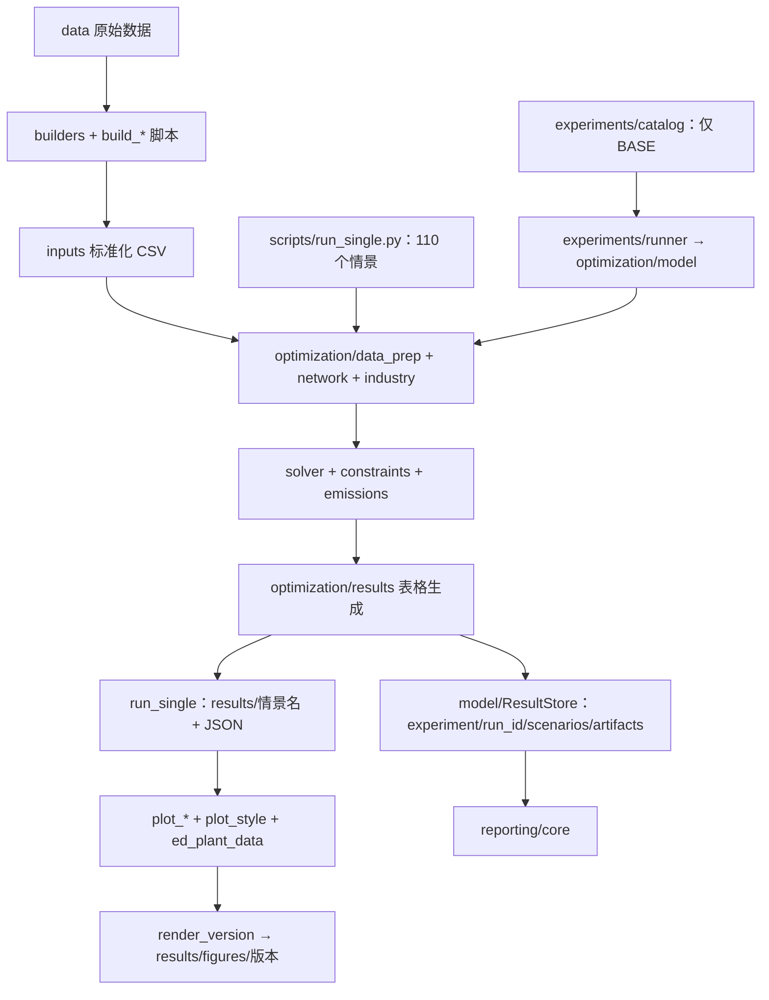

# 项目架构、重构与清理审查（2026-09-20）

结论：保留 `builders → optimization → results/reporting` 的总体分层，做分阶段的局部重构。优先统一运行入口、结果口径和运行溯源，再拆解大模块。现阶段直接删除旧目录或大规模改写求解器，收益小于复现风险。

审查基于当前工作区，包括已有未提交修改；Git 当前分支为 `feature/industrial-sectors`，HEAD 为 `0fa5523`。本次只新增此文档，未修改模型、输入、结果或删除文件。未重跑全国完整情景，也未重新审计所有研究假设。

## 1. 实际架构

主线 `src` 有 36 个 Python 文件、12,131 行；`scripts` 有 55 个、19,614 行；`tests` 有 4 个、698 行。行数包含注释与空行，不把历史树算入主线。

已有值得保留的设计：

- `src` 布局、输入构建模块、`ProjectPaths` 和参数 dataclass 已建立基本边界。
- 排放基础公式独立于求解器；跨期投资和部门目标已有小型 Gurobi 回归测试。
- 原始数据与标准化输入分离，网络构建有重复边与不可达终端检查。
- 生物质关联矩阵已经使用稀疏矩阵，不应在重构时退回稠密实现。
- 已有版本归档、输入摘要和模型指纹意识，应补全这些机制。

当前维护压力主要来自两条运行链、多个源码副本，以及承担业务计算的绘图脚本，并非顶层目录分层本身。

## 2. 按优先级处理的问题

### P1：两套结果编排已经产生不同口径

证据：`src/coal_retrofit/optimization/model.py:130` 调用 `_build_pathway_table` 时未传 `year_data` 和 `plant_reduction_mt`；`scripts/run_single.py:638` 已传入。`_build_pathway_table` 在缺参时回退到静态发电量、基线排放和经典减排公式。类似遗漏还存在于机组明细、管径、逐年注入能力和工业明细的调用。

复现：沿用现有单机组测试输入，求解 2030/2040 两期，利用小时为 4,000/3,000，2040 排放上限为 2030 基线的 40%。把**同一份最优解**按上述两种调用方式转换成表格：

| 2040 年字段 | 包内入口调用方式 | CLI 调用方式 |
|---|---:|---:|
| 发电量 MWh | 4,629,500 | 3,000,000 |
| 基线排放 Mt | 3.79619 | 2.46 |
| 减排量 Mt | 1.826599 | 1.148 |

这是表格调用差异的复现，不是重新求解全国情景后的偏差估计。

建议：建立一个共同的求解与结果组装服务；两种入口只负责参数解析和输出布局。所有物理口径从求解结果导出，增加表格总量与求解器表达式一致的回归检查。

### P1：输入指纹可能记录了错误的数据目录

`optimization/solver.py:101` 的 `_input_digest()` 用源码 `__file__` 推导根目录，而 `prepare_inputs` 使用调用者传入的 `ProjectPaths`。当代码和输入不在同一棵目录树时，两者不一致。

已用临时 toy 输入复现：实际 `plants.csv` 的摘要为 `52317a1396f1`，记录值却为主线输入的 `88992f7490d4`。当前手工复制整棵树的做法掩盖了这个问题；未来改为统一代码读取版本输入时会直接触发。

此外，目前只摘要四张表，未覆盖封存、网络、燃料、工业、部门目标等实际模型输入。CLI 结果也没有完整序列化生效后的 scenario/assumptions。

建议：从真实输入加载过程生成 manifest，记录实际文件摘要、生效配置、代码版本/工作区状态、求解参数和 schema 版本。模型 fingerprint 与文件来源摘要分别保留。

### P1：默认测试与输入校验已经偏离主线

- `python -m pytest -q` 在收集阶段失败：误导入 `_archive_20260906/patent/docx_revision/fit_test.py:26`，该脚本直接读取命令行参数。`.gitignore` 不会阻止 pytest 递归收集。
- `python -m pytest tests -q`：**16 passed**，本环境执行了 Gurobi 小模型测试。
- `scripts/validate_inputs.py:92` 等仍依赖 `plants_hub_100.csv` 和三种 `*_links_100.csv`，当前输入已经采用无 `_100` 的布局。
- 运行校验器主体得到 4 个文件缺失错误，另有 storage 旧字段 `hub_id`、`storage_capacity_kg` 两个告警。为保护已有报告，最终验证将报告写入拦截到内存；并未修改输入或报告。

建议：在 `pyproject.toml` 约束 `testpaths = ["tests"]`；把输入字段、单位、主外键与数值边界定义收口为共享契约，让构建器、加载器和校验器使用同一套定义。

### P2：实验注册、输出存储和异常处理分叉

- `experiments/catalog.py` 只注册 `BASE`，`run_single.py` 内嵌 110 个情景，其中含 assumptions 覆盖；包内模型总是构造默认 assumptions。
- 包内 `ResultStore` 生成独立 run_id；CLI 在 `results/<name>` 和 `<name>.json` 原位覆盖，重跑无法自然保留配置不同的历史运行。
- `experiments/runner.py:100` 的模型调用位于异常处理块之前。注入一个抛出异常的模型函数后，实测没有生成 `error.txt` 或 `manifest.json`。
- 默认 bundle 加载失败时会回退为无模型运行；这应成为显式 dry-run，而不是求解失败后的隐式替代。

建议：把情景定义收回包内，统一有效配置与输出契约，显式区分 dry-run、求解状态、可行性与导出状态。保留旧目录读取适配，避免一次迁移破坏全部图表。

### P2：求解核心过大，数据契约过于隐式

- `optimization/solver.py` 1,483 行，`_solve_joint_multi_period` 单函数 1,203 行。
- `optimization/data_prep.py` 1,411 行，`_build_year_matrices` 416 行，其返回字典含 75 个条目。
- `PreparedInputs.industry` 类型为 `object | None`，多个年度数据与解结果由字符串键字典跨模块传递。
- 存在 `data_prep → industry → data_prep` 的依赖环，当前通过局部导入避免立即触发导入错误；反向依赖只是为了复用距离函数。

建议：先定义 `YearInputs`、`YearSolution`、`RunResult` 等内部契约；按煤电、工业、资源、水、管网、跨期投资拆出变量/约束构建与解提取。`solver` 保留装配、优化和整体控制。重构过程中锁住数值行为，不同时修改科学假设。

### P2：绘图层承担业务规则，容易与模型再次漂移

`scripts/plot_style.py` 1,204 行，除样式、字体和地图外，还包含情景家族、排放重建、数据版本识别、运行有效性及统计计算。`residual_emissions_mt` 从默认 scenario/assumptions 重建公式，而不是完整读取每次运行的有效配置。

另有多处绘图脚本从 `run_single` 导入 `EXPERIMENTS`，或从其他图脚本导入通用计算。`plot_extended.py` 达 1,488 行。

建议：把结果读取、校验、排放/成本汇总等抽到 `reporting`；把样式、底图与图层工具独立为 `plotting`。单张复杂论文图可以保留较长的布局代码，不必为了行数机械拆分。

### P2：渲染归档不能保证“本次成功生成”

`scripts/render_version.py:136` 扫描树中现有 PDF/PNG 并复制，之后才汇总失败的绘图脚本；没有以本次生成清单筛选产物。若脚本失败但旧图仍在，存在旧图随新一批数据一起归档的风险。该项来自控制流审查，本次未实际渲染或移动图件。

建议：为每次渲染建立独立暂存目录与产物清单，成功后再归档；失败返回非零状态，明确记录部分完成情况。

### P2/P3：文档与环境声明滞后

- README/AGENTS 仍列出已不存在的 `run_phase_a.py`、`run_experiment.py`、`summarize_results.py`；README 还描述已不存在的 `pipelines/` 和旧实验 ID。
- README 中存在旧机器的绝对路径链接；关于 Git 历史不可用的说明也已过时，当前能正常读取状态和 worktree 信息。
- `pyproject.toml` 未声明代码直接使用的 `netCDF4`、绘图所需的 `matplotlib`、下载所需的 `requests` 等依赖，也没有测试依赖组或锁定的运行环境记录。本次没有执行全新环境安装，因此这里只确认声明不完整。

建议：写一条实测可执行的“构建输入 → 校验 → 小模型测试 → 求解 → 出图”路径；按核心、绘图、下载、开发区分依赖，保存研究运行使用的环境版本。

## 3. 哪些地方可以清理

目录体积来自文件遍历，单位 MiB；遍历排除了 Windows junction，不把共享的 `data/` 重复计入。

| 对象 | 大小/情况 | 建议 |
|---|---|---|
| `__pycache__`、`.pytest_cache`、`.ruff_cache`、生成的 egg-info | 很小 | 可再生，可清理；几乎不解决磁盘大头 |
| 三处完全相同的 `_haversine_distances_km` | `builders/supply.py:83`、`builders/water.py:173`、`optimization/data_prep.py:28` | 合并到 `spatial.py`，同时解除工业模块的反向依赖 |
| 旧 README 链接、失效 CLI 示例 | 已核实 | 直接修正文档；废弃兼容接口先查消费者再移除 |
| `_netbak/` | 12.37 MiB | 先做差异与出处清单；有 CSV 和源码，不能仅按名字删除 |
| `_v9tree/` | 371.72 MiB | 保留为历史复现快照，停止多处同步维护源码 |
| `_v91tree/` | 390.29 MiB | 同上 |
| `_indtree/` | 429.65 MiB | 当前含未跟踪代码、结果和不同的网络实现，先固化当前工作再决定归档 |
| `_archive_20260906/` | 2,445.08 MiB | 可考虑移至独立冷归档，但须保留 manifest、校验和及还原方式；不是已证实可丢弃的数据 |
| `results/` | 726.24 MiB | 按运行 manifest 区分正式图表、解、日志和临时产物；不能一概删除 |
| `data/` | 23,301.22 MiB | 原始数据，是最大体积来源；本审查不建议删除 |

三个版本目录不是 Git worktree：`git worktree list` 仅列出主目录。逐字节比较各树的 `src` 与 `scripts` 中 Python 文件：

| 版本树 | 与主线完全相同 | 同路径但内容不同 | 该树独有 |
|---|---:|---:|---:|
| `_v9tree` | 40 | 31 | 38 |
| `_v91tree` | 72 | 10 | 1 |
| `_indtree` | 81 | 9 | 3 |

这三棵树合计约 1,192 MiB，但并非全部可回收空间。输入、结果和源码均有版本意义；`_indtree` 的网络构建、工业与运行时网络源码还与主线不同。工作区也存在原有未提交修改。

更合适的长期组织是：一份活跃代码 + 显式输入版本 + 不可覆盖的运行目录 + 发布清单。旧源码快照只有在已能通过提交/补丁和环境记录还原时，才有条件减少副本。

## 4. 建议实施顺序与验收

1. **先修维护入口。** 限定 pytest 收集范围，修当前 schema 的输入校验，更新 README/AGENTS 和依赖声明。验收：默认测试可直接运行，校验器不再查旧文件。
2. **统一运行和导出。** 集中情景注册、有效配置、结果组装与异常留档；修实际输入目录的 provenance。验收：相同解经两个兼容入口导出相同物理总量；不同输入目录记录不同摘要；失败也有明确运行记录。
3. **建立重构保护。** 补水节点/流域约束、工业氢氨共享、工业跨期投资、结果 schema 与排放/成本守恒的小模型测试；将跨测试模块导入的 toy 输入工厂移到测试辅助模块或 fixture。
4. **拆解求解器和报告层。** 先搬公共纯函数和报表读取，再拆年度数据、领域约束与解提取。验收以可行性、目标值及物理总量为主；有多重最优解时，不要求机组选择逐元素完全一致。
5. **最后整理历史树。** 逐树记录代码差异、输入摘要、已有结果及引用者，固化后移入清楚命名的归档。先解除对目录位置的隐式依赖，再减少副本。

不建议引入服务化、数据库或通用插件框架；当前规模下，共同运行服务、明确数据契约和版本清单足以解决主要问题。

## 5. 验证记录与边界

- 默认全项目 pytest：收集失败，已定位为归档脚本命名与测试发现范围冲突。
- 主线 `tests/`：16 个测试通过；存在第三方依赖弃用告警。
- 旧校验器主体：4 个缺失文件错误、2 个旧字段告警，报告写入截获到内存。
- 小型求解：同一最优解的两种表格调用方式存在上述数值差异。
- 溯源：临时输入目录与记录的 plants 摘要不一致。
- 失败留档：注入模型异常后没有 manifest/error 文件。
- 源码规模、导入关系、精确重复函数、目录大小与版本副本差异：静态检查完成。
- 未执行完整原始数据再生、全国求解、全套绘图、冷归档迁移或任何删除；因此不能把本次结果解读为全模型正确性认证或某个历史结果已经失效。
